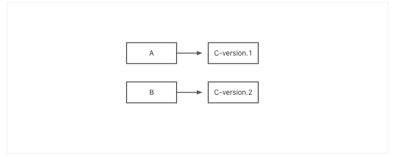
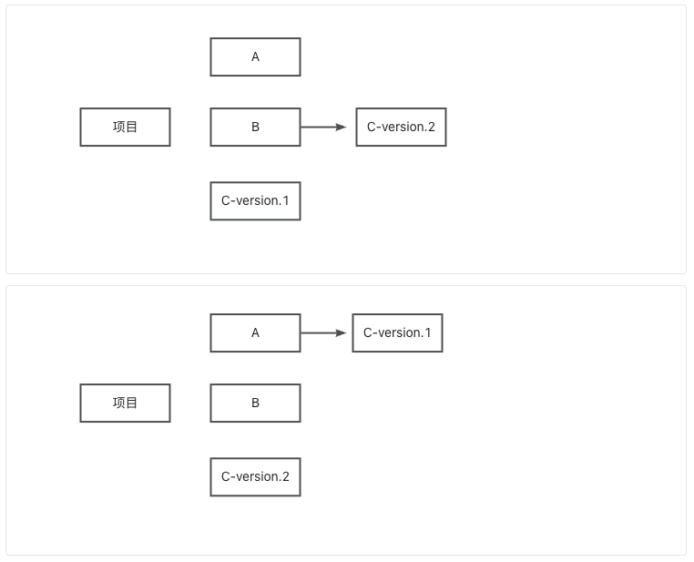
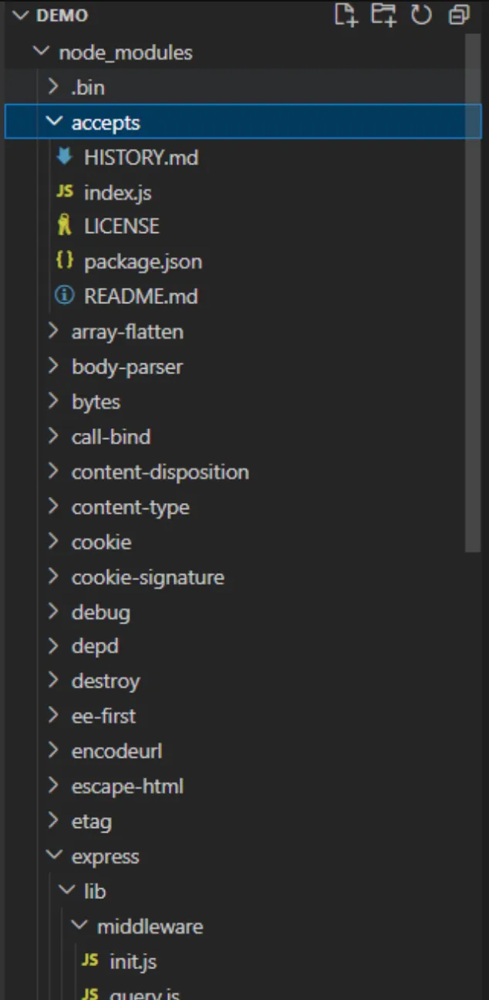
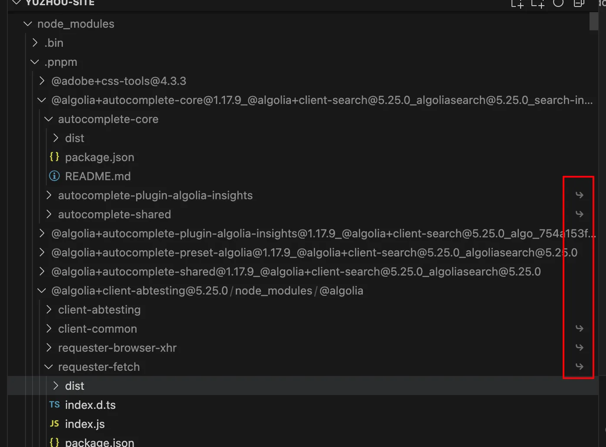
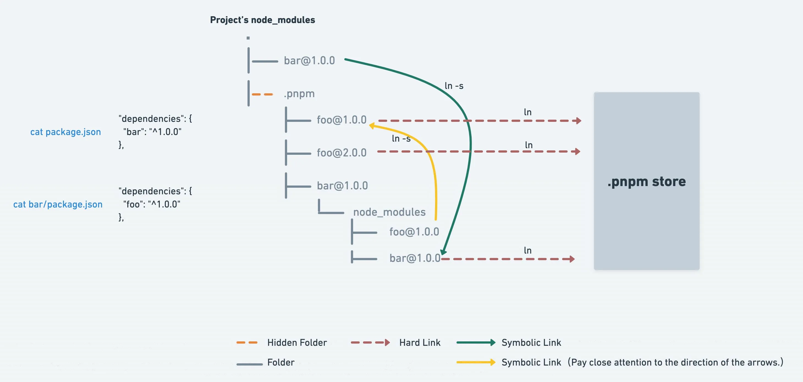
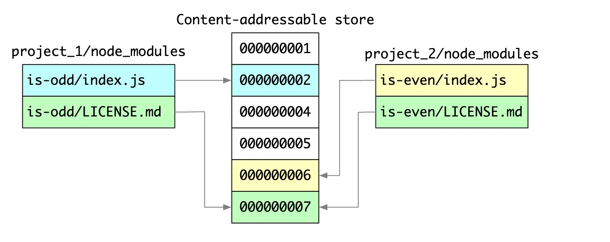

## 包安装
因为笔者最近在做仓库的依赖治理，借此机会顺便整理下依赖、依赖管理等相关内容，依赖管理目前用的比较多的主要是npm，yarn和pnpm。先说一下为什么我们会有这些工具，三者主要是包管理工具，npm（node package manage）主要是随着node的兴起应运而生的一种包管理工具。通常我们拿到仓库会进行依赖安装，通过执行xx install，包管理工具会自动解析项目依赖并安装到本地环境，这个过程实际做了以下流程：

    1. 读取配置文件，解析 package.json 和锁文件（如 package-lock.json、yarn.lock、pnpm-lock.yaml）
    2. 构建依赖树：根据依赖关系生成树形结构，处理版本范围和冲突。
    3. 解析包版本：确定每个依赖的确切版本（遵循语义化版本规则）。
    4. 下载包文件：从 npm registry 或镜像源获取包的 tarball。
    5. 验证完整性：检查下载文件的哈希值是否与锁文件一致。
    6. 安装到本地：将包内容解压到 node_modules 目录。

## 包管理方式
### npm包管理
既然都是包管理方式，那他们是怎么管理的，先看下npm
```js
ode_modules
└─ express
   ├─ index.js
   ├─ package.json
   └─ node_modules
      └─ accepts
         ├─ index.js
         └─ package.json
```
这层依赖树，每一个依赖都有自己的node_modules，这样就会有一个问题，每一层都可能安装同一个依赖，导致依赖重复，冗余，依赖层级太深，导致致命的问题是 Windows 的文件路径最长是 260 多个字符，这样嵌套是会超过 Windows 路径的长度限制的。
大量重复的包被安装，文件体积超大。比如跟 express 统计目录下有一个 foo，两者都依赖于同一个版本的 Lodash，那么 Lodash 会分别在两者的 node_modules 中被安装，也就是重复安装，会占据比较大的磁盘空间。
模块实例不能共享。比如 React 有一些内部变量，在两个不同包引入的 React 不是同一个模块实例，因此无法共享内部变量，导致一些不可预知的 bug。
npm3开始平铺依赖，从而解决了嵌套过深，但是依赖结构不确定性等问题还是存在
依赖结构不确定性（npm3）
 
项目直接依赖A和B，A依赖了C的版本1，B依赖了C的版本2，扁平化后可能存在如下两种情况，具体是哪种取决于用户的安装顺序。如果A在前面则是第一种，如果是B在前，则是第二种，在yarn中，因为有了lock文件，从而能够保证每次安装的都是一样

```js
node_modules
├── A@1.0.0
├── B@1.0.0
└── C@1.0.0
    └── node_modules
        └── B@2.0.0
```
```js
node_modules
├── A@1.0.0
│   └── node_modules
│       └── B@1.0.0
├── B@2.0.0
└── C@1.0.0
```
### yarn包管理
yarn相比npm的解法通过将依赖平铺，减少嵌套，这样就不再存在无限嵌套问题，在这种结构下根据 node require 机制，会不停往上级的 node_modules当中去找，如果找到相同版本的包就不会重新安装，解决了大量包重复安装的问题，而且依赖层级也不会太深，但是多展开几个依赖包，大家会发现，为什么还会有嵌套呢?
因为一个包是可能有多个版本的，提升只能提升一个，所以后面再遇到相同包的不同版本，依然还是用嵌套的方式

所以yarn解决的是npm的嵌套过深问题，但是这种方式还是存在一定的问题，
扁平化算法本身的复杂性很高，耗时较长。
幽灵依赖( 通俗一点的说：可以非法访问没有声明过依赖的包 )

另外假设在安装了依赖B的C和D，而C和D依赖的版本和直接依赖的版本不一致，安装后会出现，通常被称为依赖分身
```js
node_modules
├── A@1.0.0
├── B@1.0.0
├── D@1.0.0
├── C@1.0.0
│   └── node_modules
│       └── B@2.0.0
└── E@1.0.0
    └── node_modules
        └── B@2.0.0
```
#### 扁平化算法
扁平化算法的核心流程
依赖收集
Yarn 首先会收集所有直接和间接依赖，构建一棵依赖树。
版本冲突分析
对于同一个包的不同版本，Yarn 会尝试找到能被最多依赖接受的“最大兼容版本”。
顶层优先安装
能被多个依赖共享的包，Yarn 会优先安装在顶层 node_modules 下。只有当某个依赖对版本有特殊要求时，才会在其子目录下单独安装。
软链接处理
对于需要多版本共存的包，Yarn 会在对应依赖的 node_modules 下建立软链接，指向实际安装位置。
生成 flat node_modules
最终 node_modules 目录结构尽量“扁平”，减少嵌套层级。
幽灵依赖
项目中实际没有安装的包，但是仍然可以引用，比如上面的例子，没有直接在package.json中安装C，但是因为扁平化，从而可以直接引用C

### pnpm
pnpm和yarn和npm都不一样的是他通过将依赖安装在电脑硬盘上，也就是store中，每个版本只会安装一次，通过硬连接和软连接（硬连接就是同一个文件的不同引用，而软链接是新建一个文件，文件内容指向另一个路径）两种方式，将store中的依赖和项目挂钩，下图中红色圈出部分即表明依赖硬连接于全局store

官方有一张详细的图描述依赖间的连接关系，也就是项目node_modules下的依赖都是软连到.pnpm下，而.pnpm均硬链自pnpm store，依赖的node_modules中的子项的依赖也是软连至直接.pnpm下

pnpm使用的是非扁平化的平铺方式，至于为什么可以看[平铺的结构不是node_modules的唯一实现方式｜pnpm](https://pnpm.io/zh/blog/2020/05/27/flat-node-modules-is-not-the-only-way)

这种实现方式相比npm和yarn最大的优势就是快，和节省了空间，一方面通过连接替代了复制，从而相同版本的依赖只需要安装一份，不同项目间可以共享，另外真是因为不是复制，连接更加快。



## 业务实践遇到的问题
笔者所在团队的项目主要是monorepo+pnpm workspace的管理方式，且是后续迁移构造的pnpm，这个过程有一些问题，特此记录一下

1. 版本混乱，override过多，因为迁移项目，每个子项目之前就存在一些override，版本也各自不同，所以迁移后一些基建性质的依赖，比如ts，reacrt rn的版本需要override统一，否则项目启动就寄了，我们的方式是尽量升级到所有子项的最大版本，因为这些基建趋势上也是要升级的，但是这块需要做好回归
::: collapse
- override的用处
    - 解决依赖冲突
    当你的项目或某些依赖的依赖（比如 A 依赖了 lodash@4.17.15，B 依赖了 lodash@4.17.21）版本不一致时，可以用 overrides 强制所有 lodash 使用同一个版本，避免冲突和重复安装。

    - 修复安全漏洞或兼容性问题
    有些依赖的某个版本存在安全漏洞或 bug，但你的某些三方包还在引用旧版本，这时可以用 overrides 强制升级到安全版本。

    - 统一 monorepo 多包的基础依赖版本
    在 monorepo 场景下，多个子包可能依赖同一个基础库（如 react、typescript），但版本不一致。用 overrides 可以统一所有包的基础依赖版本，保证一致性和可维护性。

    - 临时修复第三方包问题
    有时第三方包依赖了有问题的库，可以用 overrides 临时指定一个修复后的版本，等官方修复后再去掉。

:::
2. 公司基建cli工具的索引方式会导致一个奇怪的方式
    - package.json中依赖了A，但是A不直接依赖B，会在monorepo的node_modules中找对应的依赖，但是会去找最新的版本


我们看下metro的寻址方式

### metro在monorepo下的依赖寻址机制

1. 默认寻址行为(Node.js require机制)

Metro 默认遵循 Node.js 的模块查找规则：

- <strong>查找顺序</strong>，先在当前包的 node_modules 目录查找 B。如果没有，再往上级目录查找（比如 monorepo 根目录的 node_modules）。一直向上，直到文件系统根目录。

- <strong>多版本共存时的选择</strong>，如果你的 monorepo 根目录 node_modules 下有多个版本的 B（比如 B@1.0.0 和 B@2.0.0），Metro/Node.js 默认只会查找 node_modules/B，即没有区分版本号，只认顶层的那个 B（通常是最后安装的版本，或者是 package.json 里声明的版本）。如果某个包需要特定版本的 B，通常会在该包自己的 node_modules 下安装该版本（比如 packages/A/node_modules/B@1.0.0），这样 require('B') 时会优先用最近的那个版本。具体的版本由安装顺序和lock文件决定，没有特殊的规律

2. Metro的watchFolders配置

Metro通过watchFolders可以指定额外的目录作为依赖查找和监听目录，在 monorepo 下，通常会把根目录和各个包目录都加到 watchFolders，这样 Metro 能正确找到依赖。

metro依赖查找核心源码在``` metro/packages/metro-resolver/src/resolve.js```

```js
resolve(
  context: ResolutionContext,
  moduleName: string,
  platform: string | null,
)
```
- context包含当前查找的根目录，watchFolders，package信息等上下文
- moduleName：查找的模块名，比如"react"或者'./foo'
- platform：平台(ios,android)用于平台相关的入口查找

如果moduleName是绝对路径或者相对路径，直接尝试解析为文件或目录，不走node_modules查找流程,如果解析成功，返回最终解析到的文件路径（result.resolution）。
```js
 /Users/xxx/project/foo.js
 ./foo、../bar
```

if (isSubpathImport(moduleName)) 这个流程是处理包内子路径导入，也叫“子模块导入”或“包内子路径解析”。如下这种依赖
```js
'lodash/fp'
'@mui/material/Button'
```
context.getPackageForModule(context.originModulePath)：根据当前模块路径找到最近的 package.json（即所属包）。
这个方法会根据当前正在解析的模块路径，向上查找最近的package.json文件，可以确定“当前模块属于哪个 npm 包”。比如你在 ```/Users/xxx/project/node_modules/lodash/fp.js ```里解析依赖，它会找到 ```/Users/xxx/project/node_modules/lodash/package.json。```

```importsField = pkg?.packageJson.imports：```获取``` package.json ```的 imports 字段（用于自定义子路径映射）。

找到 package.json 后，去读取它的 imports 字段。
imports 字段是 Node.js 的新规范，可以自定义包内子路径的映射（比如 #alias 或 ./submodule 映射到具体文件）。
如果你用的是传统包（比如 lodash），通常没有 imports 字段，这时会报错或走后续的 fallback 逻辑。


如果找不到 package.json，抛出 PackageImportNotResolvedError，提示无法定位包。
如果 package.json 没有 imports 字段，也抛出错误，提示缺少配置。


路径重定向和排除场景
```js
const realModuleName = redirectModulePath(context, moduleName);
if (realModuleName === false) {
  return {type: 'empty'};
}
```
上述主要是用于模块别名，比如配置了extraNodeModules或者类似alias机制，还有一些黑名单/排除，路径映射（比如monorepo下，某些包需要映射到workspace里的源码目录，而不是node_modules里面的包）
```js
// metro.config.js
extraNodeModules: {
  '@my-lib': path.resolve(__dirname, '../shared/my-lib'),
}
```
这样``` import '@my-lib/foo' ```实际会被重定向到 ```../shared/my-lib/foo```


绝对/相对路径导入，如果是绝对或相对路径，直接解析为文件或目录，不走 node_modules 查找。
```js
const isDirectImport =
  isRelativeImport(realModuleName) || path.isAbsolute(realModuleName);

if (isDirectImport) {
  // 计算绝对路径
  // 从 originModulePath 推导出当前包的 node_modules 目录
  // 拼接得到最终绝对路径
  const absPath = path.join(originModuleDir, realModuleName);
  const result = resolveModulePath(context, absPath, platform);
  if (result.type === 'failed') {
    throw new FailedToResolvePathError(result.candidates);
  }
  return result.resolution;
}
```

3. Haste 模块（React Native 特有）,支持 Haste 机制（RN 特有），优先查 Haste module/package。
```js
if (context.allowHaste) {
  // 支持 Haste 单文件和包名
  // 先查 Haste module，再查 Haste package
}
```

4. 包名和包内子路径导入
构建所有可能的 node_modules 路径（从当前目录向上递归）。
```js
const nodeModulesPaths = [];
let next = path.dirname(originModulePath);

if (!disableHierarchicalLookup) {
  // 递归向上查找 node_modules 目录
  let candidate;
  do {
    // 每一层都加 node_modules 路径
     candidate = next;
      const nodeModulesPath = candidate.endsWith(path.sep)
        ? candidate + 'node_modules'
        : candidate + path.sep + 'node_modules';
      nodeModulesPaths.push(nodeModulesPath);
      next = path.dirname(candidate);
  } while (candidate !== next);
}
nodeModulesPaths.push(...context.nodeModulesPaths);
```
5. extraNodeModules 支持,支持通过配置额外的 node_modules 路径（如 monorepo 别名）。
```js
const {extraNodeModules} = context;
  if (extraNodeModules && extraNodeModules[parsedSpecifier.packageName]) {
    const newPackageName = extraNodeModules[parsedSpecifier.packageName];
    extraPaths.push(path.join(newPackageName, parsedSpecifier.posixSubpath));
  }
  ```

6. 依次尝试所有候选路径,遍历所有候选 node_modules 路径，尝试解析包名或包内子路径。
每找到一个候选路径就尝试用 resolvePackage 解析。

```js
const allDirPaths = nodeModulesPaths
  .map(...)
  .filter(Boolean)
  .concat(extraPaths);

for (let i = 0; i < allDirPaths.length; ++i) {
  const candidate = redirectModulePath(context, allDirPaths[i]);
  if (candidate === false) {
    return {type: 'empty'};
  }
  const result = resolvePackage(context, candidate, platform);
  if (result.type === 'resolved') {
    return result.resolution;
  }
}
```

