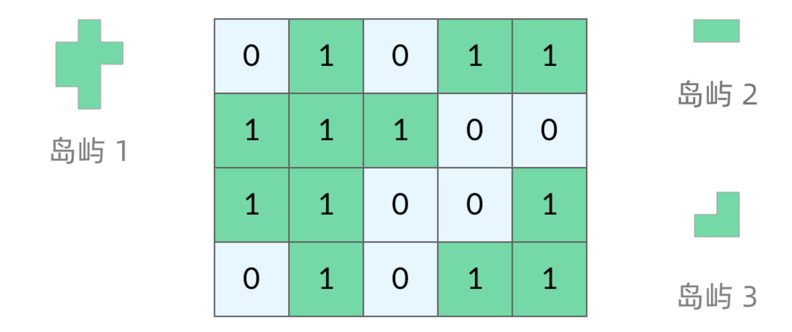

## 题目盘点
[岛屿数量](https://leetcode.cn/problems/number-of-islands/description/)

[岛屿周长](https://leetcode.cn/problems/number-of-islands/solutions/211211/dao-yu-lei-wen-ti-de-tong-yong-jie-fa-dfs-bian-li-/)

[岛屿的最大面积](https://leetcode.cn/problems/max-area-of-island/description/)

[最大人工岛](https://leetcode.cn/problems/making-a-large-island/description/)

## 通用解法说明
岛屿的图示主要如下，1表示陆地，0表示水域，而题目通常都是根据这个1和0的区域来展开，所以我们其实也是要围绕这些区域来进行计算各类问题，比如岛屿周长，面积，最大，周长等等，基于此我们主要使用的解法是DFS



### DFS基本框架
岛屿是网格，也可以理解为二维数组，简化一些其实就可以理解为二叉树，二叉树的dfs框架如下
```js
const travel=(root)=>{
    // 跳出条件
    if(root==null){
        return 
    }
    // 访问相邻节点
    travel(root.left)
    travel(root.right)
}
```
此基本框架实际是由两部分<strong>访问相邻节点，退出的条件</strong>组成

访问相邻节点：二叉树只有左子树和右子树，根据此我们可以推导出网格下，上下左右节点

退出条件：二叉树为root==null，root为null的条件其实匹配两种情况，一种是叶子节点，左右子树都为空，另一种是提前返回，避免下面travel的空条件，由此我们推导出网格下的退出条件，也就是当格子为null，也就是越界


## 参考
[解答](https://leetcode.cn/problems/number-of-islands/solutions/211211/dao-yu-lei-wen-ti-de-tong-yong-jie-fa-dfs-bian-li-)