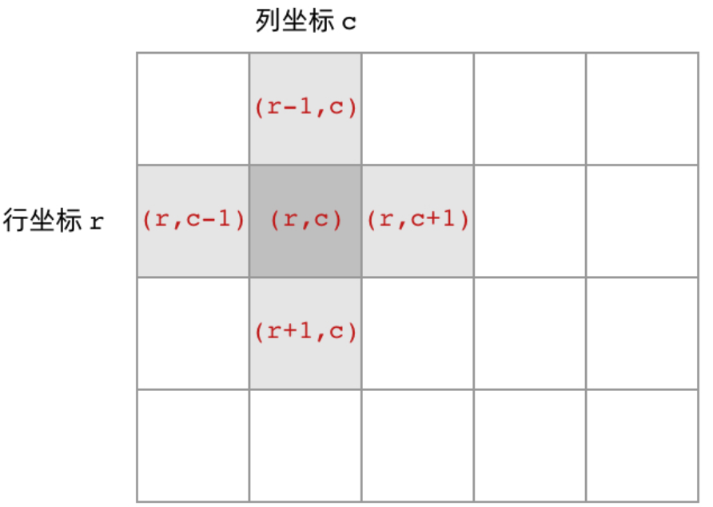
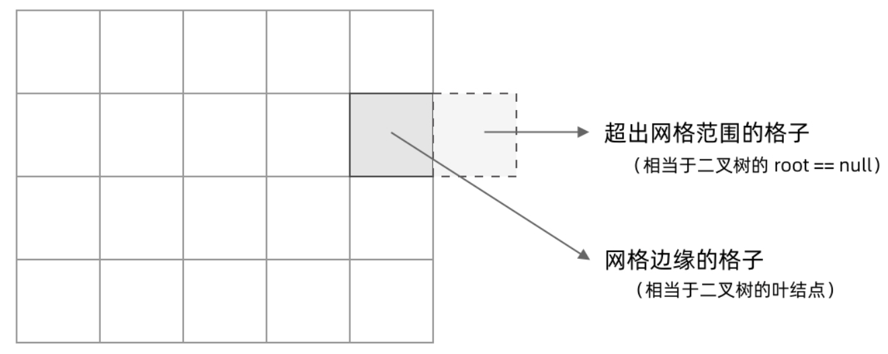

## 题目盘点
[岛屿数量](https://leetcode.cn/problems/number-of-islands/description/)

[岛屿周长](https://leetcode.cn/problems/number-of-islands/solutions/211211/dao-yu-lei-wen-ti-de-tong-yong-jie-fa-dfs-bian-li-/)

[岛屿的最大面积](https://leetcode.cn/problems/max-area-of-island/description/)

[最大人工岛](https://leetcode.cn/problems/making-a-large-island/description/)

## 通用解法说明
岛屿的图示主要如下，1表示陆地，0表示水域，而题目通常都是根据这个1和0的区域来展开，所以我们其实也是要围绕这些区域来进行计算各类问题，比如岛屿周长，面积，最大，周长等等，基于此我们主要使用的解法是DFS


### DFS基本框架
岛屿是网格，也可以理解为二维数组，简化一些其实就可以理解为二叉树，二叉树的dfs框架如下
```js
const travel=(root)=>{
    // 跳出条件
    if(root==null){
        return 
    }
    // 访问相邻节点
    travel(root.left)
    travel(root.right)
}
```
此基本框架实际是由两部分<strong>访问相邻节点，退出的条件</strong>组成

访问相邻节点：二叉树只有左子树和右子树，根据此我们可以推导出网格下，上下左右节点


退出条件：二叉树为`root==null`，root为null的条件其实匹配两种情况，一种是叶子节点，左右子树都为空，另一种是提前返回，避免下面travel的空条件，由此我们推导出网格下的退出条件，也就是当格子为null，那我们怎么判断呢，根据图示，超出网格等价于`root==null`，网格的边界格子等价于二叉树的叶子节点


在此条件上我们尝试写一下网格的DFS
```js
const dfs=(grid,i,j)=>{
    // 说明grid[i][j]越界了
    if(!isArea(grid,i,j)){
        return
    }
    // 对应网格相邻节点的遍历
    dfs(grid,i-1,j)
    dfs(grid,i+1,j)
    dfs(grid,i,j-1)
    dfs(grid,i,j+1)
}

// 判断是否越界=>判断当前的坐标是否在grid的长宽范围内
const isArea=(grid,i,j)=>{
    return 0<=i<grid.length&&0<=j<grid[0].length
}
```

进一步思考，我们这个结构存在一个问题，因为我们的会去遍历网格相邻节点，那就有可能会重复，比如访问了`[2,2]`,当我们访问相邻`[1,2],[3,2],[2,1],[2,3]`，当我们访问到`[1,2]`的时候，我们可能会再次访问到`[2,2]`,所以我们需要解决重复访问的问题,所以我们需要加一个标识,`grid[i][j]=2`，只要等于不是陆地和海洋即可


## 例题解析

### 岛屿数量
根据上面的分析，我们可以知道，如果遇到了岛屿，我们需要以此进行dfs，最终进行计数
```js
// 上来先把框架写好
const dfs=(grid,i,j)=>{
    // 越界
    if(!isArea(grid,i,j)){
        return
    }
    // 不是岛屿
    if(grid[i][j]!=='1'){
        return
    }
    // 标记访问过了
    grid[i][j]='2'
    dfs(grid,i-1,j)
    dfs(grid,i+1,j)
    dfs(grid,i,j-1)
    dfs(grid,i,j+1)
}
const inArea=(grid,i,j)=>{
    return 0<=i&&i<grid.length&&0<=j&&j<grid[0].length
}
// 接下来我们要用这个遍历
const numIslands=(grid)=>{
    let num=0
    for(let i=0;i<grid[0].length;i++){
        for(let j=0;j<grid.length;j++){
            if(grid[i][j]=='1'){
                dfs(grid,i,j)
                num++
            }
        }
    }
    return num
}
```

### 岛屿周长 
## 参考
[解答](https://leetcode.cn/problems/number-of-islands/solutions/211211/dao-yu-lei-wen-ti-de-tong-yong-jie-fa-dfs-bian-li-)