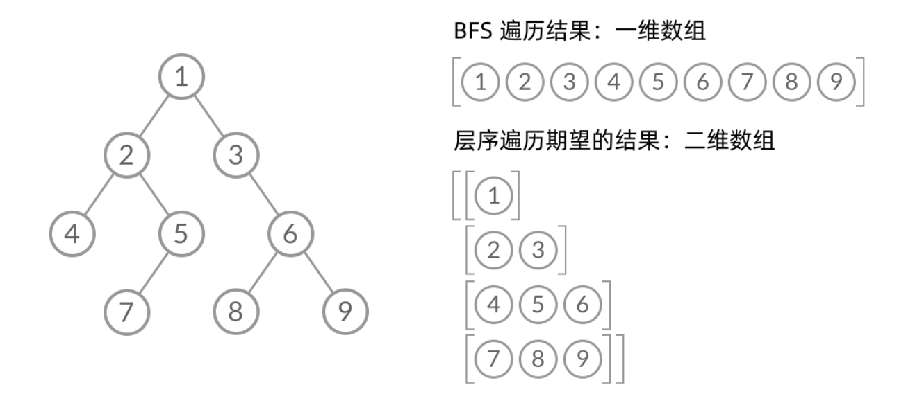

树是算法题中最常见的结构了，也是日常工作中真实遇到的结构，比如在B、M等较为复杂的配置化中，存在一些树形表格等，在树这一层也有各种各样的题型变种，以下是我整理出的一些高频题型

## 基础遍历

[二叉树的层序遍历](https://leetcode.cn/problems/binary-tree-level-order-traversal/description/)

[二叉树的中序遍历](https://leetcode.cn/problems/binary-tree-inorder-traversal/)

[二叉树的前序遍历](https://leetcode.cn/problems/binary-tree-preorder-traversal/)

[二叉树的最近公共祖先](https://leetcode.cn/problems/lowest-common-ancestor-of-a-binary-tree/description/)

[二叉树的最大深度](https://leetcode.cn/problems/maximum-depth-of-binary-tree/)

[寻找二叉搜索树的目标节点](https://leetcode.cn/problems/er-cha-sou-suo-shu-de-di-kda-jie-dian-lcof/)

[翻转二叉树](https://leetcode.cn/problems/invert-binary-tree/description/)


### 层序遍历

```js
/**
 * Definition for a binary tree node.
 * function TreeNode(val, left, right) {
 *     this.val = (val===undefined ? 0 : val)
 *     this.left = (left===undefined ? null : left)
 *     this.right = (right===undefined ? null : right)
 * }
 */
/**
 * @param {TreeNode} root
 * @return {number[][]}
 */
var levelOrder = function(root) {
    const res=[]
    if(!root){
        return res
    }
    const queue=[]
    queue.push(root)
    while(queue.length!==0){
        let len=queue.length
        res.push([])
        for(let i=1;i<=len;++i){
            const node=queue.shift()
            
            res[res.length-1].push(node.val)
            if(node.left){
                queue.push(node.left)
            }
            if(node.right){
                queue.push(node.right)
            }
        }
    }
    return res
};
```

## BFS、DFS
如果我们使用 DFS/BFS 只是为了遍历一棵树、一张图上的所有结点的话，那么 DFS 和 BFS 的能力没什么差别，我们当然更倾向于更方便写、空间复杂度更低的 DFS 遍历。

### DFS
dfs遍历使用递归
```js
const dfs=()=>{
    if(root==null){
        return 
    }
    dfs(root.left)
    dfs(root.right)
}
```

### BFS
BFS遍历使用队列
```js
const bfs=(root)=>{
    const queue=[]
    queue.push(root)
    while(queue.length!==0){
       const node= queue.shift()
       if(node.left) queue.push(node.left)
       if(node.right) queue.push(node.right)
    }
}
```
dfs实际隐藏了栈，单纯遍历的话可以使用dfs，而二叉树的层序遍历实际是一层层遍历，简直是BFS的最佳实践，上面的BFS模版存在一个问题，就是我们无法分层

那我们自然就会想到，在每次遍历的时候，记录下当前这层的节点数量，打包为一个[]组合，每层的数量为当前队列中的数量,在当前层遍历结束后，整体在塞到res的[]中
```js
const bfs=(root)=>{
    const queue=[]
    queue.add(root)
    while(queue.length){
        let len=queue.length
        for(let i=0;i<len;i++){
            const node=queue.shift()
            if(node.left){
                queue.push(node.left)
            }
            if(node.right){
                queue.add(node.right)
            }
        }
    }
}
```

## 参考

[binary-tree-level-order-traversal](https://leetcode.cn/problems/binary-tree-level-order-traversal/solutions/244853/bfs-de-shi-yong-chang-jing-zong-jie-ceng-xu-bian-l/)