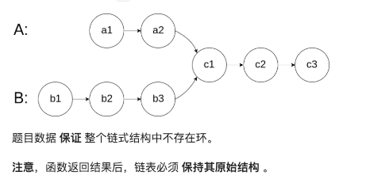
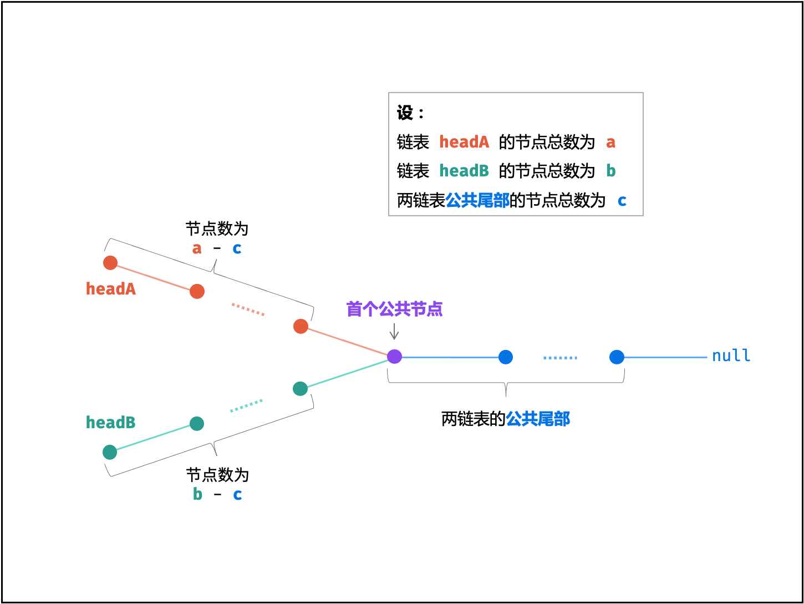

[相交链表](https://leetcode.cn/problems/intersection-of-two-linked-lists/)


该题实际是一个数学题，最后的公式

a+(b-c)=b+(a-c)


```js
var getIntersectionNode = function(headA, headB) {

    let L1=headA,L2=headB
    while(L1!==L2){
        L1=L1!==null?L1.next:L2
        L2=L2!==null?L2.next:L1
    }
    return L1

}
```