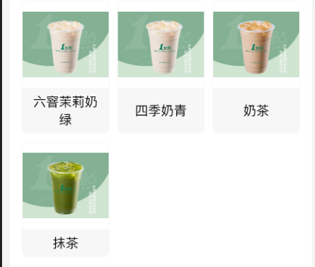

商品一行行排列，每行的每个文字可能多可能少，需要同行同高，也就是说，如果这行有一个商品的名字有两行，那么其他也要变成两行的高度，如果这行都是一行，那大家都保持一行，了解了这个UI要求，直接先看效果



图中因为第一行六角茉莉奶茶是两行了，所以另外两个也需要文字行高2行，我的实现方案是判断如果这行中有一个是2行，那就直接让同行的行高都设置为2行的行高

```js
const layout=(e)=>{
    const height=e.nativeEvent.layout.height
    if(height>18*2-2){
        // lineId=Math.floor(index/3) 3个一行 因为可能还存在分组
        updateObj(`${groupId}-${lineId}`,true) // 说明这个是两行
    }
}


<View onLayout={layout}>
    {/* 直接取这个同组同行，是否是两行，是就给这个设置为两行的行高，否则就由内容自行撑开 */}
<Text style={{height:Obj[`${groupId}-${lineId}`]?36:'auto'}}></Text>
</View>
```