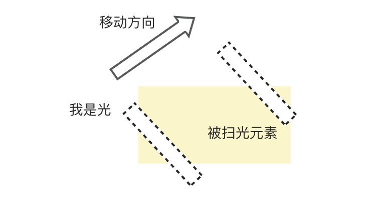

最近笔者团队的需求中设计有一个诉求，期望给一个文字加一个扫光效果，我们文设计给个角度呀，扫光板的透明度是多少呀之类的，结果设计说不用这么麻烦，我给你个图，你直接扫过去就行，直呼内行（内心狂喜），这简单

但是本着我们要更加优秀（保住饭碗🍚），于是在此整理下如果没有设计给的图，我们怎么徒手撸一个扫光，在移动端，web端各自该如何实现

##  扫光原理

其实从我们和设计的沟通中可以理解到，扫光就是一个“光的蒙层”从需要被扫光的内容上移动过去，然后一直循环不停就行

参考学习

 https://segmentfault.com/a/1190000045122864#item-1

