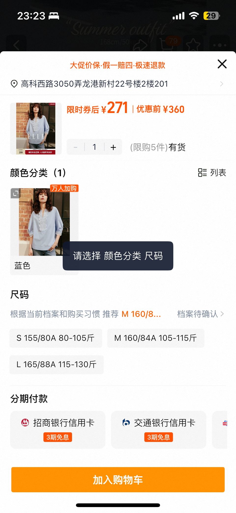

在设计的交互中有时候会期望如果用户没有选择某个组的内容，期望在“提交”或者“确定”等按钮的时候自动锚定到对应的分组，提示用户需要选择xxx，相信大家都用过淘宝，京东等，比如看个示例（PS：这里就只有静态的了，可以拿出手机尝试下）

 

那这种效果一般怎么做的呢，大概的思路就是获取每个分组的位置，存下来，然后点击的确定的时候匹配第一个没有选择的分组，然后通过scrollView的scroll方法滚动到对应的位置，这里乍一看很简单，但是会有一种问题就是有可能这里的层级会比较多，而我们每次获取的高度是当前相对于父节点的高度，所以就会存在高度获取不全等问题造成滚动的位置不精确

这里我们换个角度思考，既然可能存在不全，那我在布局的时候就给每一层都加一个id，且布局的时候就获取其相对父节点的距离，存为一个map，需要滚动的时候直接获取即可
```js
const anchorMap={}

const AnchorView=(props)=>{
    const {parentKey,anchorKey,needHighlight,highlightStyle,handleLayout}=props
    const anchorRef=useRef(null)
    const layout=(event)=>{
        const {x,y}=event.nativeEvent.layout
        anchorMap[anchorKey]={
            offsetX:x,
            offsetY:y,
            parentKey,
            anchorKey,
            ref:anchorRef
        }
        handleLayout?.(event)
    }

    return <>
        <View ref={anchorRef} style={style} onLayout={onLayout}>
            {needHighlight?<HighlightView anchorKey={anchorKey} style={highlightStyle}/>:null}
            {props.children}
        </View>
    </>
}

{/* 计算锚点在Y轴上的偏移量 */}
export const getAnchorRelativeRootPosition=(id,rootKey='root')=>{
    let offsetY=0
    let currentAnchor=anchorMap[id]
    let offsetX=0
    if(!currentAnchor){
        return {
            offsetX:0,
            offsetY:0
        }
    }
    // 向上遍历直到找到根结点
    whle(currentAnchor.parentKey!==rootKey){
        offsetY+=currentAnchor.offsetY
        offsetX+=currentAnchor.offsetX
        currentAnchor=anchorMap[currentAnchor.parentKey]
    }
    {/* 加上最外层的偏移 */}
    offsetY+=currentAnchor.offsetY
    offsetX+=currentAnchor.offsetX
    return {
        offsetX,
        offsetY
    }
   
}
```