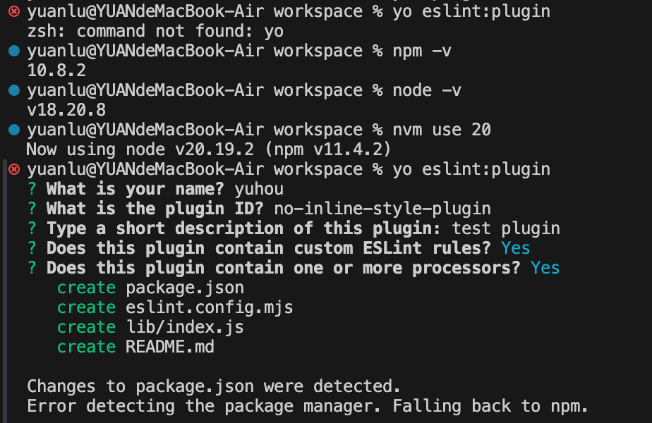

笔者今年的一个工作项就是在做团队项目的性能优化，这里提一个小点，內联样式在rn，react中在如下场景会有一定性能影响
- 每次渲染都会新建一个 style 对象，如果这个对象作为 props 传递给子组件，会导致子组件无法利用 React.memo 等浅比较优化，从而产生不必要的渲染。
- 简单、静态的内联样式（如 `style={{height: 12}}）`影响极小，几乎可以忽略。

为了让大家在业务迭代中减少这种书写，所以就想结合eslint插件功能，增加一些提示🔔

以下内容参考自[eslint插件](https://zh-hans.eslint.org/docs/latest/extend/plugins)

可以通过[ Yeoman 生成器](https://www.npmjs.com/package/generator-eslint)创建一个插件

1. 安装generator-eslint
```bash
npm i -g generator-eslint
```

2. 安装yo
```bash
npm i -g yo
```

3. 执行创建
```bash
yo eslint:plugin
```
执行后得到如下交互式



插件的具体内容可以见[no-inline-style-plugin](https://github.com/onlylovefish/no-inline-style-plugin)


之前没有写过插件，此处补充一些eslint插件的知识
```js
JSXAttribute(node) {
  // 这里的 node 就是 AST 里的 JSXAttribute 节点
  // 例如 <Component style={{ color: 'red' }} /> 里的 style 属性
}

```
你可以通过 node 访问这个属性的名字、值、类型等信息。
比如：

node.name.name 是属性名（如 "style"）
node.value 是属性值（如 { color: 'red' } 的 AST 表达）
总结：
node 就是当前遍历到的语法结构的详细信息对象。你可以用它来判断、分析和定位代码中的具体内容。

```js
create(context) {
  // context.report 用于报告错误
  // context.getSourceCode() 可以获取源码
  // context.options 获取规则参数
  // ...
}
```
context是 ESLint 规则的上下文对象，由 ESLint 在运行你的规则时自动传入。它的作用是：

提供报告错误的方法（如 context.report）
提供获取配置信息的方法（如 context.options、context.settings）
提供获取源码的方法（如 context.getSourceCode()）
提供规则 ID、文件名等信息
常用的 context 属性有：
```js
context.report({...})：报告一个 lint 错误
context.options：获取规则的自定义参数
context.getSourceCode()：获取当前文件的源码对象
context.id：当前规则的 id
context.filename：当前文件名（部分版本支持）
```

## eslint的运行原理
### 解析为AST
ESLint使用JavaScript解析器Espree把JS代码解析成AST。

PS：这里说明下，eslint本身并不做解析的事情，而是借助根据配置的parser选择对应的解析器，解析器将源码转为AST，eslint拿到AST后，运行配置规则

### 遍历AST
配置的规则遍历AST，做静态分析，报错或自动修复等

### 触发监听选择器的rule回调
在深度遍历的过程中，生效的每条规则都会对其中的某一个或多个选择器进行监听，每当匹配到选择器，监听该选择器的rule，都会触发对应的回调。

PS：这里的选择器指的是Eslint规则中用于匹配AST节点类型的名称，本质就是你想监听的语法结构的类型

```js
create(context) {
  return {
    // 这里的 JSXAttribute 就是“选择器”
    JSXAttribute(node) {
      // 只要遍历到 AST 中的 JSXAttribute 节点，就会触发这个回调
    },
    // 你也可以监听其他类型
    VariableDeclaration(node) { ... },
    FunctionDeclaration(node) { ... },
    // 还可以写更复杂的选择器
    "CallExpression[callee.name='setTimeout']"(node) { ... }
  }
}
```

## 其他思考

### 大模型可以未来替换或者做一些eslint的事情吗
随着大模型的发展，是不是一些eslint插件的逻辑可以通过mcp rules来配置

个人理解，如果一些比较自定义的小规则可以通过大模型来搭配实现，相对更加简单，无需写更复杂的插件内容，但目前来看大模型的规则还不够可控和稳定，对于团贵强制规范，自动修复等场景，传统的eslint插件更可靠

### eslint会做解析，webpack也会有ast解析，他们会是同一份吗
ESLint 和 Webpack 都会将 JS 代码解析为 AST，但它们各自有独立的解析过程，通常不会复用同一个 AST。

- ESLint
ESLint 会用自己的解析器（默认是 Espree，也可以用 babel-eslint、@typescript-eslint/parser 等）把每个 JS 文件单独解析为 AST，然后基于 AST 运行规则检测和修复。

- Webpack
Webpack 本身不会直接解析 JS 为 AST，而是依赖于 loader（如 babel-loader）或插件（如 terser-webpack-plugin、eslint-webpack-plugin）来处理 AST。
如果用到 Babel，Babel 会解析为 AST 并转换代码，但这个 AST 只在 Babel 处理流程中用，不会自动传递给 ESLint。

- 是否复用？
一般情况下，ESLint 和 Webpack/Babel 各自独立解析源码，互不复用 AST。
只有在特殊插件（如 eslint-loader、eslint-webpack-plugin）中，才可能在 Webpack 构建流程中调用 ESLint，但即使如此，ESLint 还是会自己重新解析源码。

为什么不复用？
AST 结构和需求不同（比如 Babel 的 AST 和 ESLint 的 AST 结构有差异）。
插件和工具链解耦，方便独立升级和维护。
解析器可配置，ESLint 支持多种解析器，适配不同语法。