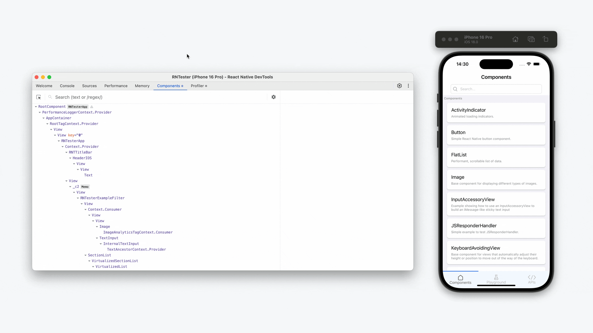

前端绕不过的一个话题就是性能优化，随着团队人员增加，需求开始没那么着急，笔者终于也踏上了这条漫漫长路～，性能优化是一个长期的过程，而这个过程中我理解最关键的其实是找到拖垮性能的原因，解决方案需要结合业务实践，理想的方案也许并不是最合适业务的，在实际优化过程中需要结合具体的情况，而非一股脑套公式
## 分析利器 🔬
C端通常在移动端设备，调试及分析不像web侧方便，可以借助chrome浏览器等工具，所以我们需要一些工具帮助我们找到拖垮性能的根因

### react-native-devTools<Badge type="tip" text="推荐" />

[react-native-devTools](https://reactnative.dev/docs/react-native-devtools)等于C端页面的chrome打开检查，可以有控制台，组件渲染element以及profile，看下官方推荐的打开方式[debugger](https://reactnative.dev/docs/debugging)，不过一般公司的app的native团队都有做一些工具，可以走工具入口，笔者公司主要是shake->远程调试即可（PS：ios），如果是安卓，需要进入设置，狂点logo，进入调试，在打开远程调试
<div style="display: flex; gap: 16px; flex-wrap: wrap;">
  
  
  

</div>

### why-did-you-render <Badge type="tip" text="好用" />
[why-did-you-render](https://github.com/welldone-software/why-did-you-render.git)

主要用于分析某些组件渲染的次数,使用demo如下，详细配置见[options](https://github.com/welldone-software/why-did-you-render?tab=readme-ov-file#options)
```js
import React from 'react';

// For react-native you might want to use 
// the __DEV__ flag instead of process.env.NODE_ENV === 'development'
if (process.env.NODE_ENV === 'development') {
  const whyDidYouRender = require('@welldone-software/why-did-you-render');
  const ReactRedux = require('react-redux');
  whyDidYouRender(React, {
    trackAllPureComponents: true, // 打印所有的组件
    trackExtraHooks: [
      [ReactRedux, 'useSelector']
    ]
    include:[/^ConnectFunction/]
  });
}
```
笔者公司有一些内部封装，可能各个公司也有，详细配置可以在业务实践中有的放矢

### Profiler
[Profiler](https://zh-hans.react.dev/reference/react/Profiler)在开发调试时个人觉得是非常好用的一个分析助手，可以帮助你了解哪块渲染耗时较大，方便快速找到拖垮性能的刺头组件，再做一些针对性分析

## 优化点
上面介绍了我们在性能分析中常见的一些工具，接下来我们细聊一下我们日常优化中可以发力的一些方向，笔者日常工作中理解，我们页面的渲染主要经历如下几个阶段

所以我们也就可以针对这几个阶段做一些优化事项

### 容器创建
这部分主要一般是native的同学去做一些优化，比如引擎复用等

### 预加载&预下载

- 预下载

    我们在app上访问某个页面通常app后台会从远端拉取这个页面，然后在打开，再渲染等等，预下载通常指你在访问B页面的前置页面先从远端拉取（只下载不解压），在访问B的时候能够减少拉取B页面的耗时，这部分主要针对的是页面有更新的情况下

- 预加载

    主要针对bundle[+bundle]加载阶段，访问页面时需要加载JSBundle代码，预加载主要优化的是这段耗时，一般公司都会提供一些api做一些bundle预热，举个🌰，我想访问B页面需要经过A页面，通常会在A页面做一下B的预热，让容器能够更快的加载B，从而B打开的更快，可以理解为相比下载多了一个解压运行的步骤


### 预请求


https://reactnative.dev/docs/performance


[+bundle]:bundle本文中可以理解为rn编写的页面打包构建后可运行单位