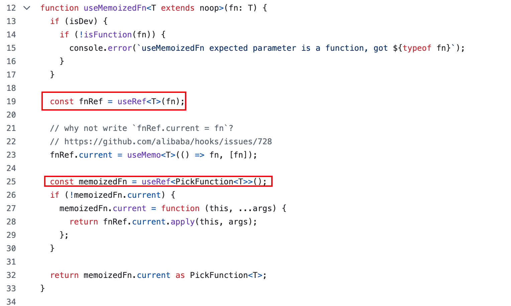
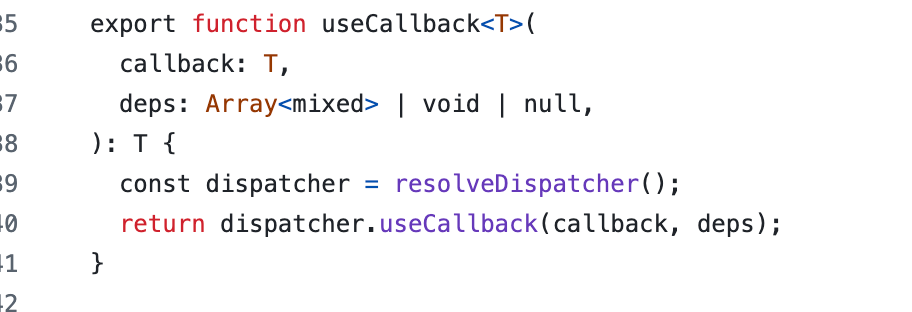

因为笔者最近在做代码优化，之前同事将仓库的useCallback换成了阿里的ahooks中的useMemorizedFn，导致了货架列表中每个选规格按钮的右上角标的选购数字在商品数量发生变化时不再更新数量
<!-- 关键这个bug同事上线后居然在线上存在了一个月，人麻了，这里小声吐槽下（略离谱，没有做好改动自测） -->

笔者也是在测其他需求的时候发现的，那线上问题肯定以修复bug为首要任务，此时还不知道什么引起的，排查后发现是因为同事将其中一个函数的useCallback换成了useMemorizedFn导致无法更新（其实数据是更新的）

这里补充一个线上问题的处理流程
1. 如果是刚上线或者灰度中，理解回滚
2. 如果是存量bug，赶紧修复
3. 写复盘

既然找到了表面的原因，那我们先看下useCallback和useMemorizedFn有什么不同，为什么一个可以，一个就不行了

### [useMemoizedFn](https://github.com/alibaba/hooks/blob/master/packages/hooks/src/useMemoizedFn/index.ts)




从代码中可以看到，useMemoizedFn创建了两个ref的持久化，第一个fnRef用来存储被包裹的函数，也就是我们传进来的函数，memoizedFn用来存储返回给用户实际使用的持久话的函数，可以看到一旦存储后，这个返回的函数实际就不回变了，但是他使用的这个fn，一直是外面传进来的这个，简单说就是它帮你包裹了你的函数，生成了一个地址一直不变的，从而你不需要管依赖及你的函数的变化，它帮你持久化了

从这个实现中我们就可以发现一些端倪，我们这个bug出现的原因，大概率就是因为这个函数不变化导致的，而useCallback没问题是因为，useCallback一旦你明确写了依赖，那就会创建新的函数，我们再回头看我们的存量老代码有啥魔力

我们的业务代码大概是这样的
```js
// ❌错误的原因就是因为将这里的useCallback换成了useMemoizedFn
const renderItem=useCallback((props)=>{
    return (
    <View>
        ...
        <Text>count</Text>
    </View>
    )

},[map])

render(){
    <SectionList
    ...
    renderItem={renderItem}
    />

}
```
从这个代码中我们就发现端倪，因为用useMemoizedFn包裹renderItem后，这个renderItem就会持久化不变了，那么renderItem也就不会变了，那这个count依赖这个map变化，map变了，这玩意也不会重新渲染，那这个sectionList也就不会展示新的count

那为什么useCallback可以，因为它依赖了map，每次用户加减购商品后，这个map会更新，那这个函数就会重新创建，那sectionList就会重新渲染，从而不会有问题，其实这里套不套useCallback都没啥用，因为其实每次都是要渲染新的组件，所以并不会优化上这个渲染次数

那我们看看[useCallback](https://github.com/facebook/react/blob/06e89951be5b4b23ca343d02721521fe392e94c5/packages/react/src/ReactHooks.js#L135)是怎么实现比对依赖做函数持久化的
