https://wproxy.org/whistle/

作为前端，日常本地开发联调或者线上排查问题，都需要查看网络请求，做一些数据mock，或者一些映射等等，尤其是一些移动端场景，比如h5等，本地开发工具，chrome调试缺乏一些功能，没有那么灵活，需要一些代理工具，篡改一些请求，配置等。

## 常规代理工具

### 名次解释
抓包：包指的是网络数据包，包括发送的请求和返回的数据，pc可以通过chrome，但是app抓包不太行
代理：中间角色，在本地调试时不需要经历鉴权，或者其他限制，直接代理请求的url请求，包括请求和返回

### http代理
代理是客户端和服务端之间的中转服务，工作原理如下：

不经过代理请求：客户端和服务端直接建立连接后，即可开始交换数据

经过代理请求：客户端不与服务端直接建立连接，而是先跟代理建立连接，将目标服务器的地址发送给代理，通过代理再和服务器建立连接，这里如果代理服务为http server，那么就是http代理

## 常见代理工具及其特点
| 工具名称   | 平台支持力度   | 是否免费 | 上手难度 | 文档           | 是否开源 | 主要特点            |
| ---------- | -------------- | -------- | -------- | -------------- | -------- | ------------------- |
| Whistle    | 是             | 是       | 易       | 开源、丰富     | 是       | 界面友好、插件丰富  |
| Charles    | 是             | 否       | 易       | 官方文档       | 否       | 功能强大、收费      |
| Fiddler    | 是             | 是       | 一般     | 官方文档       | 否       | 老牌工具、功能全面  |
| Proxyman   | 是（主打Mac）  | 否       | 易       | 官方文档       | 否       | 界面美观、易用      |


根据上面的对比，[whistle](https://github.com/avwo/whistle)对于我们来说是个优秀的选择，所以记录下其使用方法，以及一些常见的操作，和笔者日常的实践


## whistle介绍及使用方法
Whistle 是一个基于 Node.js 开发的功能强大、操作简单的跨平台抓包调试工具，支持多种代理模式（如 HTTP 代理、HTTPS 代理、Socks 代理、反向代理等），可用于抓包分析或通过配置规则修改 HTTP、HTTPS、HTTP/2、WebSocket、TCP 等请求。Whistle 还内置了 Weinre、Log、Composer 等工具，支持查看远程页面的 DOM 结构、查看页面 console 输出、重放编辑请求等。此外，Whistle 支持插件扩展，也可单独作为 NPM 包被其他项目引用。
> handlebook ：https://wproxy.org/whistle/

## 使用方式

### 安装及启动
```bash
$ npm install -g whistle
```
启动
```bash
w2 start
```
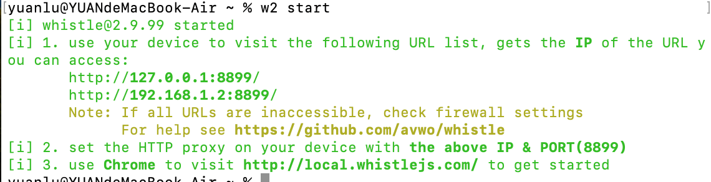

### 配置代理
1. 全局代理，这种就是本机发出的所有请求都走代理，通过命令 w2 proxy或者手动配置
Mac: System Preferences > Network > Advanced > Proxies > HTTP or HTTPS
 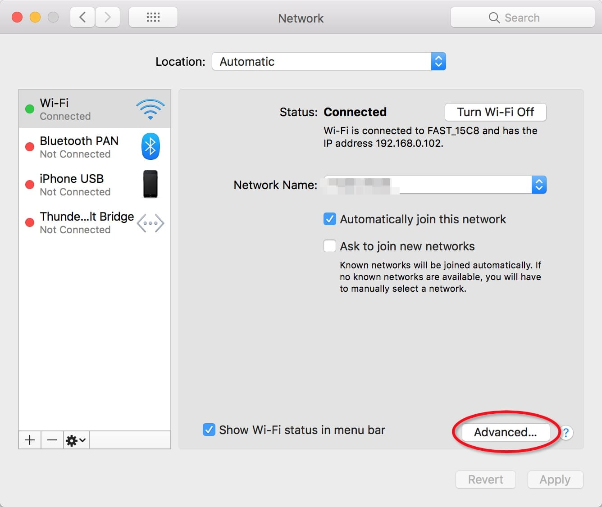

2. 浏览器代理，安装浏览器代理插件

安装Chrome代理插件：推荐安装SwitchyOmega
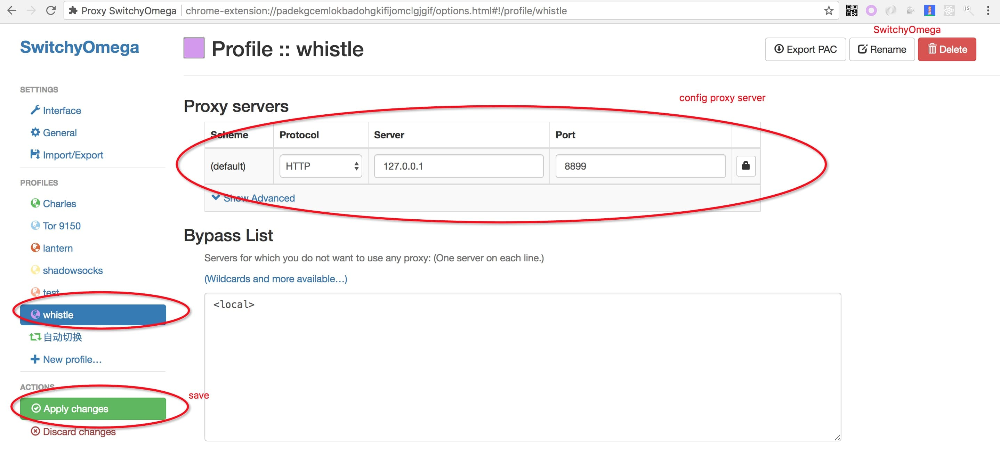

 Firefox: 地址栏输入访问 about:preferences，找到 Network Proxy，选择 手动代理配置(Manual proxy configuration)，输入代理服务器地址、端口，保存

 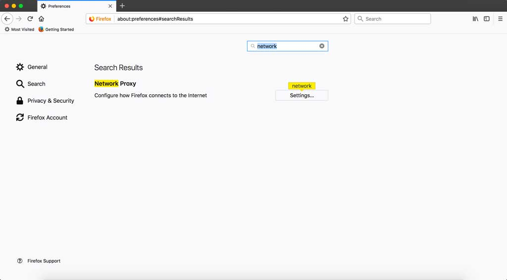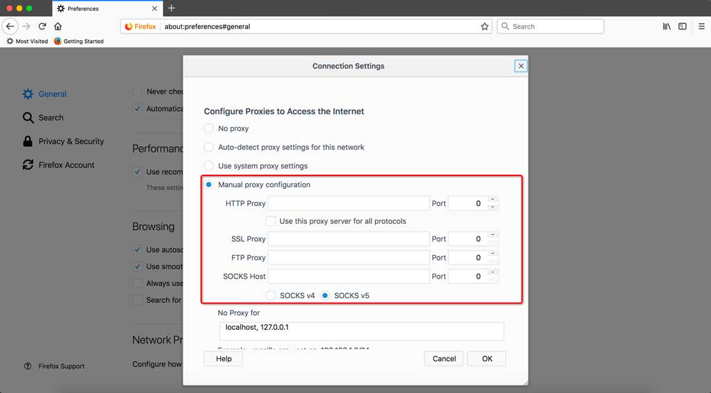

 3. 移动端代理
 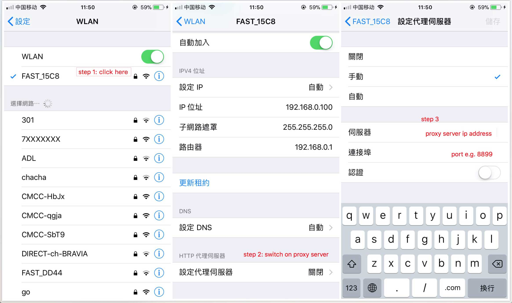

 安装证书
安装本机默认 Whistle 实例的证书：
```bash
w2 ca
```

随后即可看到对应的抓包信息了
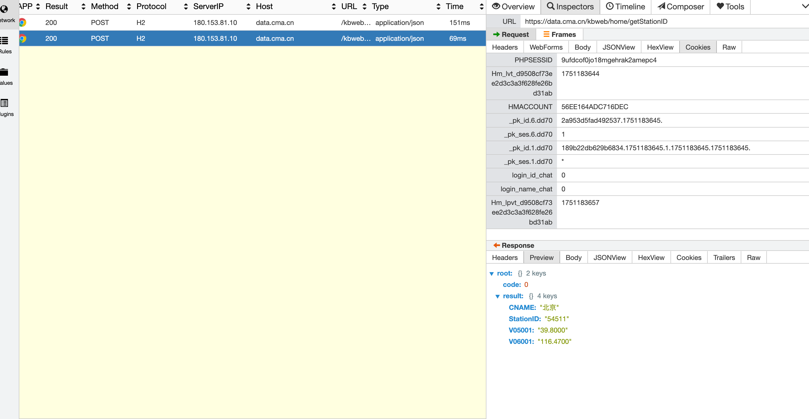

 特别说明，因为ios模拟器无法扫码，所以模拟器的安装方式如下
 
 设置全局代理后，safari地址栏输入rootca.pro，按照提示安装证书（ios安装根证书需要连接远程服务器进行验证，需要暂时把https拦截功能关掉

 Settings->General->Device Management->安装刚刚下载的证书

 手动信任自定义根证书，设置路径：setting->general->About->>certificate trust testings

 真机可以通过扫码安装证书
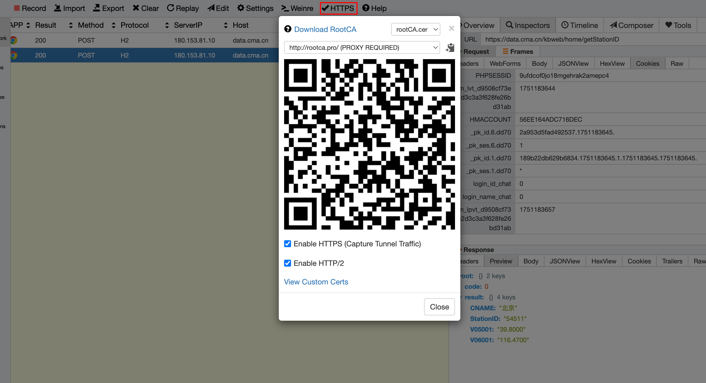

## 配置与匹配
whistle操作均可通过配置实现，配置方式扩展于系统hosts配置方式，有丰富的匹配模式及更灵活的配置方式
## [配置方式](https://wproxy.org/whistle/mode.html)
whistle将请求url与pattern匹配，如果婆培到就执行operatorURL对应的操作
```bash
pattern ooperatorURI
```
## [匹配规则](https://wproxy.org/whistle/principle.html)
whistle的匹配模式大体可以分为域名、路径、正则、精确匹配、通配符匹配,更多的可以查看whistle的handbook介绍
```bash
www.test.com 127.0.0.1:9999
 www.test.com/xxx 127.0.0.1:8080
```

## 常用功能
**1. host转发**
相当于浏览器的host文件，如果找不到再去查找本机的host文件，whistle除了传统的host配置，还支持子路径和端口的host转发配置，配置方式：Rules->create->host
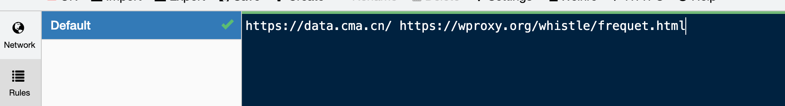
```bash
https://data.cma.cn/ https://wproxy.org/whistle/frequet.html 域名映射

https://data.cma.cn/ https://wproxy.org/whistle/frequet.html:8080 端口映射

https://data.cma.cn/api https://wproxy.org/whistle/frequet.html:8080 路径匹配

```

**2.本地替换**

把响应内容替换为本地文件内容
```bash
data.cma.cn/kbweb/home/getStationID file:///Users/yuanlu/workspace/waterHome/yuzhou-site/docs/practice/test/test.json
```
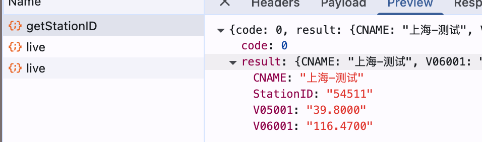

**3.修改请求和返回**

```bash
data.cma.cn/kbweb/home/getStationID resBody://{test.json}
```
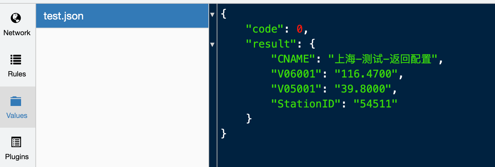
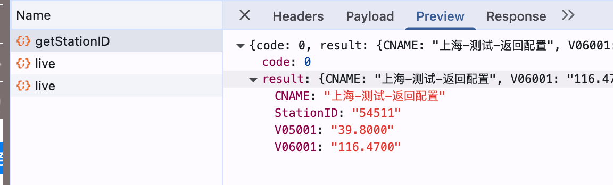

**4. js注入**
```bash
https://data.cma.cn/ jsAppend:///Users/yuanlu/workspace/waterHome/yuzhou-site/docs/practice/test/jsAppend.js
```
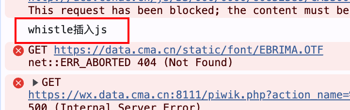

## 插件
### whistle inspect
用于往页面中插入vconsole.可以看到一些调试的console信息
### whistle.script
script.js 是你本地的 JS 文件，里面可以写自定义逻辑。
```bash
data.cma.cn whistle.script://path/to/your/script.js
```
```js
// script.js
if (req.url.includes('/api/test')) {
  res.body = JSON.stringify({ msg: 'mock data' });
}
```


## 利用whistle查看页面日志

利用whistle注入vconsole等h5调试插件

1. 手机安装whistle的证书，然后信任即可，即可在whistle中抓到手机访问的请求


2. 手机扫码安装证书，在浏览器中输入rootca
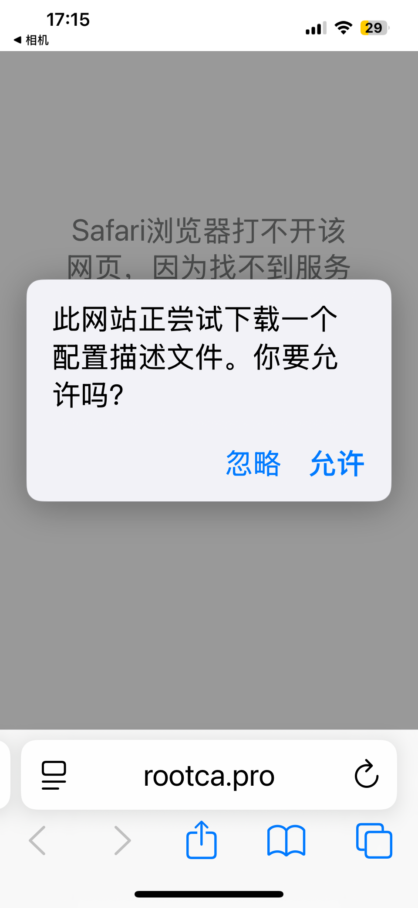

3. 在手机（ios）设置->关于手机->证书信任设置->信任whistle的证书
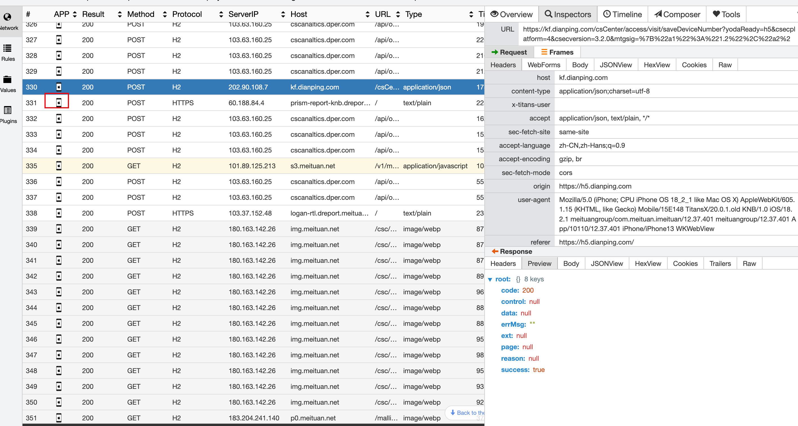


## 总结
除了本文的代理调试，还有云真机，安卓真机插线调试，不插线调试，全链路mock测试等等

实际工作中需要结合实际，搭配使用
