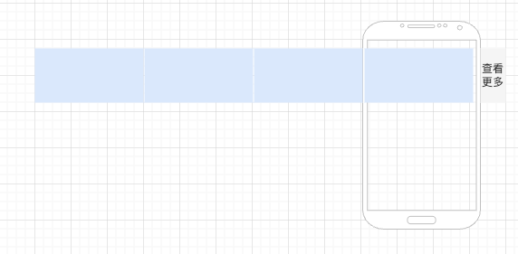
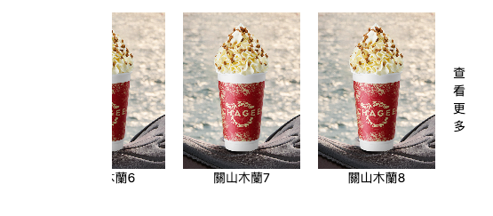

本文demo代码见[codesandbox](https://codesandbox.io/p/sandbox/react-native-flat-list-x7jbh?file=%2Fsrc%2FApp.js%3A17%2C12)

很多业务中会有这样一种交互,可以横向滑动，滑动到最右侧后，打开更多，也就是跳转到另一个页面




笔者近期也有这样一个实践，借此机会记录下

首先我们看下这个交互有几个点
1. 需要横滑，另外通常这种货架上都会存在多个列表，这部分横滑模块可能是整个列表的子模块，这样的情况下需要考虑内外滚动的互斥
2. 该模块最右边存在一个隐藏模块，拉到一定阈值，可能会存在一些icon的变换，此后打开另一个页面之类的交互

笔者在做这类交互的时候选择的是[FlatList](https://reactnative.dev/docs/flatlist)，首先因为它本身是一个滚动列表，支持header和footer部分的组件，相对比较灵活，另外有一些组件自带额事件，可以搭配触发一些交互，所以相对从头写一个会便捷且方便的多，不过这里要说的一点是，因为我们这里其实不存在列表很长，所以相对没有用到高性能这个特性，所以其实也可以纯手写


## 事件和属性
我们先了解下这次我们用到的几个事件和属性
1. <strong>data</strong>
该属性即我们需要渲染的数据list了，比如DATA这样，我们需要一个数组形式的数据格式
```js
const DATA = [
  { id: 1, title: "1 Item" },
  { id: 2, title: "2 Item" },
  { id: 3, title: "3 Item" },
  { id: 4, title: "4 Item" },
  { id: 5, title: "5 Item" },
  { id: 6, title: "6 Item" },
  { id: 7, title: "7 Item" }
];
```
2. <strong>renderItem</strong>
```js
renderItem({
  item: ItemT,
  index: number,
  separators: {
    highlight: () => void;
    unhighlight: () => void;
    updateProps: (select: 'leading' | 'trailing', newProps: any) => void;
  }
}): JSX.Element;
```
可以看到这个属性即我们渲染的每个子元素，可以理解为图示中的每个商品项

3. <strong>ListFooterComponent</strong>

我们从图示中看到的查看更多，即是通过FlatList的该属性添加

4. <strong>keyExtractor</strong>
通常为了子项的性能，我们可以使用keyExtractor，通常使用每个item的唯一值，比如id等
```js
(item: ItemT, index: number) => string;
```
5. <strong>onScroll</strong>
滚动时候的函数，因为我们这种横滑模块通常嵌套在更大的列表中，所以我们需要做一些互斥逻辑，该模块滚动的时候可以在onScroll中做一些交互限制
> tip：因为flatList本身也是封装自scrollView，所以onScroll属于scrollView的属性，同理onScrollEndDrag等


## 初步实现这个滚动列表
```js
const DATA = [
  { id: 1, title: "關山木蘭1" ,img:'https://chagee.com.hk/_next/image?url=https%3A%2F%2Fprod-oss.chagee.com.hk%2Fweb%2Fuploads%2F20240829%2F2c3a7cd6-1661-45e4-a44f-12a5f650f9cd.jpg&w=828&q=100'},
  { id: 2, title: "關山木蘭2",img:'https://chagee.com.hk/_next/image?url=https%3A%2F%2Fprod-oss.chagee.com.hk%2Fweb%2Fuploads%2F20240829%2F2c3a7cd6-1661-45e4-a44f-12a5f650f9cd.jpg&w=828&q=100' },
  { id: 3, title: "關山木蘭3",img:'https://chagee.com.hk/_next/image?url=https%3A%2F%2Fprod-oss.chagee.com.hk%2Fweb%2Fuploads%2F20240829%2F2c3a7cd6-1661-45e4-a44f-12a5f650f9cd.jpg&w=828&q=100' },
  { id: 4, title: "關山木蘭5" ,img:'https://chagee.com.hk/_next/image?url=https%3A%2F%2Fprod-oss.chagee.com.hk%2Fweb%2Fuploads%2F20240829%2F2c3a7cd6-1661-45e4-a44f-12a5f650f9cd.jpg&w=828&q=100'},
  { id: 5, title: "關山木蘭6",img:'https://chagee.com.hk/_next/image?url=https%3A%2F%2Fprod-oss.chagee.com.hk%2Fweb%2Fuploads%2F20240829%2F2c3a7cd6-1661-45e4-a44f-12a5f650f9cd.jpg&w=828&q=100' },
  { id: 6, title: "關山木蘭7",img:'https://chagee.com.hk/_next/image?url=https%3A%2F%2Fprod-oss.chagee.com.hk%2Fweb%2Fuploads%2F20240829%2F2c3a7cd6-1661-45e4-a44f-12a5f650f9cd.jpg&w=828&q=100' },
  { id: 7, title: "關山木蘭8",img:'https://chagee.com.hk/_next/image?url=https%3A%2F%2Fprod-oss.chagee.com.hk%2Fweb%2Fuploads%2F20240829%2F2c3a7cd6-1661-45e4-a44f-12a5f650f9cd.jpg&w=828&q=100' }
];

const renderItem = ({idx,item}) => (
  <View style={styles.box}>
     <Image
      source={{uri:item.img}}
      style={{width: 132, height: 176}}
    />
    <Text >{item.title}</Text>
   
  </View>
);

const footComponent=()=>{
  return <View style={{height:'100%',}}>
    <Text style={styles.boxtext}>查看更多</Text>
  </View>
}

const onScroll=()=>{}

function App() {
  return (
    <View style={styles.app}>
      <FlatList
        data={DATA}
        renderItem={renderItem}
        keyExtractor={(item) => item.id}
        horizontal
        ListFooterComponent={footComponent}
        onScroll={onScroll}
      />
     
    </View>
  );
}
```
如下图，我们基本的设置



## 监听滚动，计算滚动距离
```js

```

## 交互动作处理
```js
const [isMoveOut,setMoveOut]=useState(false)
// 因为安卓手机不像ios有天然的弹性效果，所以我们需要自己手动处理下这个回弹效果
const onMonentumScrollEnd=(event:any)=>{
    // 安卓区Footer内容区宽度包含图标和文字
    // 文本 marginLeft+文本宽度+图标marginLeft+图标宽度+图标marginRight
    const androidFooterWidth=70
    /**
     * layoutMeasurement.width容器显示在页面上的宽度
     * contentOffset.x当前已滚动的距离
     * contentSize.width 内容宽度
     */

    const {layoutMeasurement,contentOffset,contentSize}=e.nativeEvent
    // 超出滚动的距离,因为我们一开始是不希望footer区域漏出来的，所以在算可滚动的时候要把它减去
    const overflowDistance=contentOffset.x+layoutMeasurement.width-(contentSize.width-androidFootWidth)
    if(overflowDistance>=0){
        listRef.current.scrollToOffset({
            offset:contentOffset.x-overflowDistance,
            animated:true
            
        })
        if(isMoveOut){
            console.log('可以跳转了')
        }
    }
}

const handleScroll=(e)=>{

    // 安卓侧，判断isMoveOut的临界情况时，Footer还剩未显示的宽度
    // 宽度为 图标 15px+图标 marginRight 18px
    const DRAG_AREA_RIGHT_WIDTH=18+15
    // IOS 侧，判断isMoveOut的临界情况时，Footer已经显示的宽度
    // 宽度为文本 marginLeft+文本+图标marginRight
    const DRAG_AREA_LEFT_WIDTH=18+10+9
    
    changeScroll(true) // 一般为内外滚动切换，如果需要的话
    const {layoutMeasurement,contentOffset,contentSize}=e.nativeEvent
    // contentSize，整个列表的宽度，安卓侧这个值还算上了Footer内容区的宽度
    //所以对于安卓侧的临界宽度要减去DRAG_AREA_RIGHT_WIDTH
    // 对于ios的临界宽度要加上DRAG_AREA_LEFT_WIDTH
    const trueContentSize=contentSize.width+IS_IOS?DRAG_AREA_LEFT_WIDTH:-DRAG_AREA_RIGHT_WIDTH
    // layoutMeasurement.width表示当前显示出来的列表末尾到列表开头的距离
    const contentOffsetXWidthLayoutMeasurement=contentOffset.x+layoutMeasurement.width
    if(trueContentSize-contentOffsetXWidthLayoutMeasurement){
        setMoveOut(true)
    }else{
        setMoveOut(false)
    }
}


// ios结束的
// 因为ios存在一些惯性的滚动，有一些边界case，比如用户滚动到边界case，手指停下来了，没有滚动阈值，但是惯性滚动过了阈值，所以需要处理，通过onMomentumScrollEnd这个事件可以判断惯性滚动结束

```

## 滚动句柄切换
正如开头说的，很多时候都是多个滚动模块嵌套的，大多数滚动手势都有重合，所以我们通常在滚动的时候需要增加切换的逻辑
1. onScrollEndDrag&onScrollBeginDrag
onScrollBeginDrag表示用户用手指开始拖动列表时，onScrollBeginDrag会被触发

触发时机：用户用手指按住列表并开始滚动时，刚开始滑动的那一刻会触发，如果只是点击但没有滚动，则不会触发，惯性滚动（手指离开后自动滑动）不回触发，相应的用户手指离开滚动的时候会触发onScrollEndDrag，注意这里如果还有惯性滚动，滚动结束触发的则是onMomentumScrollEnd

2. onTouchStart&onTouchEnd

onTouchStart只要用户手指按在元素上，无论是否滚动都会触发，触发开始的标识和滚动无关

3. 补充一个点关于点击和touch相关的冲突
因为一般字元素也会有一些点击事件和flatList的onTouch可能存在一些冲突，所以我们可以在renderItem上添加```pointerEvent="box-none"```