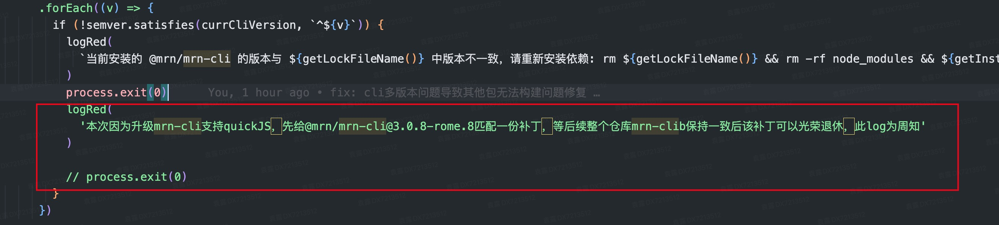
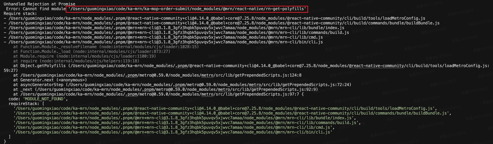

本周我们仓库在做一个quickJS引擎的应用，需要升级基建cli，发现了几个问题，所以那就梳理下吧～

先说下问题
1. 当前仓库的monorepo结构下无法单包升级cli，会提示存在多版本共存问题，导致无法构建
2. 其中试点子包会出现依赖的msi版本冗余打包问题
3. msi幽灵依赖问题

我们的仓库之前做过一次monorepo的基建改造，部分包做了子包安装，有些又在根目录锁包，因为有些是迁移的整体依赖管理不是非常好

针对这几个问题做了下排查

先说第一个问题，无法单包升级cli，因为属于基建升级，所以是期望先在其中某些子包做试点，选择的这个子包，我们发现升级这个子包A的cli到3.1.9后，不仅这个子包A不能构建了，monorepo下其他子包无法构建了，排查发现因为这个项目下其实因为之前的升级和一些历史遗留问题，再加上我们这次又引入了一个版本，整个项目下存在多个cli版本，在cli中有个卡控,如下图所示



在多版本不匹配的情况下，会直接```process.exit(0)```,而不会接下去执行，看了下后面的执行流程，多版本对构建本身不存在影响，所以先对cli进行patch，将该部分的代码注释掉，并且添加一行打印，等所有子包升级后就不会存在多版本，自然也就不需要patch了

其实这里还存在一个问题，因为我们之前从3.0.4-7升级到3.0.8-rome.8并不需要给3.0.8-rome.8打patch，为什么这次需要呢，其实还是从上面截图中看，这里匹配用的是```semver.satisfies，这个函数对于小版本中的升级其实是不影响的，但是因为我们这里直接升级了中版本号，所以会走进这个if条件，从而命中卡控

问题2，msi的冗余打包

当前的cli工具中对于monorepo的支持不是很好，它无法寻找根目录的依赖，因为cli需要寻找rn依赖，我们这次的试点子包没有在子包的 ```package.json```中直接依赖，实际用的算是幽灵依赖，用了根目录的rn


所以为了解决这个问题，和基建侧沟通，他们暂不修改，只能我们自己先解决，看了下只能我们在子包中安装rn

此时就引出了我们这个问题，构建后在sourcemap中发现msi出现了冗余打包，那这个是什么原因呢，我们发现有两个msi，其中一个是1.15.0一个是1.56.2-beta.0，看了这两个依赖的依赖发现他们的peerDev中有rn，而我们仓库中没有锁定msi的版本，所以会引入两个冗余包，分别是```@mtfe+msi@1.15.0_@mrn+react-native@3.0.21，@mtfe+msi@1.56.2-beta.0_@mrn+react-native@3.0.21```

第三个问题，msi的幽灵依赖

我们发现因为我们另一个子包B，它根本不直接依赖msi，但是也安装了1.56.2-beta.0这个版本，看了下之前的版本都是1.15.0，所以怀疑是用了兄弟包的幽灵依赖，测试了下将兄弟的包改为1.57.2-beta.0，B的构建中也变成了1.57.2-beta.0，那我们该怎么解决呢，其实他之前可能存在一些依赖的依赖是1.15.0,所以考虑直接在其```package.json```中显式声明这个1.15.0版本，这样他就不会用兄弟的幽灵依赖


其他思考🤔

我翻了下这个子包B的构建，发现从2024年底到2025.7这个包逐渐增大了100KB+，其实在隐形中包一直在变大，而这其实会影响页面的性能，所以业务开发中需要每次关注构建包的体积问题

基建的升级存在一些中间态，比如这次先尝试一个子包，那就会存在一些尴尬期，和理想态不符合的情况，比如cli存在多版本，依赖存在一些冗余等等，之前升级也遗留了一些没有做完的事情，比如之前的patch最后并没有完全清理掉等等，个人觉得，中间态必然存在，但是需要记得后续让他成为理想态，不然就会存在一个混乱💥的仓库，和永远的阵痛，这也不敢改，那也不敢改

其实这里面还存在一个问题，公司的一些基建考虑不是很完善，比如他们没有考虑到monorepo的场景，有些依赖其实我们确实可以在根目录去锁包，2而不需要每个子包安装的情况，还有msi这种无法tree-shaking的尴尬设计，随着版本的升级，这玩意体积一直在膨胀，真是忍不住喷啊～，所以基建团队也需要去思考，怎么给业务使用时是一个平和的使用，去真的接触业务的各种组织形式，或者给业务一些最佳实践的组织形式