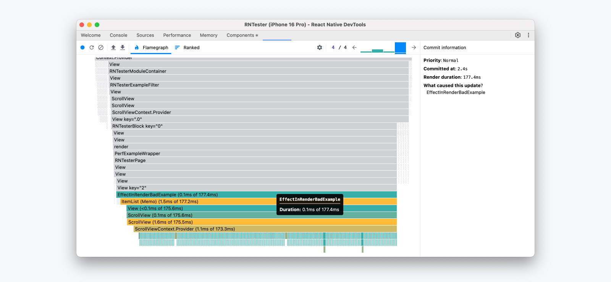

前端绕不过的一个话题就是性能优化，随着团队人员增加，需求开始没那么着急，笔者终于也踏上了这条漫漫长路～，性能优化是一个长期的过程，而这个过程中我理解最关键的其实是找到拖垮性能的原因，解决方案需要结合业务实践，理想的方案也许并不是最合适业务的，在实际优化过程中需要结合具体的情况，而非一股脑套公式
## 分析利器 🔬
C端通常在移动端设备，调试及分析不像web侧方便，可以借助chrome浏览器等工具，所以我们需要一些工具帮助我们找到拖垮性能的根因

### react-native-devTools<Badge type="tip" text="推荐" />

[react-native-devTools](https://reactnative.dev/docs/react-native-devtools)等于C端页面的chrome打开检查，可以有控制台，组件渲染element以及profile，看下官方推荐的打开方式[debugger](https://reactnative.dev/docs/debugging)，不过一般公司的app的native团队都有做一些工具，可以走工具入口，笔者公司主要是shake->远程调试即可（PS：ios），如果是安卓，需要进入设置，狂点logo，进入调试，在打开远程调试
<div style="display: flex; gap: 16px; flex-wrap: wrap;">
<!-- 这个img没了，先注释掉了 -->
  <!--  -->
  
  

</div>

### why-did-you-render <Badge type="tip" text="好用" />
[why-did-you-render](https://github.com/welldone-software/why-did-you-render.git)

主要用于分析某些组件渲染的次数,使用demo如下，详细配置见[options](https://github.com/welldone-software/why-did-you-render?tab=readme-ov-file#options)
```js
import React from 'react';

// For react-native you might want to use 
// the __DEV__ flag instead of process.env.NODE_ENV === 'development'
if (process.env.NODE_ENV === 'development') {
  const whyDidYouRender = require('@welldone-software/why-did-you-render');
  const ReactRedux = require('react-redux');
  whyDidYouRender(React, {
    trackAllPureComponents: true, // 打印所有的组件
    trackExtraHooks: [
      [ReactRedux, 'useSelector']
    ]
    include:[/^ConnectFunction/]
  });
}
```
笔者公司有一些内部封装，可能各个公司也有，详细配置可以在业务实践中有的放矢

### Profiler
[Profiler](https://zh-hans.react.dev/reference/react/Profiler)在开发调试时个人觉得是非常好用的一个分析助手，可以帮助你了解哪块渲染耗时较大，方便快速找到拖垮性能的刺头组件，再做一些针对性分析

## 优化点
上面介绍了我们在性能分析中常见的一些工具，接下来我们细聊一下我们日常优化中可以发力的一些方向，笔者日常工作中理解，我们页面的渲染主要经历如下几个阶段


所以我们也就可以针对这几个阶段做一些优化事项

### 容器创建
这部分主要一般是native的同学去做一些优化，比如引擎复用等

### 预加载&预下载

- 预下载

    我们在app上访问某个页面通常app后台会从远端拉取这个页面，然后在打开，再渲染等等，预下载通常指你在访问B页面的前置页面先从远端拉取（只下载不解压），在访问B的时候能够减少拉取B页面的耗时，这部分主要针对的是页面有更新的情况下

- 预加载

    主要针对bundle[+bundle]加载阶段，访问页面时需要加载JSBundle代码，预加载主要优化的是这段耗时，一般公司都会提供一些api做一些bundle预热，举个🌰，我想访问B页面需要经过A页面，通常会在A页面做一下B的预热，让容器能够更快的加载B，从而B打开的更快，可以理解为相比下载多了一个解压运行的步骤


### 预请求

预请求大体意思是提前请求页面接口，一般我们会对页面主要接口做预请求，，关于接口这部分，一般主要靠后端大哥们努力，争取快点返回，另外我们通常会做一些接口聚合，尽量首屏相关数据一个接口就能返回，后续的接口可以在相关交互动作时再去请求，关于如何做预请求，C端一般都由native提供相关的接入方案。笔者公司的方法大致是需要增加一些配置文件，在发出请求时会匹配参数，如果完全命中会提前发请求。

### 包体积优化
因为之前对RN的构建了解不多，在做性能优化时认为RN和webpack一样有相关的treeShaking机制，后来根据打包的产物分析发现有些实际没有使用的也会被打包进bundle,查阅资料发现目前只支持基础dead code清理,所以在代码中需要对没有使用的包进行清理，还有一个点就是包中方法的引用需要优化
举个🌰
```js
// 这种写法会将整个lodash打包进来
import {isEqual} from 'lodash'
// 按需引入
import isEqual from 'lodash/isEqual'

// 以及一些自定义包，尽量按需

```
如果还有其他需要，也可以搭配babel使用，但是个人理解可能都要基建团队的一些支持，笔者实践中就有用到，需要自行配置一个shaking的config文件，在`babel.config.js`文件中

### 渲染优化

通常前端渲染是影响性能的关键因素，我们做功较多的业主要集中在这个部分，下面列出我在性能治理中遇到的比较典型的几种问题


#### 懒加载
懒加载通常用于列表渲染，当列表量大，首屏不会完全展示时，此时我们可以对于首屏之外的资源做懒加载，比如大的图片，列表item项，对于长列表声名远播的就是FlatList，各司可能也会在其上继续封装很多针对性的优化,如果是比较小的数据，其实一般scrollView也能行，笔者之前有简单的写过一个滚动加载，应对的场景是数量还没大到上FlatList，但是有些又不在首屏，可以暂时不渲染
```js
const handleScroll=(e)=>{
    const {layoutMeasurement,contentOffset,contentSize}=e.nativeEvent
    if(layoutMeasurement&&contentOffset&&contentSize){
        if(layoutMeasyrement?.height+contentOffset?.y>=contentSize?.height-20){
            setVisible(pre=>pre+1) // 每次多加载一个
        }
    }else{
        setVisibleItems(20) // 一些兜底
    }
}
```
上述这个方式主要是让用户滚动的时候去加载更多，这样再初始的时候可以只显示首屏渲染的个数


#### 冗余render
冗余渲染一般主要是我们的编码中有些不优雅写法导致，笔者实际遇到的有如下几种情况

1. <strong>传递子组件的数据特别大，或者store中的数据特别大</strong>

```js
class Store{
    shelfData:null
    constructor(){}
}

...
// 此处的Child组件是在monorepo中的组件库中的组件，另外老仓库使用的redux
return <>
    <Child shelData={store.shelData}/>
</>

```
比如上面这个示例，用户将整个货架的数据都塞到store中，然后通过props传递给子组件，这种只要store中有变化，整个Child组件都会导致重复渲染，即使Child组件用memo包裹，也没有很好的解决。

这种比较好的建议是，尽量对store的数据简化，比如我们的货架接口中会返回门店的信息ShopInfo对象，另一个专门查门店信息的接口也会返回，那我们只需要存储一份，避免冗余数据存储，另一方面store中的数据结构也需要设计好，方便取数和赋值

如果我们将整个store共享给所有组件，比较好的做法一种是可以将其挂载到context上共享，也可以作为类组件实例传递，但是要保证其为单例，这样引用是稳定的，一般实践中，我们可以通过`useRef`包裹一层也可以
```js
const store=useStore()
```
``` js
// 单例传递
// store.js
import { makeAutoObservable } from "mobx";

class CounterStore {
  count = 0;
  constructor() {
    makeAutoObservable(this);
  }
  increment() {
    this.count++;
  }
}

export const counterStore = new CounterStore();

// Counter.jsx
import React from "react";
import { observer } from "mobx-react-lite";

const Counter = observer(({ store }) => (
  <div>
    <p>Count: {store.count}</p>
    <button onClick={() => store.increment()}>+1</button>
  </div>
));

export default Counter;


// App.jsx
import React from "react";
import { counterStore } from "./store";
import Counter from "./Counter";

export default function App() {
  return <Counter store={counterStore} />;
}
```


#### 非首屏组件优化
一般我们页面中会挂载很多元素，有些元素是在首屏进入就展示，有些是通过某些交互触发，我们可以减少首屏元素的渲染及加载，一个例子就是上述的懒加载的例子，我们有20个元素，但是首屏实际只展示3个，那后续的17个可以先不渲染，另一种是整个组件，都不是首屏元素或者是某种特定条件才需要，那我们可以通过懒加载，也就是这块JS代码都不会在首屏加载
::: tip
   懒加载用于代码分割，让组件的代码在真正需要渲染的时候才异步加载（按需加载JS资源）
   条件渲染：决定组件是否渲染到页面上
   配置了懒加载的组件，只有在条件渲染为true的时候才会进行懒加载，如果没有配置懒加载相关的方式，那组件的JS代码依然会打包进主bundle并在页面初次加载时就加载
   :::
```js
const LazyComp = React.lazy(() => import('./LazyComp'));

function App({ show }) {
  return (
    <div>
      {show && (
        <React.Suspense fallback={<div>Loading...</div>}>
          <LazyComp />
        </React.Suspense>
      )}
    </div>
  );
}
```

#### 桥调用
桥在rn下是经常要用到的，因为我们很多时候需要native层面的支持，桥的使用通常是通信的瓶颈，过程涉及线程切换，消息队列等，笔者实践中，大部份都使用了异步桥，除了少部分涉及到首屏不得不请求的数据用了同步桥，此处总结了下
::: flex center

| 桥     |  使用场景 |         列 3 |
| ---- | -------------- | ---- |
| 同步    | 一般用于必须获得的数据，比如环境变量等，首屏渲染所需要的关键信息，调用频率低，数据量小，调用快，不能阻塞JS线程    | 3    |
| 异步    | 绝大多数场景，如网络请求，设备信息获取等，不需要立即返回结果的场景，比如上面缓存的几个操作，实际可以使用异步桥    | 6    |

:::

另外部分常用的桥可以缓存下来，举个🌰，比如获取屏幕信息，因为该类信息在使用过程中基本不太会变化，所以我们获取一次，后续就不用每次都通过桥获取
```js
let screenInfo:{width:number,height:number}|null=null
const getScreenInfo=()=>{
    // 如果没有才获取
    if(!screenInfo){
        screenInfo=getScreenSize()
    }
    return screenInfo
}
```


#### 部分数据缓存
这种方法一般用于页面不太变化的数据，这样可以在下次进入时候，先用缓存内容快速渲染出页面的一部份，等待接口数据再重新刷新页面，视觉上页面有直出效果，使用缓存的时候一般会有几个注意点
1. 比如一些用户购买商品的信息，匹配的优惠券等信息不做缓存，因为这类数据时效性很强，避免缓存数据造成用户数据错乱
2. 商品的信息缓存需要谨慎，可能存在一些商品失效，优惠匹配失败等问题，造成一些边界错误，生产环境中造成不必要的客诉等问题
3. 做好清除动作，避免缓存过多，缓存信息时差太长等问题

总之，生产环境需要考虑一些边界case，失效问题等真实的使用问题，避免为了性能造成没必要的客诉
```js
import {setStorage,cleanStorage,getStorage} from 'xxx' // 公司内部提供的一些桥方法

const setStorageInfo=(id,data)=>{   
    try{
        // 假设返回的是所有缓存的信息
        const storageInfo=getStorage()
        // 避免缓存过多，存5条数据左右通过替换的方式存储最新的
        if(storageInfo.length>5){
            // 获取最早的key
            const earliesKey=storageInfo?.[0]
            clearCache(earliesKey) // 清除最早存储的key
        }   
        // 每次都用id的最新的数据更新store
        setStorage({key:id,data:{...data,cacheTime:new Date().getTime()}}).then(res=>{}).catch(e=>{})
    }catch(e){
        // 避免报错，导致页面白屏
    }
}

const getCache=(key:string):Promise<CacheData|null>=>{ 
    let cacheData:CacheData=null
    try{
        cacheData=await getStorage({key}) as CacheData
        const hourDiff=(currentTime-cacheData.cacheTime)/(1000*60*60)
        // 笔者这边是超过48小时就清除
        if(hoursDiff>48){
            await clearCache({key})
            console.log('缓存已过期')
            return null
        }
    }catche(e){
        return null
    }
    return cacheData
}

const clearCache=(key:string)=>{
   clearStorage({key}).then(()=>{
    console.log('清除成功')
   }).catch(e=>{
    console.log('清除失败')
   })
}

```


#### 代码优化 

<strong> 遍历次数优化 </strong>

记述一次CR中的同事建议，有个场景,大概是如下一个数据format的功能
```js
const List=userSelectedInfo.attrList.map(item=>{
    return item.itemList.filter(e=>e.count).map(eachItem=>{
        return {
            title:eachItem.title
            ...
        }
    })
})

// map，filter都会做遍历，我们可以优化下上面的代码
const List=[]
userSelectList.attrList.forEach(item=>{
    item.itemList.forEach(each=>{
        if(each.count){
            List.push({
                title:each.title
                ...
            })
        }
    })
   
})
```

<strong> style UI 优化 </strong>
1. 推荐写法

将style写到对应的style文件中,通过createStyleSheet创建style文件，因为RN的createStyle会通过一些对应的key值保证style的引用不变，从而减少样式对象的创建，静态样式，推荐这样写，内存更低，性能更优

```js 
<!-- 推荐写法 -->
<View style={styles.text}></View>

<!-- memo包裹计算 -->
const width=useMemo(()=>{
    return getScreenInfo().width-12
},[])
```
- 不推荐写法

这种写法会导致每次render时候会创建新的style对象，有一定性能损耗
```js
<View style={{height:12}}></View>
```


<strong>函数传递</strong>

推荐通过useCallback包裹，减少子组件的rerender，尤其是子组件整体内容比较多的情况下
```js
import React, { useState, useCallback } from "react";

// 子组件
function Child({ onClick }) {
  console.log("Child render");
  return <button onClick={onClick}>点击</button>;
}

// 父组件
function Parent() {
  const [count, setCount] = useState(0);

  // 用 useCallback 包裹，避免每次渲染都生成新函数
  const handleClick = useCallback(() => {
    setCount(c => c + 1);
  }, []);

  return (
    <div>
      <p>Count: {count}</p>
      <Child onClick={handleClick} />
    </div>
  );
}

export default Parent;
```
另外关于父子变量存放，笔者的建议是尽量让组件函数和状态维护在子组件内部，减少传递，因为即使我们用memo包裹组件，实际业务中我们传递参数整体也是比较大的和复杂的，体感上memo减少的不多，另外对于渲染较为复杂，比如轮播条之类的，可以单独拆分子组件，因为写在一个组件中会导致整个组件重新渲染
有兴趣的话可以尝试下这个[playground](https://codesandbox.io/p/sandbox/lively-cookies-953rxx?file=%2Fsrc%2FApp.js)

传递值方面的一些小建议✅
::: flex center

| 值类型         | 特征                   | 举例         | 建议         |
| -------------- | ---------------------- | ------------ | ------------ |
| 编译时常量     | 启动时就确定，且不会改变 | process.env   | 直接获取  做缓存       |
| 运行时变量     | 可能随时间比那话，来自hooks，状态管理,用户交互等   | `const width=getScreenSize().width` | useMemo     |
| 计算值         | 由其他值计算得出，依赖的值可能发生变化         | `const show=invalid&&visible`     | useMemo     |

:::


该文章内容为笔者在工作中一些实验小结，仅供参考和互相学习，后续也会及时补充，毕竟性能优化是前端绕不过去的一个重要课题


[+bundle]:bundle本文中可以理解为rn编写的页面打包构建后可运行单位

## 参考的文档
https://reactnative.dev/docs/performance

https://zhuanlan.zhihu.com/p/441221144

