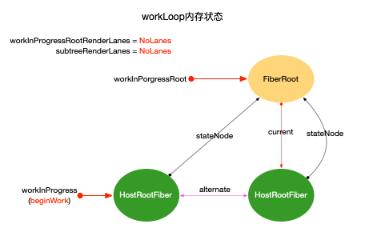
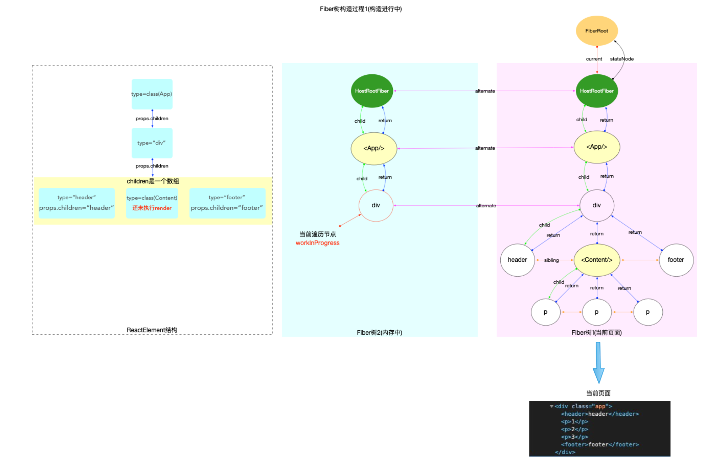

Fiber树创建示例demo
```js
class App extends React.Component {
  componentDidMount() {
    console.log(`App Mount`);
    console.log(`App 组件对应的fiber节点: `, this._reactInternals);
  }
  render() {
    return (
      <div className="app">
        <header>header</header>
        <Content />
      </div>
    );
  }
}

class Content extends React.Component {
  componentDidMount() {
    console.log(`Content Mount`);
    console.log(`Content 组件对应的fiber节点: `, this._reactInternals);
  }
  render() {
    return (
      <React.Fragment>
        <p>1</p>
        <p>2</p>
      </React.Fragment>
    );
  }
}
export default App;
```

# 启动阶段
React 应用启动流程是：入口挂载 → 创建 FiberRoot/HostRootFiber → render 触发 update → 构建 update 对象 → 入队调度 → 构建 Fiber 树 → commit → 页面渲染完成。每一步在源码中都有对应实现，核心在于 Fiber 架构和调度机制。

创建FiberRoot和HostRootFiber->调用render，触发update流程->创建update对象->入队并调度->Fiber树构造(reconciler)->commit->页面渲染，完成


我们可以看到一个react项目index.js文件,初始会调用createRoot，对应的即createContainer
```js
import React from 'react';
import ReactDOM from 'react-dom/client';
import './index.css';
import App from './App';
import reportWebVitals from './reportWebVitals';

const root = ReactDOM.createRoot(document.getElementById('root'));
console.log(document.getElementById('root'),'root');
root.render(
  <React.StrictMode>
    <App />
  </React.StrictMode>
);
```

对应[createRoot](https://github.com/facebook/react/blob/main/packages/react-dom/client.js)如下
```js
export function createRoot(
  container: Element | Document | DocumentFragment,
  options?: CreateRootOptions,
): RootType {
  if (!isValidContainer(container)) {
    throw new Error('Target container is not a DOM element.');
  }

  warnIfReactDOMContainerInDEV(container);

  const concurrentUpdatesByDefaultOverride = false;
  let isStrictMode = false;
  let identifierPrefix = '';
  let onUncaughtError = defaultOnUncaughtError;
  let onCaughtError = defaultOnCaughtError;
  let onRecoverableError = defaultOnRecoverableError;
  let onDefaultTransitionIndicator = defaultOnDefaultTransitionIndicator;
  let transitionCallbacks = null;
    // ...省略无关代码
  const root = createContainer(
    container,
    ConcurrentRoot,
    null,
    isStrictMode,
    concurrentUpdatesByDefaultOverride,
    identifierPrefix,
    onUncaughtError,
    onCaughtError,
    onRecoverableError,
    onDefaultTransitionIndicator,
    transitionCallbacks,
  );
  markContainerAsRoot(root.current, container);

  const rootContainerElement: Document | Element | DocumentFragment =
    !disableCommentsAsDOMContainers && container.nodeType === COMMENT_NODE
      ? (container.parentNode: any)
      : container;
  listenToAllSupportedEvents(rootContainerElement);

  // $FlowFixMe[invalid-constructor] Flow no longer supports calling new on functions
  return new ReactDOMRoot(root);
}

// $FlowFixMe[missing-this-annot]
function ReactDOMRoot(internalRoot: FiberRoot) {
  this._internalRoot = internalRoot;
}
```

createContainer源码如下,所以此处实际开始进入的是Fiber树构造
```js
export function createContainer(
  containerInfo: Container,
  tag: RootTag,
  hydrationCallbacks: null | SuspenseHydrationCallbacks,
  isStrictMode: boolean,
  // TODO: Remove `concurrentUpdatesByDefaultOverride`. It is now ignored.
  concurrentUpdatesByDefaultOverride: null | boolean,
  identifierPrefix: string,
  onUncaughtError: (
    error: mixed,
    errorInfo: {+componentStack?: ?string},
  ) => void,
  onCaughtError: (
    error: mixed,
    errorInfo: {
      +componentStack?: ?string,
      +errorBoundary?: ?React$Component<any, any>,
    },
  ) => void,
  onRecoverableError: (
    error: mixed,
    errorInfo: {+componentStack?: ?string},
  ) => void,
  onDefaultTransitionIndicator: () => void | (() => void),
  transitionCallbacks: null | TransitionTracingCallbacks,
): OpaqueRoot {
  const hydrate = false;
  const initialChildren = null;
  const root = createFiberRoot(
    containerInfo,
    tag,
    hydrate,
    initialChildren,
    hydrationCallbacks,
    isStrictMode,
    identifierPrefix,
    null,
    onUncaughtError,
    onCaughtError,
    onRecoverableError,
    onDefaultTransitionIndicator,
    transitionCallbacks,
  );
  registerDefaultIndicator(onDefaultTransitionIndicator);
  return root;
}
```

再回到代码中，刚刚讨论的是createRoot，现在我们看下render实际做了什么,```root.render```会将更新任务加入到调度队列，触发调度流程。相关源码在 ```react-reconciler/src/ReactFiberWorkLoop.js```
[Reconciliation](https://github.com/facebook/react/blob/main/packages/react-reconciler/src/ReactFiberReconciler.js)

## 创建update对象
```root.render```调用[updateContainer](https://github.com/facebook/react/blob/main/packages/react-reconciler/src/ReactFiberReconciler.js#L315)，创建后，内存结构会变为如下

```js
export function updateContainer(
  element: ReactNodeList,
  container: OpaqueRoot,
  parentComponent: ?React$Component<any, any>,
  callback: ?Function,
): Lane {
  const current = container.current;
  const lane = requestUpdateLane(current);
  updateContainerImpl(
    current,
    lane,
    element,
    container,
    parentComponent,
    callback,
  );
  return lane;
}
```

updateContainerImpl的实现
```js
function updateContainerImpl(
  rootFiber: Fiber,
  lane: Lane,
  element: ReactNodeList,
  container: OpaqueRoot,
  parentComponent: ?React$Component<any, any>,
  callback: ?Function,
): void {
 

  if (enableSchedulingProfiler) {
    markRenderScheduled(lane);
  }

  const context = getContextForSubtree(parentComponent);
  if (container.context === null) {
    container.context = context;
  } else {
    container.pendingContext = context;
  }

 
// 2. 设置fiber.updateQueue
  const update = createUpdate(lane);
  // Caution: React DevTools currently depends on this property
  // being called "element".
  update.payload = {element};

  callback = callback === undefined ? null : callback;
  if (callback !== null) {
   
    update.callback = callback;
  }
// 加入update对象
  const root = enqueueUpdate(rootFiber, update, lane);
  if (root !== null) {
    startUpdateTimerByLane(lane, 'root.render()');
    scheduleUpdateOnFiber(root, rootFiber, lane);
    entangleTransitions(root, rootFiber, lane);
  }
}
```

## 构造阶段
上一步后如果```root!==null```则会进行scheduleUpdateOnFiber,该函数的内容很多，初次渲染主要为下面部分，（注legacy模式，也就是ReactDOM.render(<App/>,root)）


```js
 if (
      lane === SyncLane &&
      executionContext === NoContext &&
      !disableLegacyMode &&
      (fiber.mode & ConcurrentMode) === NoMode
    ) {
      if (__DEV__ && ReactSharedInternals.isBatchingLegacy) {
        // Treat `act` as if it's inside `batchedUpdates`, even in legacy mode.
      } else {
        // Flush the synchronous work now, unless we're already working or inside
        // a batch. This is intentionally inside scheduleUpdateOnFiber instead of
        // scheduleCallbackForFiber to preserve the ability to schedule a callback
        // without immediately flushing it. We only do this for user-initiated
        // updates, to preserve historical behavior of legacy mode.
        resetRenderTimer();
        flushSyncWorkOnLegacyRootsOnly();
      }
    }
```

在补充一个关于legacy模式和concurrent、blocking模式
1. legacy通过```ReactDOM.render(<App/>,rootDOM)```,采用同步渲染机制，一旦开始渲染，就会持续执行直到完成，期间无法被中断。如果渲染任务耗时较长，就会阻塞浏览器主线程，导致页面卡顿，无法响应
```js
// LegacyRoot
ReactDOM.render(<App />, document.getElementById('root'), (dom) => {}); // 支持callback回调, 参数是一个dom对象
```
2. Blocking，通过```ReactDOM.createBlockingRoot(rootNode).render(<App />)```，启动，但未完全启用并发，是legacy到concurrent模式的过渡，支持部分并发，允许渲染过程中被高优先级任务（如用户输入）中断，但中断后会重新开始整个渲染过程（而不是继续之前的进度），支持suspense用于代码分割，不支持useTransition等
```js
// BlockingRoot
// 1. 创建ReactDOMRoot对象
const reactDOMBlockingRoot = ReactDOM.createBlockingRoot(
  document.getElementById('root'),
);
// 2. 调用render
reactDOMBlockingRoot.render(<App />); // 不支持回调
```
3. concurrent，并发模式```ReactDOM.createRoot(rootNode).render(<App />)```,采用异步渲染，支持渲染中断、暂停、恢复，放弃等

```js
// ConcurrentRoot
// 1. 创建ReactDOMRoot对象
const reactDOMRoot = ReactDOM.createRoot(document.getElementById('root'));
// 2. 调用render
reactDOMRoot.render(<App />); // 不支持回调
```

在```scheduleUpdateOnFiber```后走到```performSyncWorkOnRoot```
```js
function performSyncWorkOnRoot(root: FiberRoot, lanes: Lanes) {
  // This is the entry point for synchronous tasks that don't go
  // through Scheduler.
  const didFlushPassiveEffects = flushPendingEffects();
  if (didFlushPassiveEffects) {
    // If passive effects were flushed, exit to the outer work loop in the root
    // scheduler, so we can recompute the priority.
    return null;
  }
  if (enableProfilerTimer && enableProfilerNestedUpdatePhase) {
    syncNestedUpdateFlag();
  }
  const forceSync = true;
  performWorkOnRoot(root, lanes, forceSync);
}
```
继续看```performWorkOnRoot```，会看到```renderRootSync```,部分代码如下
```js
function renderRootSync(root: FiberRoot, lanes: Lanes) {
  const prevExecutionContext = executionContext;
  executionContext |= RenderContext;
  // 如果fiberRoot变动, 或者update.lane变动, 都会刷新栈帧, 丢弃上一次渲染进度
  if (workInProgressRoot !== root || workInProgressRootRenderLanes !== lanes) {
    // 刷新栈帧, legacy模式下都会进入
    prepareFreshStack(root, lanes);
  }
  do {
    try {
      workLoopSync();
      break;
    } catch (thrownValue) {
      handleError(root, thrownValue);
    }
  } while (true);
  executionContext = prevExecutionContext;
  // 重置全局变量, 表明render结束
  workInProgressRoot = null;
  workInProgressRootRenderLanes = NoLanes;
  return workInProgressRootExitStatus;
}
```
在```renderRootSync```中，执行fiber构造(workLoopSync)前，会根据当前的情况进行判断，If the root or lanes have changed, throw out the existing stack
  // and prepare a fresh one. Otherwise we'll continue where we left off，这里应该就是并发模式可以恢复栈帧的逻辑，刷新栈帧```prepareFreshStack```,重置全局变量workInProgress和workInProgressRoot等


这里有看到一种没见过的写法,所以特此记录一下
```js
/**
 * ,outer: 是一个标签（label），可以给后面的循环或代码块命名。do { ... }    while (true); 是一个 do-while 循环。
 在循环体内部，可以用 break outer; 或 continue outer; 跳出或继续这个带标签的循环。
 */
outer: do {
  // ...
  if (something) break outer;
  // ...
} while (true);
```

### 循环构造
```js
function workLoopSync() {
  // Perform work without checking if we need to yield between fiber.
  while (workInProgress !== null) {
    performUnitOfWork(workInProgress);
  }
}
/**
 * 相比workLoopSync的模式，多了一个停顿机制，实现切片，可中断渲染
 */
function workLoopConcurrent(nonIdle: boolean) {
  // We yield every other "frame" when rendering Transition or Retries. Those are blocking
  // revealing new content. The purpose of this yield is not to avoid the overhead of yielding,
  // which is very low, but rather to intentionally block any frequently occuring other main
  // thread work like animations from starving our work. In other words, the purpose of this
  // is to reduce the framerate of animations to 30 frames per second.
  // For Idle work we yield every 5ms to keep animations going smooth.
  if (workInProgress !== null) {
    const yieldAfter = now() + (nonIdle ? 25 : 5);
    do {
      // $FlowFixMe[incompatible-call] flow doesn't know that now() is side-effect free
      performUnitOfWork(workInProgress);
    } while (workInProgress !== null && now() < yieldAfter);
  }
}
```
继续查看```performUnitOfWork```
```js
function performUnitOfWork(unitOfWork: Fiber): void {
  // The current, flushed, state of this fiber is the alternate. Ideally
  // nothing should rely on this, but relying on it here means that we don't
  // need an additional field on the work in progress.
  // unitOfWork就是被传入的workInProgress
  const current = unitOfWork.alternate;

  let next;
  if (enableProfilerTimer && (unitOfWork.mode & ProfileMode) !== NoMode) {
    startProfilerTimer(unitOfWork);
    if (__DEV__) {
      next = runWithFiberInDEV(
        unitOfWork,
        beginWork,
        current,
        unitOfWork,
        entangledRenderLanes,
      );
    } else {
      next = beginWork(current, unitOfWork, entangledRenderLanes);
    }
    stopProfilerTimerIfRunningAndRecordDuration(unitOfWork);
  } else {
    if (__DEV__) {
      next = runWithFiberInDEV(
        unitOfWork,
        beginWork,
        current,
        unitOfWork,
        entangledRenderLanes,
      );
    } else {
      next = beginWork(current, unitOfWork, entangledRenderLanes);
    }
  }

  unitOfWork.memoizedProps = unitOfWork.pendingProps;
  if (next === null) {
    // If this doesn't spawn new work, complete the current work.
    completeUnitOfWork(unitOfWork);
  } else {
    workInProgress = next;
  }
}
```
workInProgress（正在处理中的fiber节点）不停的往下next，整个fiber树构造事一个深度优先遍历


- workInProgress和current视为双指针
- workInProgress指向当前正在构造的fiber节点
- current=workInProgress.alternate(fiber.alternate)指向当前页面正在使用的fiber节点，初次构造时，页面还未渲染，此时current=null

在深度优先遍历中，每个fiber节点经历两个阶段，这两个阶段共同完成每个fiber节点的创建，所有fiber节点构成fiber树
1. 探寻beginWork
2. 回溯completeWork

### beginWork（探寻阶段）
[beginWork](https://github.com/facebook/react/blob/c78625842239f29ff130136fff2729fd4c7c2e91/packages/react-reconciler/src/ReactFiberBeginWork.js#L4091)针对所有的fiber类型,通过switch workInProgress的tag，进行不同的update处理,主要逻辑如下
1. 根据ReactElement对象创建所有的fiber节点，最终构造出fiber树形结构(设置return和sibling指针)
2. 设置fiber.flags(二进制形式变量, 用来标记 fiber节点 的增,删,改状态, 等待completeWork阶段处理)
3. 设置fiber.stateNode局部状态（如Class类型节点: fiber.stateNode=new Class()）

```js
function beginWork(
  current: Fiber | null,
  workInProgress: Fiber,
  renderLanes: Lanes,
): Fiber | null {


  if (current !== null) {
   // 非首次渲染，先不管
  } else {
    didReceiveUpdate = false;

    if (getIsHydrating() && isForkedChild(workInProgress)) {
      // Check if this child belongs to a list of muliple children in
      // its parent.
      //
      // In a true multi-threaded implementation, we would render children on
      // parallel threads. This would represent the beginning of a new render
      // thread for this subtree.
      //
      // We only use this for id generation during hydration, which is why the
      // logic is located in this special branch.
      const slotIndex = workInProgress.index;
      const numberOfForks = getForksAtLevel(workInProgress);
      pushTreeId(workInProgress, numberOfForks, slotIndex);
    }
  }
   switch (workInProgress.tag) {
    case LazyComponent: {
      const elementType = workInProgress.elementType;
      return mountLazyComponent(
        current,
        workInProgress,
        elementType,
        renderLanes,
      );
    }
    case FunctionComponent: {
      const Component = workInProgress.type;
      return updateFunctionComponent(
        current,
        workInProgress,
        Component,
        workInProgress.pendingProps,
        renderLanes,
      );
    }
    case ClassComponent: {
      const Component = workInProgress.type;
      const unresolvedProps = workInProgress.pendingProps;
      const resolvedProps = resolveClassComponentProps(
        Component,
        unresolvedProps,
      );
      return updateClassComponent(
        current,
        workInProgress,
        Component,
        resolvedProps,
        renderLanes,
      );
    }
    // ...
  ```

  updateXXX函数逻辑主要为3个步骤，总的目的是为了向下生成子节点，在这个过程将一些需要持久化的数据挂载到fiber节点上,(如fiber.stateNode,fiber.memoizedState等); 把fiber节点的特殊操作设置到fiber.flags(如:节点ref,class组件的生命周期,function组件的hook,节点删除等).


  1. 根据```fiber.pendingProps,fiber.updateQueue```等输入数据状态，计算```fiber.memoizedState```作为输出状态
  2. 获取下级ReactElement对象
  3. 根据ReactElement对象调用reconcileChild生成Fiber子节点

#### update示例
##### fiber根节点是HostRootFiber
fiber根节点是HostRootFiber，所以初次进入调用```updateHostRoot(current, workInProgress, renderLanes)```
```js
function updateHostRoot(
  current: null | Fiber,
  workInProgress: Fiber,
  renderLanes: Lanes,
) {
  pushHostRootContext(workInProgress);

  if (current === null) {
    throw new Error('Should have a current fiber. This is a bug in React.');
  }
    // 进行状态计算，更新整合到workInProgress.memoizedState中
  const nextProps = workInProgress.pendingProps;
  const prevState = workInProgress.memoizedState;
  const prevChildren = prevState.element;
  cloneUpdateQueue(current, workInProgress);
    //  遍历updateQueue.shared.pending，提取有足够优先级的update对象，计算出最终的状态 workInProgress.memoizedState
  processUpdateQueue(workInProgress, nextProps, null, renderLanes);

  const nextState: RootState = workInProgress.memoizedState;
  const root: FiberRoot = workInProgress.stateNode;
  pushRootTransition(workInProgress, root, renderLanes);

  if (enableTransitionTracing) {
    pushRootMarkerInstance(workInProgress);
  }

  const nextCache: Cache = nextState.cache;
  pushCacheProvider(workInProgress, nextCache);
  if (nextCache !== prevState.cache) {
    // The root cache refreshed.
    propagateContextChange(workInProgress, CacheContext, renderLanes);
  }

  // This would ideally go inside processUpdateQueue, but because it suspends,
  // it needs to happen after the `pushCacheProvider` call above to avoid a
  // context stack mismatch. A bit unfortunate.
  suspendIfUpdateReadFromEntangledAsyncAction();

  // Caution: React DevTools currently depends on this property
  // being called "element".
  const nextChildren = nextState.element;
//   服务端渲染相关
  if (supportsHydration && prevState.isDehydrated) {
    // This is a hydration root whose shell has not yet hydrated. We should
    // attempt to hydrate.

    // Flip isDehydrated to false to indicate that when this render
    // finishes, the root will no longer be dehydrated.
    const overrideState: RootState = {
      element: nextChildren,
      isDehydrated: false,
      cache: nextState.cache,
    };
    const updateQueue: UpdateQueue<RootState> =
      (workInProgress.updateQueue: any);
    // `baseState` can always be the last state because the root doesn't
    // have reducer functions so it doesn't need rebasing.
    updateQueue.baseState = overrideState;
    workInProgress.memoizedState = overrideState;

    if (workInProgress.flags & ForceClientRender) {
      // Something errored during a previous attempt to hydrate the shell, so we
      // forced a client render. We should have a recoverable error already scheduled.
      return mountHostRootWithoutHydrating(
        current,
        workInProgress,
        nextChildren,
        renderLanes,
      );
    } else if (nextChildren !== prevChildren) {
      const recoverableError = createCapturedValueAtFiber<mixed>(
        new Error(
          'This root received an early update, before anything was able ' +
            'hydrate. Switched the entire root to client rendering.',
        ),
        workInProgress,
      );
      queueHydrationError(recoverableError);
      return mountHostRootWithoutHydrating(
        current,
        workInProgress,
        nextChildren,
        renderLanes,
      );
    } else {
      // The outermost shell has not hydrated yet. Start hydrating.
      enterHydrationState(workInProgress);

      const child = mountChildFibers(
        workInProgress,
        null,
        nextChildren,
        renderLanes,
      );
      workInProgress.child = child;

      let node = child;
      while (node) {
        // Mark each child as hydrating. This is a fast path to know whether this
        // tree is part of a hydrating tree. This is used to determine if a child
        // node has fully mounted yet, and for scheduling event replaying.
        // Conceptually this is similar to Placement in that a new subtree is
        // inserted into the React tree here. It just happens to not need DOM
        // mutations because it already exists.
        node.flags = (node.flags & ~Placement) | Hydrating;
        node = node.sibling;
      }
    }
  } else {
    // Root is not dehydrated. Either this is a client-only root, or it
    // already hydrated.
    resetHydrationState();
    if (nextChildren === prevChildren) {
      return bailoutOnAlreadyFinishedWork(current, workInProgress, renderLanes);
    }
    // 根据ReactElement对象，调用reconcileChildren生成Fiber子节点
    reconcileChildren(current, workInProgress, nextChildren, renderLanes);
  }
  return workInProgress.child;
}
```

通过processUpdateQueue处理update的对象
```js
function processUpdateQueue(workInProgress, props, instance, renderLanes) {
  // 1. 合并 pending 队列到 base 队列
        // React 的更新分为“base 队列”（已知的、可遍历的链表）和“pending 队列”（新加的、环形链表）。
        // 首先把 pending 队列拆开并追加到 base 队列尾部，保证所有更新都能被处理。
  // 2. 遍历 base 队列
  //    - 如果优先级不够，克隆到新 base 队列
  //    - 如果优先级够，计算新 state，处理 callback
  // 3. 更新 baseState、baseUpdate 指针
        // 跳过的 update 会被克隆到新的 base 队列，保证下次还能被处理。
        // 处理完后，更新队列的 baseState、firstBaseUpdate、lastBaseUpdate 等指针。
  // 4. 更新 fiber.lanes 和 fiber.memoizedState
}

```
```reconcileChildren```生成Fiber子节点
```js
export function reconcileChildren(
  current: Fiber | null,
  workInProgress: Fiber,
  nextChildren: any,
  renderLanes: Lanes,
) {
  if (current === null) {
    // If this is a fresh new component that hasn't been rendered yet, we
    // won't update its child set by applying minimal side-effects. Instead,
    // we will add them all to the child before it gets rendered. That means
    // we can optimize this reconciliation pass by not tracking side-effects.
    workInProgress.child = mountChildFibers(
      workInProgress,
      null,
      nextChildren,
      renderLanes,
    );
  } else {
    // If the current child is the same as the work in progress, it means that
    // we haven't yet started any work on these children. Therefore, we use
    // the clone algorithm to create a copy of all the current children.

    // If we had any progressed work already, that is invalid at this point so
    // let's throw it out.
    workInProgress.child = reconcileChildFibers(
      workInProgress,
      current.child,
      nextChildren,
      renderLanes,
    );
  }
}
```

初次创建调用```reconcileChildFibers```,实际实现在```reconcileChildFibersImpl```，该函数是 React Fiber 架构中子节点<strong> diff（协调/reconciliation）的核心实现之一</strong>。它的作用是：根据新的子节点描述（newChild），对比当前 Fiber 树的子节点（currentFirstChild），生成新的 Fiber 子链表，并标记需要的副作用（如插入、删除、移动等）。继续向下实际你会看到Fiber节点的创建等等，该函数会递归处理 Lazy、Promise、Context 等特殊类型，直到拿到实际可渲染的内容。在处理过程中，会为新建/移动/删除的 Fiber 节点打上 Placement、ChildDeletion 等副作用标记，供 commit 阶段使用。
```js
 function reconcileChildFibers(
    returnFiber: Fiber,
    currentFirstChild: Fiber | null,
    newChild: any,
    lanes: Lanes,
  ): Fiber | null {
    const prevDebugInfo = currentDebugInfo;
    currentDebugInfo = null;
    try {
      // This indirection only exists so we can reset `thenableState` at the end.
      // It should get inlined by Closure.
      thenableIndexCounter = 0;
      const firstChildFiber = reconcileChildFibersImpl(
        returnFiber,
        currentFirstChild,
        newChild,
        lanes,
      );
      thenableState = null;
      // Don't bother to reset `thenableIndexCounter` to 0 because it always gets
      // set at the beginning.
      return firstChildFiber;
    } catch (x) {
      if (
        x === SuspenseException ||
        x === SuspenseActionException ||
        (!disableLegacyMode &&
          (returnFiber.mode & ConcurrentMode) === NoMode &&
          typeof x === 'object' &&
          x !== null &&
          typeof x.then === 'function')
      ) {
        // Suspense exceptions need to read the current suspended state before
        // yielding and replay it using the same sequence so this trick doesn't
        // work here.
        // Suspending in legacy mode actually mounts so if we let the child
        // mount then we delete its state in an update.
        throw x;
      }
      // Something errored during reconciliation but it's conceptually a child that
      // errored and not the current component itself so we create a virtual child
      // that throws in its begin phase. That way the current component can handle
      // the error or suspending if needed.
      const throwFiber = createFiberFromThrow(x, returnFiber.mode, lanes);
      throwFiber.return = returnFiber;
      if (__DEV__) {
        const debugInfo = (throwFiber._debugInfo = currentDebugInfo);
        // Conceptually the error's owner/task should ideally be captured when the
        // Error constructor is called but neither console.createTask does this,
        // nor do we override them to capture our `owner`. So instead, we use the
        // nearest parent as the owner/task of the error. This is usually the same
        // thing when it's thrown from the same async component but not if you await
        // a promise started from a different component/task.
        throwFiber._debugOwner = returnFiber._debugOwner;
        throwFiber._debugTask = returnFiber._debugTask;
        if (debugInfo != null) {
          for (let i = debugInfo.length - 1; i >= 0; i--) {
            if (typeof debugInfo[i].stack === 'string') {
              throwFiber._debugOwner = (debugInfo[i]: any);
              throwFiber._debugTask = debugInfo[i].debugTask;
              break;
            }
          }
        }
      }
      return throwFiber;
    } finally {
      currentDebugInfo = prevDebugInfo;
    }
  }
```
在```reconcileChildFibersImpl```中有一段newChild是否是数组的判断
```js
 if (isArray(newChild)) {
        const prevDebugInfo = pushDebugInfo(newChild._debugInfo);
        const firstChild = reconcileChildrenArray(
          returnFiber,
          currentFirstChild,
          newChild,
          lanes,
        );
        currentDebugInfo = prevDebugInfo;
        return firstChild;
      }
```
举个🌰，比如我们通过map返回一通jsx,则会走到这段处理
```js
function List({ items }) {
  return items.map(item => <li key={item.id}>{item.text}</li>);
}
```

##### fiber节点是普通的DOM标签(div、span等)
```js
function updateHostComponent(
  current: Fiber | null,
  workInProgress: Fiber,
  renderLanes: Lanes,
) {
  if (current === null) {
    tryToClaimNextHydratableInstance(workInProgress);
  }

  pushHostContext(workInProgress);

  const type = workInProgress.type;
  const nextProps = workInProgress.pendingProps;
  const prevProps = current !== null ? current.memoizedProps : null;

  let nextChildren = nextProps.children;
  const isDirectTextChild = shouldSetTextContent(type, nextProps);

  if (isDirectTextChild) {
    // We special case a direct text child of a host node. This is a common
    // case. We won't handle it as a reified child. We will instead handle
    // this in the host environment that also has access to this prop. That
    // avoids allocating another HostText fiber and traversing it.
    nextChildren = null;
  } else if (prevProps !== null && shouldSetTextContent(type, prevProps)) {
    // If we're switching from a direct text child to a normal child, or to
    // empty, we need to schedule the text content to be reset.
    workInProgress.flags |= ContentReset;
  }

  const memoizedState = workInProgress.memoizedState;
  if (memoizedState !== null) {
    // This fiber has been upgraded to a stateful component. The only way
    // happens currently is for form actions. We use hooks to track the
    // pending and error state of the form.
    //
    // Once a fiber is upgraded to be stateful, it remains stateful for the
    // rest of its lifetime.
    const newState = renderTransitionAwareHostComponentWithHooks(
      current,
      workInProgress,
      renderLanes,
    );

    // If the transition state changed, propagate the change to all the
    // descendents. We use Context as an implementation detail for this.
    //
    // This is intentionally set here instead of pushHostContext because
    // pushHostContext gets called before we process the state hook, to avoid
    // a state mismatch in the event that something suspends.
    //
    // NOTE: This assumes that there cannot be nested transition providers,
    // because the only renderer that implements this feature is React DOM,
    // and forms cannot be nested. If we did support nested providers, then
    // we would need to push a context value even for host fibers that
    // haven't been upgraded yet.
    if (isPrimaryRenderer) {
      HostTransitionContext._currentValue = newState;
    } else {
      HostTransitionContext._currentValue2 = newState;
    }
  }

  markRef(current, workInProgress);
  reconcileChildren(current, workInProgress, nextChildren, renderLanes);
  return workInProgress.child;
}function updateHostComponent(
  current: Fiber | null,
  workInProgress: Fiber,
  renderLanes: Lanes,
) {
  if (current === null) {
    tryToClaimNextHydratableInstance(workInProgress);
  }

  pushHostContext(workInProgress);

  const type = workInProgress.type;
  const nextProps = workInProgress.pendingProps;
  const prevProps = current !== null ? current.memoizedProps : null;

  let nextChildren = nextProps.children;
  const isDirectTextChild = shouldSetTextContent(type, nextProps);

// 如果子节点只有一个文本节点、不再创建一个HostText类型的fiber
  if (isDirectTextChild) {
    // We special case a direct text child of a host node. This is a common
    // case. We won't handle it as a reified child. We will instead handle
    // this in the host environment that also has access to this prop. That
    // avoids allocating another HostText fiber and traversing it.
    nextChildren = null;
  } else if (prevProps !== null && shouldSetTextContent(type, prevProps)) {
    // If we're switching from a direct text child to a normal child, or to
    // empty, we need to schedule the text content to be reset.
    workInProgress.flags |= ContentReset;
  }

  const memoizedState = workInProgress.memoizedState;
  if (memoizedState !== null) {
    // This fiber has been upgraded to a stateful component. The only way
    // happens currently is for form actions. We use hooks to track the
    // pending and error state of the form.
    //
    // Once a fiber is upgraded to be stateful, it remains stateful for the
    // rest of its lifetime.
    const newState = renderTransitionAwareHostComponentWithHooks(
      current,
      workInProgress,
      renderLanes,
    );

    // If the transition state changed, propagate the change to all the
    // descendents. We use Context as an implementation detail for this.
    //
    // This is intentionally set here instead of pushHostContext because
    // pushHostContext gets called before we process the state hook, to avoid
    // a state mismatch in the event that something suspends.
    //
    // NOTE: This assumes that there cannot be nested transition providers,
    // because the only renderer that implements this feature is React DOM,
    // and forms cannot be nested. If we did support nested providers, then
    // we would need to push a context value even for host fibers that
    // haven't been upgraded yet.
    if (isPrimaryRenderer) {
      HostTransitionContext._currentValue = newState;
    } else {
      HostTransitionContext._currentValue2 = newState;
    }
  }

  markRef(current, workInProgress);
//   根据ReactElement对象，调用reconcileChildren生成Fiber子节点
  reconcileChildren(current, workInProgress, nextChildren, renderLanes);
  return workInProgress.child;
}
```

可以看到最终都会调用```reconcileChildren```

### performUnitOfWork(回溯阶段)
回溯阶段，调用```completeUnitOfWork```,处理```beginWork```阶段创建出来的fiber节点，它的主要任务是自底向上遍历 fiber 树，调用 completeWork 生成 DOM、收集副作用等。
```js
function completeUnitOfWork(unitOfWork: Fiber): void {
  // Attempt to complete the current unit of work, then move to the next
  // sibling. If there are no more siblings, return to the parent fiber.
  let completedWork: Fiber = unitOfWork;
//   该循环控制并移动指针
  do {
    if ((completedWork.flags & Incomplete) !== NoFlags) {
      // This fiber did not complete, because one of its children did not
      // complete. Switch to unwinding the stack instead of completing it.
      //
      // The reason "unwind" and "complete" is interleaved is because when
      // something suspends, we continue rendering the siblings even though
      // they will be replaced by a fallback.
      const skipSiblings = workInProgressRootDidSkipSuspendedSiblings;
      unwindUnitOfWork(completedWork, skipSiblings);
      return;
    }

    // The current, flushed, state of this fiber is the alternate. Ideally
    // nothing should rely on this, but relying on it here means that we don't
    // need an additional field on the work in progress.
    const current = completedWork.alternate;
    const returnFiber = completedWork.return;

    let next;
    startProfilerTimer(completedWork);
    if (__DEV__) {
      next = runWithFiberInDEV(
        completedWork,
        completeWork,
        current,
        completedWork,
        entangledRenderLanes,
      );
    } else {
        // 处理Fiber节点,会调用渲染器(调用react-dom包, 关联Fiber节点和dom对象, 绑定事件等)
      next = completeWork(current, completedWork, entangledRenderLanes);// 处理单个节点
    }
    if (enableProfilerTimer && (completedWork.mode & ProfileMode) !== NoMode) {
      // Update render duration assuming we didn't error.
      stopProfilerTimerIfRunningAndRecordIncompleteDuration(completedWork);
    }
    if (next !== null) {
      // 如果派生出其他子节点，则回到beginWork阶段进行处理
      // Completing this fiber spawned new work. Work on that next.
      workInProgress = next;
      return;
    }

    const siblingFiber = completedWork.sibling;
    if (siblingFiber !== null) {
        // 如果有兄弟节点, 返回之后再次进入`beginWork`阶段
      // If there is more work to do in this returnFiber, do that next.
      workInProgress = siblingFiber;
      return;
    }
    // 移动指针, 指向下一个节点
    // Otherwise, return to the parent
    // $FlowFixMe[incompatible-type] we bail out when we get a null
    completedWork = returnFiber;
    // Update the next thing we're working on in case something throws.
    workInProgress = completedWork;
  } while (completedWork !== null);
  // 已回溯到根节点, 设置workInProgressRootExitStatus = RootCompleted
  // We've reached the root.
  if (workInProgressRootExitStatus === RootInProgress) {
    workInProgressRootExitStatus = RootCompleted;
  }
}
```

#### <strong>这里说明下关于副作用队列的处理</strong>
在 React 18 及以后，副作用（effect）队列的收集已经不再在 completeUnitOfWork 里显式维护 effect 链表了，而是通过 flags 和 subtreeFlags 标记在 fiber 节点上，commit 阶段再统一遍历 fiber 树处理副作用。

<strong>早期版本（React 16/17）</strong>
会在 completeUnitOfWork 里维护 effect 链表（firstEffect/nextEffect），每个 fiber 的副作用会挂到父 fiber 的 effect 链表上。

<strong>现在的版本（React 18+）</strong>
副作用收集方式变了：
每个 fiber 节点有 flags（自身副作用）和 subtreeFlags（子树副作用）。
commit 阶段直接遍历 fiber 树，根据这些 flags 处理副作用。
completeUnitOfWork 只负责递归回溯、调用 completeWork，并没有再拼接 effect 链表。

继续看```completeWork```
```js
function completeWork(
  current: Fiber | null,
  workInProgress: Fiber,
  renderLanes: Lanes,
): Fiber | null {
  const newProps = workInProgress.pendingProps;
  // Note: This intentionally doesn't check if we're hydrating because comparing
  // to the current tree provider fiber is just as fast and less error-prone.
  // Ideally we would have a special version of the work loop only
  // for hydration.
  popTreeContext(workInProgress);
  switch (workInProgress.tag) {
    case IncompleteFunctionComponent: {
      if (disableLegacyMode) {
        break;
      }
      // Fallthrough
    }
    case LazyComponent:
    case SimpleMemoComponent:
    case FunctionComponent:
    case ForwardRef:
    case Fragment:
    case Mode:
    case Profiler:
    case ContextConsumer:
    case MemoComponent:
      bubbleProperties(workInProgress);
      return null;
    case ClassComponent: {
      const Component = workInProgress.type;
      if (isLegacyContextProvider(Component)) {
        popLegacyContext(workInProgress);
      }
      bubbleProperties(workInProgress);
      return null;
    }
    case HostRoot: {
      const fiberRoot = (workInProgress.stateNode: FiberRoot);

      if (enableTransitionTracing) {
        const transitions = getWorkInProgressTransitions();
        // We set the Passive flag here because if there are new transitions,
        // we will need to schedule callbacks and process the transitions,
        // which we do in the passive phase
        if (transitions !== null) {
          workInProgress.flags |= Passive;
        }
      }

      let previousCache: Cache | null = null;
      if (current !== null) {
        previousCache = current.memoizedState.cache;
      }
      const cache: Cache = workInProgress.memoizedState.cache;
      if (cache !== previousCache) {
        // Run passive effects to retain/release the cache.
        workInProgress.flags |= Passive;
      }
      popCacheProvider(workInProgress, cache);

      if (enableTransitionTracing) {
        popRootMarkerInstance(workInProgress);
      }

      popRootTransition(workInProgress, fiberRoot, renderLanes);
      popHostContainer(workInProgress);
      popTopLevelLegacyContextObject(workInProgress);
      if (fiberRoot.pendingContext) {
        fiberRoot.context = fiberRoot.pendingContext;
        fiberRoot.pendingContext = null;
      }
      if (current === null || current.child === null) {
        // If we hydrated, pop so that we can delete any remaining children
        // that weren't hydrated.
        const wasHydrated = popHydrationState(workInProgress);
        if (wasHydrated) {
          emitPendingHydrationWarnings();
          // If we hydrated, then we'll need to schedule an update for
          // the commit side-effects on the root.
          markUpdate(workInProgress);
        } else {
          if (current !== null) {
            const prevState: RootState = current.memoizedState;
            if (
              // Check if this is a client root
              !prevState.isDehydrated ||
              // Check if we reverted to client rendering (e.g. due to an error)
              (workInProgress.flags & ForceClientRender) !== NoFlags
            ) {
              // Schedule an effect to clear this container at the start of the
              // next commit. This handles the case of React rendering into a
              // container with previous children. It's also safe to do for
              // updates too, because current.child would only be null if the
              // previous render was null (so the container would already
              // be empty).
              workInProgress.flags |= Snapshot;

              // If this was a forced client render, there may have been
              // recoverable errors during first hydration attempt. If so, add
              // them to a queue so we can log them in the commit phase.
              upgradeHydrationErrorsToRecoverable();
            }
          }
        }
      }
      updateHostContainer(current, workInProgress);
      bubbleProperties(workInProgress);
      if (enableTransitionTracing) {
        if ((workInProgress.subtreeFlags & Visibility) !== NoFlags) {
          // If any of our suspense children toggle visibility, this means that
          // the pending boundaries array needs to be updated, which we only
          // do in the passive phase.
          workInProgress.flags |= Passive;
        }
      }
      return null;
    }
// 省略部分代码
```

以下举🌰说明
##### HostComponent
```js
 case HostComponent: {
      popHostContext(workInProgress);
      const type = workInProgress.type;
      if (current !== null && workInProgress.stateNode != null) {
        updateHostComponent(
          current,
          workInProgress,
          type,
          newProps,
          renderLanes,
        );
      } else {
        if (!newProps) {
          if (workInProgress.stateNode === null) {
            throw new Error(
              'We must have new props for new mounts. This error is likely ' +
                'caused by a bug in React. Please file an issue.',
            );
          }

          // This can happen when we abort work.
          bubbleProperties(workInProgress);
          if (enableViewTransition) {
            // Host Components act as their own View Transitions which doesn't run enter/exit animations.
            // We clear any ViewTransitionStatic flag bubbled from inner View Transitions.
            workInProgress.subtreeFlags &= ~ViewTransitionStatic;
          }
          return null;
        }

        const currentHostContext = getHostContext();
        // TODO: Move createInstance to beginWork and keep it on a context
        // "stack" as the parent. Then append children as we go in beginWork
        // or completeWork depending on whether we want to add them top->down or
        // bottom->up. Top->down is faster in IE11.
        const wasHydrated = popHydrationState(workInProgress);
        if (wasHydrated) {
          // TODO: Move this and createInstance step into the beginPhase
          // to consolidate.
          prepareToHydrateHostInstance(workInProgress, currentHostContext);
          if (
            finalizeHydratedChildren(
              workInProgress.stateNode,
              type,
              newProps,
              currentHostContext,
            )
          ) {
            workInProgress.flags |= Hydrate;
          }
        } else {
          const rootContainerInstance = getRootHostContainer();
          const instance = createInstance(
            type,
            newProps,
            rootContainerInstance,
            currentHostContext,
            workInProgress,
          );
          // TODO: For persistent renderers, we should pass children as part
          // of the initial instance creation
          markCloned(workInProgress);
          appendAllChildren(instance, workInProgress, false, false);
          workInProgress.stateNode = instance;

          // Certain renderers require commit-time effects for initial mount.
          // (eg DOM renderer supports auto-focus for certain elements).
          // Make sure such renderers get scheduled for later work.
          if (
            finalizeInitialChildren(
              instance,
              type,
              newProps,
              currentHostContext,
            )
          ) {
            markUpdate(workInProgress);
          }
        }
      }
      bubbleProperties(workInProgress);
      if (enableViewTransition) {
        // Host Components act as their own View Transitions which doesn't run enter/exit animations.
        // We clear any ViewTransitionStatic flag bubbled from inner View Transitions.
        workInProgress.subtreeFlags &= ~ViewTransitionStatic;
      }

      // This must come at the very end of the complete phase, because it might
      // throw to suspend, and if the resource immediately loads, the work loop
      // will resume rendering as if the work-in-progress completed. So it must
      // fully complete.
      preloadInstanceAndSuspendIfNeeded(
        workInProgress,
        workInProgress.type,
        current === null ? null : current.memoizedProps,
        workInProgress.pendingProps,
        renderLanes,
      );
      return null;
    }
```
针对其中的HostComponent说明，HostComponent 表示原生宿主节点，比如 DOM 的 ```<div>, <span>``` 等。

在 React Fiber 树中，每个 HostComponent Fiber 对应一个真实的宿主实例（如 DOM 节点）。``` if (current !== null && workInProgress.stateNode != null)```说明是更新，调用 updateHostComponent，对比 props，决定是否需要打 Update 标记。否则是首次挂载，需要创建 DOM 实例。

1. 首次挂载流程

如果没有 newProps 且 stateNode 也没有，说明出错（一般不会发生）。
获取当前 HostContext。
  
- 判断是否是 hydration（SSR 挂载）：

    是 hydration：调用 prepareToHydrateHostInstance，并根据 finalizeHydratedChildren 判断是否需要 Hydrate 标记。

- 否则是纯客户端挂载：

    调用 createInstance 创建 DOM 节点，appendAllChildren 把所有子节点 append 到自己下，finalizeInitialChildren 判断是否需要额外的副作用（如 autoFocus），并打上 Update 标记

2. 副作用冒泡bubbleProperties

调用 bubbleProperties，把子树的副作用和优先级合并到当前节点。
```js
function bubbleProperties(completedWork: Fiber) {
  const didBailout =
    completedWork.alternate !== null &&
    completedWork.alternate.child === completedWork.child;

  let newChildLanes: Lanes = NoLanes;
  let subtreeFlags = NoFlags;

  if (!didBailout) {
    // Bubble up the earliest expiration time.
    if (enableProfilerTimer && (completedWork.mode & ProfileMode) !== NoMode) {
      // In profiling mode, resetChildExpirationTime is also used to reset
      // profiler durations.
      let actualDuration = completedWork.actualDuration;
      let treeBaseDuration = ((completedWork.selfBaseDuration: any): number);

      let child = completedWork.child;
      while (child !== null) {
        newChildLanes = mergeLanes(
          newChildLanes,
          mergeLanes(child.lanes, child.childLanes),
        );

        subtreeFlags |= child.subtreeFlags;
        subtreeFlags |= child.flags;

        // When a fiber is cloned, its actualDuration is reset to 0. This value will
        // only be updated if work is done on the fiber (i.e. it doesn't bailout).
        // When work is done, it should bubble to the parent's actualDuration. If
        // the fiber has not been cloned though, (meaning no work was done), then
        // this value will reflect the amount of time spent working on a previous
        // render. In that case it should not bubble. We determine whether it was
        // cloned by comparing the child pointer.
        // $FlowFixMe[unsafe-addition] addition with possible null/undefined value
        actualDuration += child.actualDuration;

        // $FlowFixMe[unsafe-addition] addition with possible null/undefined value
        treeBaseDuration += child.treeBaseDuration;
        child = child.sibling;
      }

      completedWork.actualDuration = actualDuration;
      completedWork.treeBaseDuration = treeBaseDuration;
    } else {
      let child = completedWork.child;
      while (child !== null) {
        newChildLanes = mergeLanes(
          newChildLanes,
          mergeLanes(child.lanes, child.childLanes),
        );

        subtreeFlags |= child.subtreeFlags;
        subtreeFlags |= child.flags;

        // Update the return pointer so the tree is consistent. This is a code
        // smell because it assumes the commit phase is never concurrent with
        // the render phase. Will address during refactor to alternate model.
        child.return = completedWork;

        child = child.sibling;
      }
    }

    completedWork.subtreeFlags |= subtreeFlags;
  } else {
    // Bubble up the earliest expiration time.
    if (enableProfilerTimer && (completedWork.mode & ProfileMode) !== NoMode) {
      // In profiling mode, resetChildExpirationTime is also used to reset
      // profiler durations.
      let treeBaseDuration = ((completedWork.selfBaseDuration: any): number);
      // 正常回溯，递归所有子节点
      let child = completedWork.child;
      while (child !== null) {
        // 合并子节点的lanes/childLanes，得到整个子树优先级
        newChildLanes = mergeLanes(
          newChildLanes,
          mergeLanes(child.lanes, child.childLanes),
        );

        // "Static" flags share the lifetime of the fiber/hook they belong to,
        // so we should bubble those up even during a bailout. All the other
        // flags have a lifetime only of a single render + commit, so we should
        // ignore them.
        // 合并子节点的副作用标记
        subtreeFlags |= child.subtreeFlags & StaticMask;
        subtreeFlags |= child.flags & StaticMask;

        // $FlowFixMe[unsafe-addition] addition with possible null/undefined value
        treeBaseDuration += child.treeBaseDuration;
        child = child.sibling;
      }

      completedWork.treeBaseDuration = treeBaseDuration;
    } else {
      // bailout（跳过本次更新）时，只冒泡 static 类型的副作用
      let child = completedWork.child;
      while (child !== null) {
        newChildLanes = mergeLanes(
          newChildLanes,
          mergeLanes(child.lanes, child.childLanes),
        );

        // "Static" flags share the lifetime of the fiber/hook they belong to,
        // so we should bubble those up even during a bailout. All the other
        // flags have a lifetime only of a single render + commit, so we should
        // ignore them.
        subtreeFlags |= child.subtreeFlags & StaticMask;
        subtreeFlags |= child.flags & StaticMask;

        // Update the return pointer so the tree is consistent. This is a code
        // smell because it assumes the commit phase is never concurrent with
        // the render phase. Will address during refactor to alternate model.
        child.return = completedWork;

        child = child.sibling;
      }
    }

    completedWork.subtreeFlags |= subtreeFlags;
  }
  // 记录子树的最高优先级
  completedWork.childLanes = newChildLanes;

  return didBailout;
}
```
```js
createInstance
```

##### HostRoot
```js
case HostRoot: {
      const fiberRoot = (workInProgress.stateNode: FiberRoot);
      // 1. 处理 Transition Tracing
      if (enableTransitionTracing) {
        const transitions = getWorkInProgressTransitions();
        // We set the Passive flag here because if there are new transitions,
        // we will need to schedule callbacks and process the transitions,
        // which we do in the passive phase
        if (transitions !== null) {
          workInProgress.flags |= Passive;
        }
      }
    // 2. 处理 Cache 变化
      let previousCache: Cache | null = null;
      if (current !== null) {
        previousCache = current.memoizedState.cache;
      }
      const cache: Cache = workInProgress.memoizedState.cache;
      if (cache !== previousCache) {
        // Run passive effects to retain/release the cache.
        workInProgress.flags |= Passive;
      }
      popCacheProvider(workInProgress, cache);
      // 3. 处理 Transition Tracing 相关的 marker
      if (enableTransitionTracing) {
        popRootMarkerInstance(workInProgress);
      }
      // 4. 处理 Transition（并发更新相关）
      popRootTransition(workInProgress, fiberRoot, renderLanes);
      // 5. 处理 HostContainer（宿主环境上下文）
      popHostContainer(workInProgress);
       // 6. 处理 Legacy Context
      popTopLevelLegacyContextObject(workInProgress);
      if (fiberRoot.pendingContext) {
        fiberRoot.context = fiberRoot.pendingContext;
        fiberRoot.pendingContext = null;
      }
      // 7. 处理 Hydration（SSR 挂载相关）
      if (current === null || current.child === null) {
        // If we hydrated, pop so that we can delete any remaining children
        // that weren't hydrated.
        const wasHydrated = popHydrationState(workInProgress);
        if (wasHydrated) {
          emitPendingHydrationWarnings();
          // If we hydrated, then we'll need to schedule an update for
          // the commit side-effects on the root.
          markUpdate(workInProgress);
        } else {
          if (current !== null) {
            const prevState: RootState = current.memoizedState;
            if (
              // Check if this is a client root
              !prevState.isDehydrated ||
              // Check if we reverted to client rendering (e.g. due to an error)
              (workInProgress.flags & ForceClientRender) !== NoFlags
            ) {
              // Schedule an effect to clear this container at the start of the
              // next commit. This handles the case of React rendering into a
              // container with previous children. It's also safe to do for
              // updates too, because current.child would only be null if the
              // previous render was null (so the container would already
              // be empty).
              workInProgress.flags |= Snapshot;

              // If this was a forced client render, there may have been
              // recoverable errors during first hydration attempt. If so, add
              // them to a queue so we can log them in the commit phase.
              upgradeHydrationErrorsToRecoverable();
            }
          }
        }
      }
      // 8. 处理持久化渲染器的容器更新
      updateHostContainer(current, workInProgress);
      // 9. 冒泡副作用
      bubbleProperties(workInProgress);
      if (enableTransitionTracing) {
        if ((workInProgress.subtreeFlags & Visibility) !== NoFlags) {
          // If any of our suspense children toggle visibility, this means that
          // the pending boundaries array needs to be updated, which we only
          // do in the passive phase.
          workInProgress.flags |= Passive;
        }
      }
      return null;
    }
```

HostRoot Fiber 是整个 Fiber 树的根节点，通常对应于 ReactDOM.render 或 ReactDOM.createRoot 挂载的那个“根”。
它的 stateNode 指向 FiberRoot 对象，包含整个应用的状态、更新队列等。

##### bubbleProperties
每个case都会涉及到冒泡流程```bubbleProperties```

<strong>核心说明</strong>
1. subtreeFlags

记录整个子树的副作用类型（如 Placement、Update、Passive 等）。
这样父节点只需看自己的 subtreeFlags，就知道子树是否有副作用。

2. childLanes

记录子树的最高优先级（lanes），用于调度。

3. didBailout 分支

如果本节点跳过了本次更新（bailout），只冒泡 static 类型的副作用（如 ref 挂载等），其它副作用只在本次 render+commit 有效。

4. return 指针

保证每个子节点的 return 指向父节点，方便 commit 阶段遍历。

通过冒泡流程，commit 阶段只需遍历有副作用的分支，极大提升性能。
父节点能感知整个子树的副作用和优先级，方便调度和副作用处理。
```js

function bubbleProperties(completedWork: Fiber) {
  const didBailout =
    completedWork.alternate !== null &&
    completedWork.alternate.child === completedWork.child;

  let newChildLanes: Lanes = NoLanes;
  let subtreeFlags = NoFlags;

  if (!didBailout) {
    // Bubble up the earliest expiration time.
    if (enableProfilerTimer && (completedWork.mode & ProfileMode) !== NoMode) {
      // In profiling mode, resetChildExpirationTime is also used to reset
      // profiler durations.
      let actualDuration = completedWork.actualDuration;
      let treeBaseDuration = ((completedWork.selfBaseDuration: any): number);

      let child = completedWork.child;
      while (child !== null) {
        newChildLanes = mergeLanes(
          newChildLanes,
          mergeLanes(child.lanes, child.childLanes),
        );

        subtreeFlags |= child.subtreeFlags;
        subtreeFlags |= child.flags;

        // When a fiber is cloned, its actualDuration is reset to 0. This value will
        // only be updated if work is done on the fiber (i.e. it doesn't bailout).
        // When work is done, it should bubble to the parent's actualDuration. If
        // the fiber has not been cloned though, (meaning no work was done), then
        // this value will reflect the amount of time spent working on a previous
        // render. In that case it should not bubble. We determine whether it was
        // cloned by comparing the child pointer.
        // $FlowFixMe[unsafe-addition] addition with possible null/undefined value
        actualDuration += child.actualDuration;

        // $FlowFixMe[unsafe-addition] addition with possible null/undefined value
        treeBaseDuration += child.treeBaseDuration;
        child = child.sibling;
      }

      completedWork.actualDuration = actualDuration;
      completedWork.treeBaseDuration = treeBaseDuration;
    } else {
      let child = completedWork.child;
      while (child !== null) {
        newChildLanes = mergeLanes(
          newChildLanes,
          mergeLanes(child.lanes, child.childLanes),
        );

        subtreeFlags |= child.subtreeFlags;
        subtreeFlags |= child.flags;

        // Update the return pointer so the tree is consistent. This is a code
        // smell because it assumes the commit phase is never concurrent with
        // the render phase. Will address during refactor to alternate model.
        child.return = completedWork;

        child = child.sibling;
      }
    }

    completedWork.subtreeFlags |= subtreeFlags;
  } else {
    // Bubble up the earliest expiration time.
    if (enableProfilerTimer && (completedWork.mode & ProfileMode) !== NoMode) {
      // In profiling mode, resetChildExpirationTime is also used to reset
      // profiler durations.
      let treeBaseDuration = ((completedWork.selfBaseDuration: any): number);
      // 正常回溯，递归所有子节点
      let child = completedWork.child;
      while (child !== null) {
        // 合并子节点的lanes/childLanes，得到整个子树优先级
        newChildLanes = mergeLanes(
          newChildLanes,
          mergeLanes(child.lanes, child.childLanes),
        );

        // "Static" flags share the lifetime of the fiber/hook they belong to,
        // so we should bubble those up even during a bailout. All the other
        // flags have a lifetime only of a single render + commit, so we should
        // ignore them.
        // 合并子节点的副作用标记
        subtreeFlags |= child.subtreeFlags & StaticMask;
        subtreeFlags |= child.flags & StaticMask;

        // $FlowFixMe[unsafe-addition] addition with possible null/undefined value
        treeBaseDuration += child.treeBaseDuration;
        child = child.sibling;
      }

      completedWork.treeBaseDuration = treeBaseDuration;
    } else {
      // bailout（跳过本次更新）时，只冒泡 static 类型的副作用
      let child = completedWork.child;
      while (child !== null) {
        newChildLanes = mergeLanes(
          newChildLanes,
          mergeLanes(child.lanes, child.childLanes),
        );

        // "Static" flags share the lifetime of the fiber/hook they belong to,
        // so we should bubble those up even during a bailout. All the other
        // flags have a lifetime only of a single render + commit, so we should
        // ignore them.
        subtreeFlags |= child.subtreeFlags & StaticMask;
        subtreeFlags |= child.flags & StaticMask;

        // Update the return pointer so the tree is consistent. This is a code
        // smell because it assumes the commit phase is never concurrent with
        // the render phase. Will address during refactor to alternate model.
        child.return = completedWork;

        child = child.sibling;
      }
    }

    completedWork.subtreeFlags |= subtreeFlags;
  }
  // 记录子树的最高优先级
  completedWork.childLanes = newChildLanes;

  return didBailout;
}
```

### 补充

- workInProgressRoot：当前渲染的 FiberRoot（根）。
- rootWorkInProgress：根节点的 workInProgress Fiber（副本）。
- workInProgress：当前正在处理的 Fiber 节点。

workInProgressRoot
      |
      v
root.current  <---(createWorkInProgress)--->  rootWorkInProgress
                                                |
                                                v
                                         workInProgress (遍历时指向当前节点)