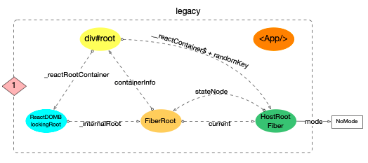
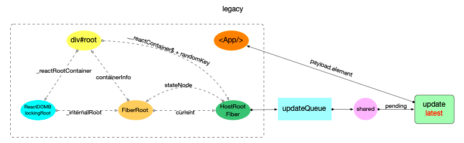
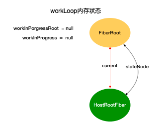

Fiber树创建示例demo
```js
class App extends React.Component {
  componentDidMount() {
    console.log(`App Mount`);
    console.log(`App 组件对应的fiber节点: `, this._reactInternals);
  }
  render() {
    return (
      <div className="app">
        <header>header</header>
        <Content />
      </div>
    );
  }
}

class Content extends React.Component {
  componentDidMount() {
    console.log(`Content Mount`);
    console.log(`Content 组件对应的fiber节点: `, this._reactInternals);
  }
  render() {
    return (
      <React.Fragment>
        <p>1</p>
        <p>2</p>
      </React.Fragment>
    );
  }
}
export default App;
```

# 启动阶段

在react-reconciler包调用updateContainer
```js
export function updateContainer(
  element: ReactNodeList,
  container: OpaqueRoot,
  parentComponent: ?React$Component<any, any>,
  callback: ?Function,
): Lane {
  const current = container.current;
  const lane = requestUpdateLane(current);
  updateContainerImpl(
    current,
    lane,
    element,
    container,
    parentComponent,
    callback,
  );
  return lane;
}

function updateContainerImpl(
  rootFiber: Fiber,
  lane: Lane,
  element: ReactNodeList,
  container: OpaqueRoot,
  parentComponent: ?React$Component<any, any>,
  callback: ?Function,
): void {

  if (enableSchedulingProfiler) {
    markRenderScheduled(lane);
  }

  const context = getContextForSubtree(parentComponent);
  if (container.context === null) {
    container.context = context;
  } else {
    container.pendingContext = context;
  }

 
// 2. 设置fiber.updateQueue
  const update = createUpdate(lane);
  // Caution: React DevTools currently depends on this property
  // being called "element".
  update.payload = {element};

  callback = callback === undefined ? null : callback;
  if (callback !== null) {
   
    update.callback = callback;
  }

  const root = enqueueUpdate(rootFiber, update, lane);
  if (root !== null) {
    startUpdateTimerByLane(lane, 'root.render()');
    scheduleUpdateOnFiber(root, rootFiber, lane);
    entangleTransitions(root, rootFiber, lane);
  }
}
```
update对象创建后，内存结构如下：


最初的ReactElement对象<App/>被挂载到```HostRootFiber.updateQueue.shared.pending.payload.element```中

# 构造阶段
