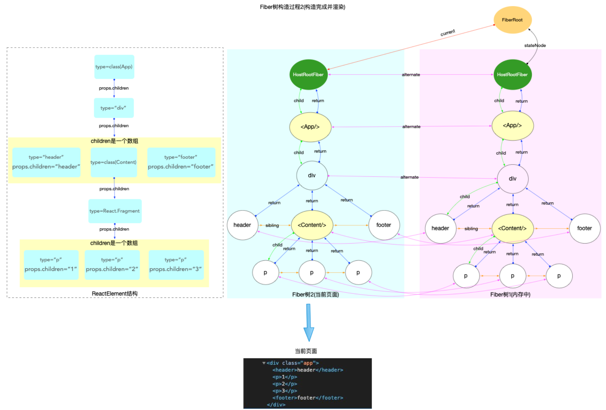

fiber树构造处于上述运作流程中的第三个阶段，执行任务回调，从scheduler调度中心的角度看，他是任务队列taskQueue中的一个具体的任务回调(task.callback)，从react工作循环角度看，属于fiber树构造循环

Fiber树构造有两种情况，一种是初次创建流程，一种是对比更新流程

初次创建在react首次启动时，界面还没有完全渲染，此时不回进入对比流程，相当于直接创建一棵全新的树

对比更新，React引用启动后，界面已经渲染，如果在此发生更新，创建新Fiber会和旧Fiber进行对比

## ReactElement、Fiber、DOM

1. ReactElement对象：所有采用jsx语法书写的节点, 都会被编译器转换, 最终会以React.createElement(...)的方式, 创建出来一个与之对应的ReactElement对象

2. Fiber对象：fiber对象是通过ReactElement对象进行创建的, 多个fiber对象构成了一棵fiber树, fiber树是构造DOM树的数据模型, fiber树的任何改动, 最后都体现到DOM树.

3. DOM对象：DOM将文档解析为一个由节点和对象（包含属性和方法的对象）组成的结构集合, 也就是常说的DOM树.
JavaScript可以访问和操作存储在 DOM 中的内容, 也就是操作DOM对象, 进而触发 UI 渲染.

上图表示JSX代码到DOM节点的转换过程，也就是说JSX->ReactElement->Fiber->DOM

Fiber树通过ReactElement生成，Fiber树是DOM树的数据模型，Fiber树驱动DOM

## ReactFiberWorkLoop中全局变量
在React运行中，ReactFiberWorkLoop中有很多变量，属于模块级闭包变量，随着Fiber树构造循环的进行而变化
```js
let executionContext: ExecutionContext = NoContext;
let workInProgressRoot: FiberRoot | null = null;
let workInProgress: Fiber | null = null;
let workInProgressRootRenderLanes: Lanes = NoLanes;
let workInProgressSuspendedReason: SuspendedReason = NotSuspended;
let workInProgressThrownValue: mixed = null;
// ... 以及很多其他变量
```

### 执行上下文
在全局变量中有```executionContext```,代表渲染期间的执行栈（执行上下文），是二进制表示变量，通过位运算进行操作，共有如下几种执行栈
```js
type ExecutionContext = number;

export const NoContext = /*             */ 0b000;
const BatchedContext = /*               */ 0b001;
export const RenderContext = /*         */ 0b010;
export const CommitContext = /*         */ 0b100;

```

在```scheduleUpdateOnFiber```中会根据executionContext进行不同逻辑执行，而在渲染更新中会更新executionContext,比如比如：
```js
renderRootSync
renderRootConcurrent
performWorkOnRoot
flushSyncFromReconciler
batchedUpdates
discreteUpdates
```
以及 commit 相关流程,这些函数会在进入渲染或提交阶段时设置 executionContext

### 双缓冲技术(double buffering)
全局变量中workInProgress,该变量对应双缓冲技术的应用，ReactElement,Fiber,Fiber树构造即将ReactElement->Fiber，这个过程其实有两份Fiber树

1. 一棵为当前界面展示的Fiber树，如果是初次渲染，则为空，```fiberRoot.current = null```

2. 正在构造的Fiber，即将展示出来, 挂载到```HostRootFiber.alternate```上, 正在构造的节点称为```workInProgress```,当构造完成之后, 重新渲染页面, 最后切换fiberRoot.current = workInProgress, 使得fiberRoot.current重新指向代表当前界面的fiber树.


<strong>这里在补充下关于HostFiberRoot和FiberRoot的内容</strong>
1. FiberRoot对象属于```react-reconciler```包, 作为```react-reconciler```在运行过程中的全局上下文, 保存 fiber 构建过程中所依赖的全局状态.其大部分实例变量用来存储fiber 构造循环(详见两大工作循环)过程的各种状态.react 应用内部, 可以根据这些实例变量的值, 控制执行逻辑.
2. HostRootFiber是react-reconciler包, 这是 react 应用中的第一个 Fiber 对象, 是 Fiber 树的根节点, 节点的类型是HostRoot.

#### 双缓冲树的过程如下：
1. 构造过程中, fiberRoot.current指向当前界面对应的fiber树.


2. 构造完成并渲染, 切换fiberRoot.current指针, 使其继续指向当前界面对应的fiber树(原来代表界面的 fiber 树, 变成了内存中).


### 优先级(Lanes)
在react-reconciler中优先级可以分为三类
#### update优先级(update.lane)

update对象是一个环形链表，对于单个update对象来说，update.lane是它的优先级,从```createUpdate```中可以看到，lane作为参数传入，主要用于首次渲染和组件更新
```js
export function createUpdate(lane: Lane): Update<mixed> {
  const update: Update<mixed> = {
    lane,

    tag: UpdateState,
    payload: null,
    callback: null,

    next: null,
  };
  return update;
}
```

1. 应用初始化，通过```updateContainerImpl```
```js
export function updateContainer(
  element: ReactNodeList,
  container: OpaqueRoot,
  parentComponent: ?React$Component<any, any>,
  callback: ?Function,
): Lane {
  const current = container.current;
//  创建lane
  const lane = requestUpdateLane(current);
  updateContainerImpl(
    current,
    lane,
    element,
    container,
    parentComponent,
    callback,
  );
  return lane;
}
function updateContainerImpl(){
    /**
     * 省略
     * ....
     */
    // 2. 设置fiber.updateQueue
  const update = createUpdate(lane);
  // Caution: React DevTools currently depends on this property
  // being called "element".
  update.payload = {element};
}
```

2. 发起组建更新，调用setState
```js
const classComponentUpdater = {
  // $FlowFixMe[missing-local-annot]
  enqueueSetState(inst: any, payload: any, callback) {
    const fiber = getInstance(inst);
    // 创建优先级
    const lane = requestUpdateLane(fiber);

    const update = createUpdate(lane);
    update.payload = payload;
    if (callback !== undefined && callback !== null) {
     
      update.callback = callback;
    }

    const root = enqueueUpdate(fiber, update, lane);
    if (root !== null) {
      startUpdateTimerByLane(lane, 'this.setState()');
      scheduleUpdateOnFiber(root, fiber, lane);
      entangleTransitions(root, fiber, lane);
    }

    if (enableSchedulingProfiler) {
      markStateUpdateScheduled(fiber, lane);
    }
  }
}
  ```

接着去看```requestUpdateLane```,lane 的分配会用到 fiber 的 mode 字段（判断是否并发模式）。但最终 lane 的选择还会结合当前上下文、transition、事件优先级等。
不是单纯“根据 fiber 对象”分配，而是“以 fiber 为入口，结合调度环境共同决定”。
```js
export function requestUpdateLane(fiber: Fiber): Lane {
  const mode = fiber.mode;
  if (!disableLegacyMode && (mode & ConcurrentMode) === NoMode) {
    // legacy 模式，直接返回 SyncLane
    return SyncLane;
  } else if (
    (executionContext & RenderContext) !== NoContext &&
    workInProgressRootRenderLanes !== NoLanes
  ) {
    // render 阶段的更新，复用当前渲染的 lanes
    return pickArbitraryLane(workInProgressRootRenderLanes);
  }

  const transition = requestCurrentTransition();
  if (transition !== null) {
    // 如果有 transition，分配 transition lane
    return requestTransitionLane(transition);
  }

  // 默认：根据当前事件优先级分配 lane
  return eventPriorityToLane(resolveUpdatePriority());
}
```

<strong>transition阶段</strong>

transition（过渡）是一种特殊的更新类型，主要用于描述非紧急、可中断的 UI 更新，比如页面切换、列表过滤、懒加载等场景。它的核心目标是让 React 能够区分“高优先级的交互更新”（如输入、点击）和“可以延迟的 UI 过渡”。

```js
import { startTransition } from 'react';

startTransition(() => {
  setState(...); // 这个 setState 就是 transition 更新
});

```
transition 在调度中的作用:transition 会被分配到专门的 transition lane，优先级低于同步/离散事件，但高于空闲任务。

transition 更新可以被打断（中断），以保证高优先级的交互（如输入）不会被卡顿。
React 会尝试把同一事件循环内的所有 transition 更新分配到同一个 lane，保证它们一起批量调度。

 transition 在源码中的表现:Transition 是一个类型（type），通常包含如 name、startTime、_updatedFibers 等属性，用于追踪和标识一次 transition。
在调度时，requestCurrentTransition() 会返回当前的 transition 对象，requestTransitionLane(transition) 会为其分配 lane。
相关类型定义在 react/src/ReactStartTransition.js 及调度相关文件中

#### 小结
这两种情况，都是通过综合 fiber 的 mode、当前调度上下文、transition 等因素，动态分配 lane。

上述创建了优先级lane后，则会执行```scheduleUpdateOnFiber```
```js
const classComponentUpdater = {
  // $FlowFixMe[missing-local-annot]
  enqueueSetState(inst: any, payload: any, callback) {
    const fiber = getInstance(inst);
    const lane = requestUpdateLane(fiber);

    const update = createUpdate(lane);
    update.payload = payload;
   /**
    * 省略
    */

    const root = enqueueUpdate(fiber, update, lane);
    if (root !== null) {
      startUpdateTimerByLane(lane, 'this.setState()');
      // 执行更新
      scheduleUpdateOnFiber(root, fiber, lane);
      entangleTransitions(root, fiber, lane);
    }

    if (enableSchedulingProfiler) {
      markStateUpdateScheduled(fiber, lane);
    }
  },
  enqueueReplaceState(inst: any, payload: any, callback: null) {
    const fiber = getInstance(inst);
    const lane = requestUpdateLane(fiber);

    const update = createUpdate(lane);
    update.tag = ReplaceState;
    update.payload = payload;

    /**
    * 省略
    */

    const root = enqueueUpdate(fiber, update, lane);
    if (root !== null) {
      startUpdateTimerByLane(lane, 'this.replaceState()');
      scheduleUpdateOnFiber(root, fiber, lane);
      entangleTransitions(root, fiber, lane);
    }

    if (enableSchedulingProfiler) {
      markStateUpdateScheduled(fiber, lane);
    }
  },
  // $FlowFixMe[missing-local-annot]
  enqueueForceUpdate(inst: any, callback) {
    const fiber = getInstance(inst);
    const lane = requestUpdateLane(fiber);

    const update = createUpdate(lane);
    update.tag = ForceUpdate;

     /**
    * 省略
    */

    const root = enqueueUpdate(fiber, update, lane);
    if (root !== null) {
      startUpdateTimerByLane(lane, 'this.forceUpdate()');
      scheduleUpdateOnFiber(root, fiber, lane);
      entangleTransitions(root, fiber, lane);
    }

    if (enableSchedulingProfiler) {
      markForceUpdateScheduled(fiber, lane);
    }
  },
};

```

对应的创建root
```js
function updateContainerImpl(
  rootFiber: Fiber,
  lane: Lane,
  element: ReactNodeList,
  container: OpaqueRoot,
  parentComponent: ?React$Component<any, any>,
  callback: ?Function,
): void {
 

  if (enableSchedulingProfiler) {
    markRenderScheduled(lane);
  }

  const context = getContextForSubtree(parentComponent);
  if (container.context === null) {
    container.context = context;
  } else {
    container.pendingContext = context;
  }

  
// 2. 设置fiber.updateQueue
  const update = createUpdate(lane);
  // Caution: React DevTools currently depends on this property
  // being called "element".
  update.payload = {element};

  callback = callback === undefined ? null : callback;
  

  const root = enqueueUpdate(rootFiber, update, lane);
  if (root !== null) {
    startUpdateTimerByLane(lane, 'root.render()');
    // 更新
    scheduleUpdateOnFiber(root, rootFiber, lane);
    entangleTransitions(root, rootFiber, lane);
  }
}
```
在```scheduleUpdateOnFiber```函数中涉及热点问题<strong>setState是同步还是异步</strong>


```js
export function scheduleUpdateOnFiber(
  root: FiberRoot,
  fiber: Fiber,
  lane: Lane,
) {

  // Check if the work loop is currently suspended and waiting for data to
  // finish loading.
  if (
    // Suspended render phase
    (root === workInProgressRoot &&
      (workInProgressSuspendedReason === SuspendedOnData ||
        workInProgressSuspendedReason === SuspendedOnAction)) ||
    // Suspended commit phase
    root.cancelPendingCommit !== null
  ) {
    // The incoming update might unblock the current render. Interrupt the
    // current attempt and restart from the top.
    prepareFreshStack(root, NoLanes);
    const didAttemptEntireTree = false;
    markRootSuspended(
      root,
      workInProgressRootRenderLanes,
      workInProgressDeferredLane,
      didAttemptEntireTree,
    );
  }

  // Mark that the root has a pending update.
  markRootUpdated(root, lane);

  if (
    (executionContext & RenderContext) !== NoContext &&
    root === workInProgressRoot
  ) {
    // This update was dispatched during the render phase. This is a mistake
    // if the update originates from user space (with the exception of local
    // hook updates, which are handled differently and don't reach this
    // function), but there are some internal React features that use this as
    // an implementation detail, like selective hydration.
    warnAboutRenderPhaseUpdatesInDEV(fiber);

    // Track lanes that were updated during the render phase
    workInProgressRootRenderPhaseUpdatedLanes = mergeLanes(
      workInProgressRootRenderPhaseUpdatedLanes,
      lane,
    );
  } else {
    // This is a normal update, scheduled from outside the render phase. For
    // example, during an input event.
    if (enableUpdaterTracking) {
      if (isDevToolsPresent) {
        addFiberToLanesMap(root, fiber, lane);
      }
    }

    warnIfUpdatesNotWrappedWithActDEV(fiber);

    if (enableTransitionTracing) {
      const transition = ReactSharedInternals.T;
      if (transition !== null && transition.name != null) {
        if (transition.startTime === -1) {
          transition.startTime = now();
        }

        addTransitionToLanesMap(root, transition, lane);
      }
    }

    if (root === workInProgressRoot) {
      // Received an update to a tree that's in the middle of rendering. Mark
      // that there was an interleaved update work on this root.
      if ((executionContext & RenderContext) === NoContext) {
        workInProgressRootInterleavedUpdatedLanes = mergeLanes(
          workInProgressRootInterleavedUpdatedLanes,
          lane,
        );
      }
      if (workInProgressRootExitStatus === RootSuspendedWithDelay) {
        // The root already suspended with a delay, which means this render
        // definitely won't finish. Since we have a new update, let's mark it as
        // suspended now, right before marking the incoming update. This has the
        // effect of interrupting the current render and switching to the update.
        // TODO: Make sure this doesn't override pings that happen while we've
        // already started rendering.
        const didAttemptEntireTree = false;
        markRootSuspended(
          root,
          workInProgressRootRenderLanes,
          workInProgressDeferredLane,
          didAttemptEntireTree,
        );
      }
    }

    ensureRootIsScheduled(root);
    if (
      lane === SyncLane &&
      executionContext === NoContext &&
      !disableLegacyMode &&
      (fiber.mode & ConcurrentMode) === NoMode
    ) {
      if (__DEV__ && ReactSharedInternals.isBatchingLegacy) {
        // Treat `act` as if it's inside `batchedUpdates`, even in legacy mode.
      } else {
        // Flush the synchronous work now, unless we're already working or inside
        // a batch. This is intentionally inside scheduleUpdateOnFiber instead of
        // scheduleCallbackForFiber to preserve the ability to schedule a callback
        // without immediately flushing it. We only do this for user-initiated
        // updates, to preserve historical behavior of legacy mode.
        resetRenderTimer();
        flushSyncWorkOnLegacyRootsOnly();
      }
    }
  }
}
```

从上述```scheduleUpdateOnFiber```中可以看到
1. 如果 ```lane === SyncLane```,且当前 ```executionContext === NoContext```，并且是 legacy 模式（非 ConcurrentMode），那么会立即同步刷新,其它情况下（如并发模式、transition lane、默认事件优先级等），会走异步调度流程。
2. setState 的同步/异步本质上由 lane 的分配决定，而 lane 的分配是在 requestUpdateLane 里完成的

举个🌰
```js
import React from 'react';
import ReactDOM from 'react-dom';

class Demo extends React.Component {
  state = { count: 0 };

  handleClick = () => {
    this.setState({ count: this.state.count + 1 });
    console.log('count after setState:', this.state.count); // 这里是 1 吗？
  };

  render() {
    return <button onClick={this.handleClick}>{this.state.count}</button>;
  }
}

ReactDOM.render(<Demo />, document.getElementById('root'));
```

在 React 18 之前，这里 console.log 打印的 count 还是 0，因为 setState 是批量同步执行但不会立刻更新 this.state。

在 React 18+，如果用 ReactDOM.render（非 createRoot），事件里的 setState 依然是同步刷新 DOM 的（即 scheduleUpdateOnFiber 里会直接 flush），但 this.state 依然是旧值，直到 render 结束。

```js
import { flushSync } from 'react-dom';

class Demo extends React.Component {
  state = { count: 0 };

  handleClick = () => {
    flushSync(() => {
      this.setState({ count: this.state.count + 1 });
    });
    // 这里 DOM 已经同步更新
  };

  render() {
    return <button onClick={this.handleClick}>{this.state.count}</button>;
  }
}
```

#### 渲染优先级（renderLanes）

渲染优先级是一个全局概念，每次render之前，首先要确定本次render的优先级,比如在上一步的```flushSyncWorkOnLegacyRootsOnly```,继续往下追寻```flushSyncWorkAcrossRoots_impl```
```js
export function flushSyncWorkOnLegacyRootsOnly() {
  // This is allowed to be called synchronously, but the caller should check
  // the execution context first.
  if (!disableLegacyMode) {
    flushSyncWorkAcrossRoots_impl(NoLanes, true);
  }
}
```
```js
function flushSyncWorkAcrossRoots_impl(){
    /**
     * 省略
     */
    if (syncTransitionLanes !== NoLanes) {
          // 获取nextLanes
          const nextLanes = getNextLanesToFlushSync(root, syncTransitionLanes);
          if (nextLanes !== NoLanes) {
            // This root has pending sync work. Flush it now.
            didPerformSomeWork = true;
            performSyncWorkOnRoot(root, nextLanes);
          }
        } else {
          const workInProgressRoot = getWorkInProgressRoot();
          const workInProgressRootRenderLanes =
            getWorkInProgressRootRenderLanes();
          const rootHasPendingCommit =
            root.cancelPendingCommit !== null ||
            root.timeoutHandle !== noTimeout;
            // 获取nextLanes
          const nextLanes = getNextLanes(
            root,
            root === workInProgressRoot
              ? workInProgressRootRenderLanes
              : NoLanes,
            rootHasPendingCommit,
          );
          if (
            (includesSyncLane(nextLanes) ||
              (enableGestureTransition && isGestureRender(nextLanes))) &&
            !checkIfRootIsPrerendering(root, nextLanes)
          ) {
            // This root has pending sync work. Flush it now.
            didPerformSomeWork = true;
            performSyncWorkOnRoot(root, nextLanes);
          }
        }
        /**
         * 省略
         */
}
```

getNextLanes会根据FiberRoot对象上的属性，确定出当前最紧急的lanes，此处返回的lanes会作为全局渲染的优先级，用于fiber树构造过程中，针对fiber对象或update对象，只要他们的优先级比渲染优先级低，都会被忽略

#### fiber优先级(fiber.lanes)

1. fiber.lanes:代表本节点的优先级
2. fiber.childLanes：代表子节点的优先级

从FiberNode的构造函数中，fiber.lanes和fiber.childLanes的初始值都是noLanes，在fiber树构造过程中，使用全局的渲染优先级(renderLanes)和fiber.lanes判断fiber节点是否更新
- 如果全局的渲染优先级renderLanes不包括fiber.lanes，证明该fiber节点没有更新，可以复用，该部分的使用场景如下
  
    - 当前 Fiber（workInProgress）对应的 current 没有任何待处理的更新（如 setState、props 变化、context 变化等）。
    也不是 error boundary 或 suspense boundary 的第二次渲染（即没有 DidCapture 标记）。组件 props 没变、没有 setState、没有 context 变化，也不是 error/suspense 边界的特殊情况。这种情况下，React 会直接跳过该组件和它的子树的 diff 和渲染，直接复用上一次的结果。

- 如果不能复用，进入创建阶段

```js
function beginWork(){
    if (
        !hasScheduledUpdateOrContext &&
        // If this is the second pass of an error or suspense boundary, there
        // may not be work scheduled on `current`, so we check for this flag.
        (workInProgress.flags & DidCapture) === NoFlags
      ) {
        // No pending updates or context. Bail out now.
        // 本`fiber`节点的没有更新, 可以复用, 进入bailout逻辑
        /**
         * 这段代码出现在 beginWork 阶段，是Fiber 构建阶段的优化分支，用于提前“bailout”跳过无更新的子树，以提升性能。
         */
        didReceiveUpdate = false;
        return attemptEarlyBailoutIfNoScheduledUpdate(
          current,
          workInProgress,
          renderLanes,
        );
      }
      /**
       * 省略
       */

// 不能复用，则创建新的fiber节点
      workInProgress.lanes = NoLanes;
      switch (workInProgress.tag) {
        // ...
      }
}
```

### 栈帧管理
每次执行fiber树构造(也就是调用performSyncWorkOnRoot或者performConcurrentWorkOnRoot函数)

如果从单个变量来看, 它们就是一个个的全局变量. 如果将这些全局变量组合起来, 它们代表了当前fiber树构造的活动记录. 通过这一组全局变量, 可以还原fiber树构造过程(比如时间切片的实现过程(参考React 调度原理), fiber树构造过程被打断之后需要还原进度, 全靠这一组全局变量). 所以每次fiber树构造是一个独立的过程, 需要独立的一组全局变量, 在React内部把这一个独立的过程封装为一个栈帧stack(简单来说就是每次构造都需要独立的空间).

所以在进行fiber构造之前，如果不需要恢复上一次构造进度，都会刷新栈帧```prepareFreshStack```
```js
function prepareFreshStack(root,lanes){
    // ...
    const rootWorkInProgress = createWorkInProgress(root.current, null);
    // ...
}
```
```createWorkInProgress(root.current, null)```, 其参数root.current即HostRootFiber, 作用是给HostRootFiber创建一个alternate副本.workInProgress指针指向这个副本(即workInProgress = HostRootFiber.alternate), 在上文```double buffering```中分析过, ```HostRootFiber.alternate```是正在构造的fiber树的根节点.