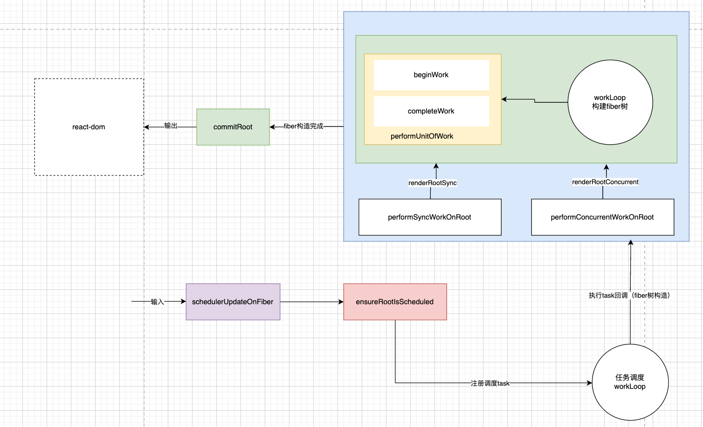
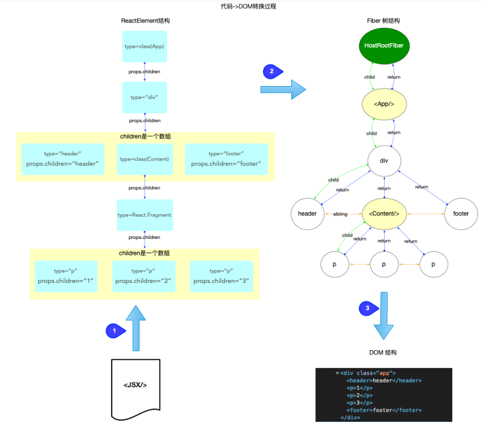

fiber树构造处于上述运作流程中的第三个阶段，执行任务回调，从scheduler调度中心的角度看，他是任务队列taskQueue中的一个具体的任务回调(task.callback)，从react工作循环角度看，属于fiber树构造循环

Fiber树构造有两种情况，一种是初次创建流程，一种是对比更新流程

初次创建在react首次启动时，界面还没有完全渲染，此时不回进入对比流程，相当于直接创建一棵全新的树

对比更新，React引用启动后，界面已经渲染，如果在此发生更新，创建新Fiber会和旧Fiber进行对比

## ReactElement、Fiber、DOM

1. ReactElement对象：所有采用jsx语法书写的节点, 都会被编译器转换, 最终会以React.createElement(...)的方式, 创建出来一个与之对应的ReactElement对象

2. Fiber对象：fiber对象是通过ReactElement对象进行创建的, 多个fiber对象构成了一棵fiber树, fiber树是构造DOM树的数据模型, fiber树的任何改动, 最后都体现到DOM树.

3. DOM对象：DOM将文档解析为一个由节点和对象（包含属性和方法的对象）组成的结构集合, 也就是常说的DOM树.
JavaScript可以访问和操作存储在 DOM 中的内容, 也就是操作DOM对象, 进而触发 UI 渲染.

上图表示JSX代码到DOM节点的转换过程，也就是说JSX->ReactElement->Fiber->DOM

Fiber树通过ReactElement生成，Fiber树是DOM树的数据模型，Fiber树驱动DOM

## ReactFiberWorkLoop中全局变量
在React运行中，ReactFiberWorkLoop中有很多变量，属于模块级闭包变量，随着Fiber树构造循环的进行而变化
```js
let executionContext: ExecutionContext = NoContext;
let workInProgressRoot: FiberRoot | null = null;
let workInProgress: Fiber | null = null;
let workInProgressRootRenderLanes: Lanes = NoLanes;
let workInProgressSuspendedReason: SuspendedReason = NotSuspended;
let workInProgressThrownValue: mixed = null;
// ... 以及很多其他变量
```

### 执行上下文
在全局变量中有```executionContext```,代表渲染期间的执行栈（执行上下文），是二进制表示变量，通过位运算进行操作，共有如下几种执行栈
```js
type ExecutionContext = number;

export const NoContext = /*             */ 0b000;
const BatchedContext = /*               */ 0b001;
export const RenderContext = /*         */ 0b010;
export const CommitContext = /*         */ 0b100;

```

在```scheduleUpdateOnFiber```中会根据executionContext进行不同逻辑执行，而在渲染更新中会更新executionContext,比如比如：
```js
renderRootSync
renderRootConcurrent
performWorkOnRoot
flushSyncFromReconciler
batchedUpdates
discreteUpdates
```
以及 commit 相关流程,这些函数会在进入渲染或提交阶段时设置 executionContext