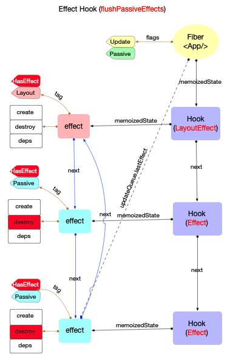
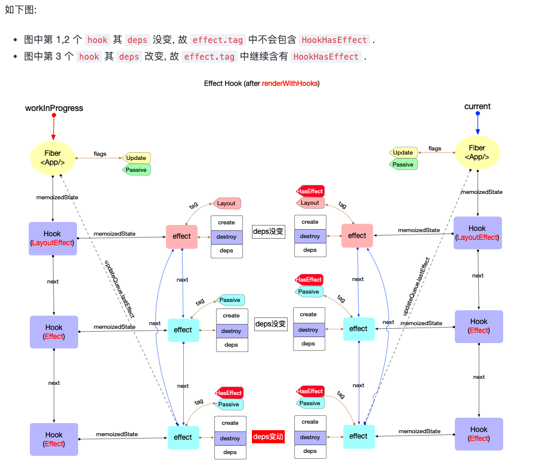

重点讨论useEffect、useLayoutEffect等标准副作用Hook

## 创建Hook
useEffect对应源码mountEffect, useLayoutEffect对应源码mountLayoutEffect

```js
function mountEffect(
  create: () => (() => void) | void,
  deps: Array<mixed> | void | null,
): void {
  return mountEffectImpl(
    UpdateEffect | PassiveEffect, // fiberFlags
    HookPassive, // hookFlags
    create,
    deps,
  );
}

function mountLayoutEffect(
  create: () => (() => void) | void,
  deps: Array<mixed> | void | null,
): void {
  return mountEffectImpl(
    UpdateEffect, // fiberFlags
    HookLayout, // hookFlags
    create,
    deps,
  );
}
```
可以看到两者内部都是调用mountEffectImpl,只是参数不同

mountEffectImpl逻辑:

1. 创建hook
2. 设置workInProgress的副作用标记: flags |= fiberFlags
3. 创建effect(在pushEffect中), 挂载到hook.memoizedState上, 即 hook.memoizedState = effect
4. 注意: 状态Hook中hook.memoizedState = state

```js
function mountEffectImpl(
  fiberFlags: Flags,
  hookFlags: HookFlags,
  create: () => (() => void) | void,
  deps: Array<mixed> | void | null,
): void {
  // 创建hook
  const hook = mountWorkInProgressHook();
  const nextDeps = deps === undefined ? null : deps;
  // 2. 设置workInProgress的副作用标记
  currentlyRenderingFiber.flags |= fiberFlags;
  // 2. 创建Effect, 挂载到hook.memoizedState上
  hook.memoizedState = pushSimpleEffect(
    HookHasEffect | hookFlags,
    createEffectInstance(),
    create,
    nextDeps,
  );
}

function mountWorkInProgressHook(): Hook {
  const hook: Hook = {
    memoizedState: null,

    baseState: null,
    baseQueue: null,
    queue: null,

    next: null,
  };

  if (workInProgressHook === null) {
    // This is the first hook in the list
    currentlyRenderingFiber.memoizedState = workInProgressHook = hook;
  } else {
    // Append to the end of the list
    workInProgressHook = workInProgressHook.next = hook;
  }
  return workInProgressHook;
}
```

### 创建Effect
```js
function pushSimpleEffect(
  tag: HookFlags,
  inst: EffectInstance,
  create: () => (() => void) | void,
  deps: Array<mixed> | void | null,
): Effect {
  const effect: Effect = {
    tag,
    create,
    deps,
    inst,
    // Circular
    next: (null: any),
  };
  return pushEffectImpl(effect);
}

function pushEffectImpl(effect: Effect): Effect {
  let componentUpdateQueue: null | FunctionComponentUpdateQueue =
    (currentlyRenderingFiber.updateQueue: any);
  if (componentUpdateQueue === null) {
    componentUpdateQueue = createFunctionComponentUpdateQueue();
    currentlyRenderingFiber.updateQueue = (componentUpdateQueue: any);
  }
  const lastEffect = componentUpdateQueue.lastEffect;
  if (lastEffect === null) {
    componentUpdateQueue.lastEffect = effect.next = effect;
  } else {
    const firstEffect = lastEffect.next;
    lastEffect.next = effect;
    effect.next = firstEffect;
    componentUpdateQueue.lastEffect = effect;
  }
  return effect;
}
```
从```pushEffectImpl```可以看到effect一个环形链表,effect数据结构如下, ```effect.create```实际上就是通过useEffect()所传入的函数.```effect.deps```依赖项, 如果依赖项变动, 会创建新的effect.
```js
export type Effect = {|
  tag: HookFlags,
  create: () => (() => void) | void,
  destroy: (() => void) | void,
  deps: Array<mixed> | null,
  next: Effect,
|};

export type HookFlags = number;

export const NoFlags = /*   */ 0b0000;

// Represents whether effect should fire.
export const HasEffect = /* */ 0b0001;

// Represents the phase in which the effect (not the clean-up) fires.
export const Insertion = /* */ 0b0010;
export const Layout = /*    */ 0b0100;// Layout, dom突变后同步触发
export const Passive = /*   */ 0b1000;// Passive, dom突变前异步触发

```
hook、fiber和effect三者引用关系如下,现在workInProgress.flags被打上了标记, 最后会在fiber树渲染阶段的commitRoot函数中处理.


### useEffect&useLayoutEffect
站在fiber,hook,effect的视角, 无需关心这个hook是通过useEffect还是useLayoutEffect创建的. 只需要关心内部fiber.flags,effect.tag的状态.

useEffect与useLayoutEffect的区别如下:

1. fiber.flags不同
    - 使用useEffect时: fiber.flags = UpdateEffect | PassiveEffect.
    - 使用useLayoutEffect时: fiber.flags = UpdateEffect.
2. effect.tag不同
    - 使用useEffect时: effect.tag = HookHasEffect | HookPassive.
    - 使用useLayoutEffect时: effect.tag = HookHasEffect | HookLayout.

## 处理Effect回调
完成fiber树构造后, 逻辑会进入渲染阶段. 通过fiber 树渲染中的介绍, 在commitRootImpl函数中, 整个渲染过程被 3 个函数分布实现，分别为```Before Mutation Phase、Mutation Phase、Layout Effect Phase、Passive Effect Phase```，在前两个阶段都不会执行effect回调，在第三阶段通过 ```commitLayoutEffects```，遍历 Fiber 树，执行带有 Layout 标记的 Effect（如 useLayoutEffect 的回调和清理）。

Commit 阶段分为几个子阶段：

1. Before Mutation Phase
    处理快照（如 getSnapshotBeforeUpdate）、Ref、ViewTransition 等。不会执行 Effect 回调。

2. Mutation Phase
处理 DOM 变更（插入、删除、更新）。依然不会执行 Effect 回调。
```js
commitMutationEffects->commitMutationEffectsOnFiber->commitHookEffectListUnmount

switch (finishedWork.tag) {
    case FunctionComponent:
    case ForwardRef:
    case MemoComponent:
    case SimpleMemoComponent: {
      recursivelyTraverseMutationEffects(root, finishedWork, lanes);
      commitReconciliationEffects(finishedWork, lanes);

      if (flags & Update) {
        commitHookEffectListUnmount(
          HookInsertion | HookHasEffect,
          finishedWork,
          finishedWork.return,
        );
        //// 在突变阶段调用销毁函数, 保证所有的effect.destroy函数都会在effect.create之前执行
        // TODO: Use a commitHookInsertionUnmountEffects wrapper to record timings.
        commitHookEffectListMount(HookInsertion | HookHasEffect, finishedWork);
        commitHookLayoutUnmountEffects(
          finishedWork,
          finishedWork.return,
          HookLayout | HookHasEffect,
        );
      }
      break;
    }
    ...

// commitHookEffectListUnmount
// 依次执行: effect.destroy
function commitHookEffectListUnmount(tag: number, finishedWork: Fiber) {
  const updateQueue: FunctionComponentUpdateQueue | null =
    (finishedWork.updateQueue: any);
  const lastEffect = updateQueue !== null ? updateQueue.lastEffect : null;
  if (lastEffect !== null) {
    const firstEffect = lastEffect.next;
    let effect = firstEffect;
    do {
      if ((effect.tag & tag) === tag) {
        // 根据传入的tag过滤 effect链表.
        const destroy = effect.destroy;
        effect.destroy = undefined;
        if (destroy !== undefined) {
          destroy();
        }
      }
      effect = effect.next;
    } while (effect !== firstEffect);
  }
}
```
3. Layout Effect Phase
通过 commitLayoutEffects，遍历 Fiber 树，执行带有 Layout 标记的 Effect（如 useLayoutEffect 的回调和清理）。相关源码入口：commitLayoutEffects、commitLayoutEffectOnFiber。

4. Passive Effect Phase
通过 commitPassiveMountEffects，异步遍历 Fiber 树，执行带有 Passive 标记的 Effect（如 useEffect 的回调和清理）。相关源码入口：commitPassiveMountEffects、commitPassiveMountOnFiber。


```js
export function commitHookLayoutEffects(
  finishedWork: Fiber,
  hookFlags: HookFlags,
) {
  // At this point layout effects have already been destroyed (during mutation phase).
  // This is done to prevent sibling component effects from interfering with each other,
  // e.g. a destroy function in one component should never override a ref set
  // by a create function in another component during the same commit.
  if (shouldProfile(finishedWork)) {
    startEffectTimer();
    commitHookEffectListMount(hookFlags, finishedWork);
    recordEffectDuration(finishedWork);
  } else {
    commitHookEffectListMount(hookFlags, finishedWork);
  }
}
```
```commitHookEffectListMount```是 React commit 阶段用于执行 hooks effect 的“挂载”回调的核心函数。它会遍历当前 Fiber 节点的 effect 链表，依次执行所有匹配指定 flags（如 HookLayout/useLayoutEffect、HookPassive/useEffect、HookInsertion/useInsertionEffect）的 effect 的 create 回调，并保存返回的清理函数（destroy）。

主要流程如下
1. 获取 effect 链表

    - 通过 finishedWork.updateQueue.lastEffect 拿到 effect 的循环链表。如果有 effect，则从第一个 effect 开始遍历。
2. 遍历 effect 链表

    - 对每个 effect，判断其 tag 是否包含传入的 flags（如 HookLayout、HookPassive）。如果匹配，执行 effect 的 create 回调（即 useEffect/useLayoutEffect 里的回调）。  

3. 执行回调并保存清理函数

    - 执行 create 回调，返回值（如果是函数）会被保存到 effect.inst.destroy 上，供卸载时调用。DEV 环境下有额外的开发警告和调试信息，比如返回值不是函数时会报错。 

4. 调度器和性能分析

    - 如果启用了调度器分析（如 enableSchedulingProfiler），会在 effect 执行前后打点。

5. 异常处理
    
    - 整个过程用 try-catch 包裹，确保即使某个 effect 抛错也不会影响其他 effect 的执行。

```js
export function commitLayoutEffects(
  finishedWork: Fiber,
  root: FiberRoot,
  committedLanes: Lanes,
): void {
  inProgressLanes = committedLanes;
  inProgressRoot = root;

  resetComponentEffectTimers();

  const current = finishedWork.alternate;
  commitLayoutEffectOnFiber(root, current, finishedWork, committedLanes);

  inProgressLanes = null;
  inProgressRoot = null;
}

/**
 * commitLayoutEffects->commitLayoutEffectOnFiber->commitHookLayoutEffects->commitHookEffectListMount
 */

export function commitHookEffectListMount(
  flags: HookFlags,
  finishedWork: Fiber,
) {
  try {
    const updateQueue: FunctionComponentUpdateQueue | null =
      (finishedWork.updateQueue: any);
    const lastEffect = updateQueue !== null ? updateQueue.lastEffect : null;
    if (lastEffect !== null) {
      const firstEffect = lastEffect.next;
      let effect = firstEffect;
      do {
        if ((effect.tag & flags) === flags) {
          if (enableSchedulingProfiler) {
            if ((flags & HookPassive) !== NoHookEffect) {
              markComponentPassiveEffectMountStarted(finishedWork);
            } else if ((flags & HookLayout) !== NoHookEffect) {
              markComponentLayoutEffectMountStarted(finishedWork);
            }
          }

          // Mount
          let destroy;
           
            const create = effect.create;
            const inst = effect.inst;
            destroy = create();
            inst.destroy = destroy;
          

          if (enableSchedulingProfiler) {
            if ((flags & HookPassive) !== NoHookEffect) {
              markComponentPassiveEffectMountStopped();
            } else if ((flags & HookLayout) !== NoHookEffect) {
              markComponentLayoutEffectMountStopped();
            }
          }
        }
        effect = effect.next;
      } while (effect !== firstEffect);
    }
  } catch (error) {
    captureCommitPhaseError(finishedWork, finishedWork.return, error);
  }
}
```


### 为什么在mutation和layout阶段都执行了commitMutationEffectsOnFiber
#### mutation 阶段和 layout 阶段的区别
1. mutation 阶段（commitMutationEffectsOnFiber）：

    主要负责实际的 DOM 变更、ref 的 detach、effect 的销毁（如 useLayoutEffect/useInsertionEffect 的清理函数）、组件卸载等“副作用的销毁”。需要先销毁所有旧的副作用（如上一次的 useLayoutEffect 清理函数、ref detach），再做 DOM 变更（插入、删除、更新），这样可以保证不会出现“新旧副作用交叉干扰”的问题（比如一个 effect 的清理函数影响了另一个 effect 的挂载）。

2. layout 阶段（commitLayoutEffectOnFiber）：
    
    主要负责副作用的挂载，比如执行 useLayoutEffect 的回调、ref 的 attach、componentDidMount/componentDidUpdate 等“副作用的执行”。mutation 阶段 DOM 已经变更完毕，这时可以安全地执行新的副作用（如 useLayoutEffect 的回调、ref attach），这些副作用可以安全地访问最新的 DOM 状态。

3. 如果只在 mutation 阶段执行 effect 的挂载和清理，会导致以下问题：

    可能出现“先挂载新 effect，再销毁旧 effect”的顺序问题，副作用之间会互相干扰。React 设计上要求：先销毁所有旧 effect，再统一做 DOM 变更，最后再挂载所有新 effect，这样副作用的生命周期才是清晰且可预测的。


### flushPassiveEffects
该阶段主要执行passive effect 的挂载和卸载
```js
// commitRoot->flushPassiveEffects
scheduleCallback(NormalSchedulerPriority, () => {
        if (enableProfilerTimer && enableComponentPerformanceTrack) {
          // Track the currently executing event if there is one so we can ignore this
          // event when logging events.
          trackSchedulerEvent();
        }
        flushPassiveEffects(true);
        // This render triggered passive effects: release the root cache pool
        // *after* passive effects fire to avoid freeing a cache pool that may
        // be referenced by a node in the tree (HostRoot, Cache boundary etc)
        return null;
      });

export function commitPassiveMountEffects(
  root: FiberRoot,
  finishedWork: Fiber,
  committedLanes: Lanes,
  committedTransitions: Array<Transition> | null,
  renderEndTime: number, // Profiling-only
): void {
  resetComponentEffectTimers();

  commitPassiveMountOnFiber(
    root,
    finishedWork,
    committedLanes,
    committedTransitions,
    enableProfilerTimer && enableComponentPerformanceTrack ? renderEndTime : 0,
  );
}
```

#### passive effect（被动副作用）
在 React 中，被认为是“passive effect”（被动副作用）的只有通过 useEffect（以及 useEffect 的变体，比如 useImperativeHandle 的内部实现）注册的副作用。具体来说：

useEffect 注册的 effect 是 passive effect。

useLayoutEffect 注册的 effect 是 layout effect（不是 passive）。

useInsertionEffect 注册的 effect 是 insertion effect（不是 passive）。

<strong>passive effect 的特点：</strong>

1. 不会阻塞浏览器绘制（commit DOM 后异步执行）。
2. 典型用途：订阅、事件监听、数据请求、定时器等。
3. 其回调（mount）和清理函数（destroy/unmount）都在 commit 阶段的“passive effect”子阶段统一调度。

总结：只有 useEffect（及其变体）产生的 effect 是 React 里的 passive effect。useLayoutEffect 和 useInsertionEffect 不是 passive effect。



## 更新Hook
```js
function updateEffectImpl(
  fiberFlags: Flags,
  hookFlags: HookFlags,
  create: () => (() => void) | void,
  deps: Array<mixed> | void | null,
): void {
    // 1. 获取当前hook
  const hook = updateWorkInProgressHook();
  const nextDeps = deps === undefined ? null : deps;
  const effect: Effect = hook.memoizedState;
  const inst = effect.inst;

  // currentHook is null on initial mount when rerendering after a render phase
  // state update or for strict mode.
  if (currentHook !== null) {
    if (nextDeps !== null) {
      const prevEffect: Effect = currentHook.memoizedState;
      const prevDeps = prevEffect.deps;
      // $FlowFixMe[incompatible-call] (@poteto)
    //   比较依赖是否相等
      if (areHookInputsEqual(nextDeps, prevDeps)) {
        // 2.1 如果依赖不变, 新建effect(tag不含HookHasEffect)
        hook.memoizedState = pushSimpleEffect(
          hookFlags,
          inst,
          create,
          nextDeps,
        );
        return;
      }
    }
  }
// 2.2 如果依赖改变, 更改fiber.flag, 新建effect
  currentlyRenderingFiber.flags |= fiberFlags;

  hook.memoizedState = pushSimpleEffect(
    HookHasEffect | hookFlags,
    inst,
    create,
    nextDeps,
  );
}

/**
 * React（包括 useEffect、useLayoutEffect、useInsertionEffect 等 hooks）在比较依赖项（dependency array）是否发生变化时，采用的是“浅比较”（shallow comparison），而不是深比较。

具体来说，React 会逐项对比依赖数组中的每一项（=== 严格相等），只要有一项不相等（即引用变了），就会认为依赖发生了变化，重新执行 effect。不会递归比较对象或数组的内部内容。
 */
function areHookInputsEqual(
  nextDeps: Array<mixed>,
  prevDeps: Array<mixed> | null,
): boolean {

  if (prevDeps === null) {
   
    return false;
  }

  // $FlowFixMe[incompatible-use] found when upgrading Flow
  for (let i = 0; i < prevDeps.length && i < nextDeps.length; i++) {
    // $FlowFixMe[incompatible-use] found when upgrading Flow
    if (is(nextDeps[i], prevDeps[i])) {
      continue;
    }
    return false;
  }
  return true;
}

```
注意: 无论依赖是否变化, 都复用之前的effect.destroy. 等待commitRoot阶段的调用(上文已经说明).



### 处理effect回调
新的hook以及新的effect创建完成之后, 余下逻辑与初次渲染完全一致. 处理 Effect 回调时也会根据effect.tag进行判断: 只有effect.tag包含HookHasEffect时才会调用effect.destroy和effect.create()

## 组件销毁
当function组件被销毁时, fiber节点必然会被打上Deletion标记, 即```fiber.flags |= Deletion```. 带有Deletion标记的fiber在```commitMutationEffects```被处理