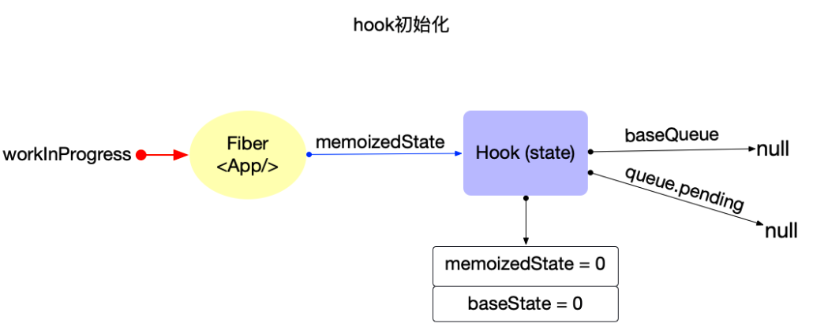
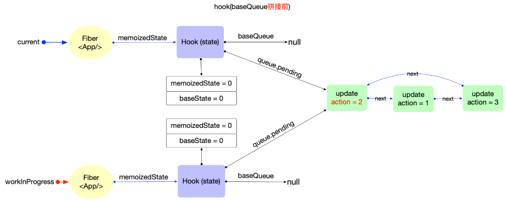
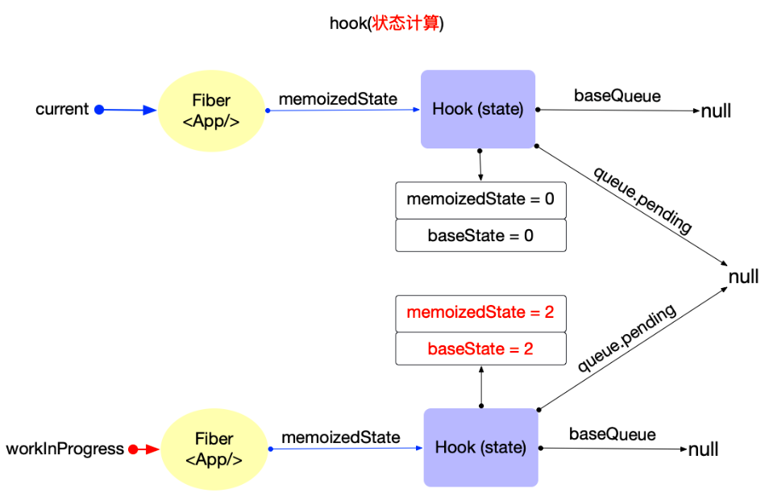

## 创建hook
在fiber初次构造阶段, useState对应源码mountState, useReducer对应源码mountReducer

### mountState
```js
function mountStateImpl<S>(initialState: (() => S) | S): Hook {
    // 创建hook
  const hook = mountWorkInProgressHook();
  if (typeof initialState === 'function') {
    const initialStateInitializer = initialState;
    // $FlowFixMe[incompatible-use]: Flow doesn't like mixed types
    initialState = initialStateInitializer();
    if (shouldDoubleInvokeUserFnsInHooksDEV) {
      setIsStrictModeForDevtools(true);
      try {
        // $FlowFixMe[incompatible-use]: Flow doesn't like mixed types
        initialStateInitializer();
      } finally {
        setIsStrictModeForDevtools(false);
      }
    }
  }
    //   初始化hook的属性
    /**
     * 2.1 设置 hook.memoizedState/hook.baseState
     * 2.2 设置 hook.queue
     */
  hook.memoizedState = hook.baseState = initialState;
  const queue: UpdateQueue<S, BasicStateAction<S>> = {
    pending: null,
    lanes: NoLanes,
    dispatch: null,
    lastRenderedReducer: basicStateReducer,
    lastRenderedState: (initialState: any),
  };
  hook.queue = queue;
  return hook;
}

function mountState<S>(
  initialState: (() => S) | S,
): [S, Dispatch<BasicStateAction<S>>] {
  const hook = mountStateImpl(initialState);
  const queue = hook.queue;
  // 2.3 设置 hook.dispatch
  const dispatch: Dispatch<BasicStateAction<S>> = (dispatchSetState.bind(
    null,
    currentlyRenderingFiber,
    queue,
  ): any);
  queue.dispatch = dispatch;
  // 3. 返回[当前状态, dispatch函数]
  return [hook.memoizedState, dispatch];
}
```
这里的dispatchSetState即React内部实现setState的核心函数,它的作用是把新的 state 更新加入到当前 hook 的更新队列，并触发一次调度，让 React 重新渲染组件。
```js
function dispatchSetState<S, A>(
  fiber: Fiber,
  queue: UpdateQueue<S, A>,
  action: A,
): void {
  if (__DEV__) {
    // using a reference to `arguments` bails out of GCC optimizations which affect function arity
    const args = arguments;
    if (typeof args[3] === 'function') {
      console.error(
        "State updates from the useState() and useReducer() Hooks don't support the " +
          'second callback argument. To execute a side effect after ' +
          'rendering, declare it in the component body with useEffect().',
      );
    }
  }

  const lane = requestUpdateLane(fiber);
  const didScheduleUpdate = dispatchSetStateInternal(
    fiber,
    queue,
    action,
    lane,
  );
  if (didScheduleUpdate) {
    startUpdateTimerByLane(lane, 'setState()');
  }
  markUpdateInDevTools(fiber, lane, action);
}

function dispatchSetStateInternal<S, A>(
  fiber: Fiber,
  queue: UpdateQueue<S, A>,
  action: A,
  lane: Lane,
): boolean {
  const update: Update<S, A> = {
    lane,
    revertLane: NoLane,
    gesture: null,
    action,
    hasEagerState: false,
    eagerState: null,
    next: (null: any),
  };

  if (isRenderPhaseUpdate(fiber)) {
    enqueueRenderPhaseUpdate(queue, update);
  } else {
    const alternate = fiber.alternate;
    if (
      fiber.lanes === NoLanes &&
      (alternate === null || alternate.lanes === NoLanes)
    ) {
      // The queue is currently empty, which means we can eagerly compute the
      // next state before entering the render phase. If the new state is the
      // same as the current state, we may be able to bail out entirely.
      const lastRenderedReducer = queue.lastRenderedReducer;
      if (lastRenderedReducer !== null) {
        let prevDispatcher = null;
        if (__DEV__) {
          prevDispatcher = ReactSharedInternals.H;
          ReactSharedInternals.H = InvalidNestedHooksDispatcherOnUpdateInDEV;
        }
        try {
          const currentState: S = (queue.lastRenderedState: any);
          const eagerState = lastRenderedReducer(currentState, action);
          // Stash the eagerly computed state, and the reducer used to compute
          // it, on the update object. If the reducer hasn't changed by the
          // time we enter the render phase, then the eager state can be used
          // without calling the reducer again.
          update.hasEagerState = true;
          update.eagerState = eagerState;
          if (is(eagerState, currentState)) {
            // Fast path. We can bail out without scheduling React to re-render.
            // It's still possible that we'll need to rebase this update later,
            // if the component re-renders for a different reason and by that
            // time the reducer has changed.
            // TODO: Do we still need to entangle transitions in this case?
            enqueueConcurrentHookUpdateAndEagerlyBailout(fiber, queue, update);
            return false;
          }
        } catch (error) {
          // Suppress the error. It will throw again in the render phase.
        } finally {
          if (__DEV__) {
            ReactSharedInternals.H = prevDispatcher;
          }
        }
      }
    }

    const root = enqueueConcurrentHookUpdate(fiber, queue, update, lane);
    if (root !== null) {
      scheduleUpdateOnFiber(root, fiber, lane);
      entangleTransitionUpdate(root, queue, lane);
      return true;
    }
  }
  return false;
}
```
1. 你调用 setState(x) 时，实际上就是调用了 dispatchSetState。
2. 它会把 action 封装成 update，加入到 hook 的队列，并安排一次调度。
3. 如果新 state 和旧 state 相同，React 会优化跳过不必要的更新。
4. 最终会触发一次新的渲染流程，React 会在下次 render 时处理这些更新。


### mountReducer
```js
function mountReducer<S, I, A>(
  reducer: (S, A) => S,
  initialArg: I,
  init?: I => S,
): [S, Dispatch<A>] {
  const hook = mountWorkInProgressHook();
  let initialState;
  if (init !== undefined) {
    initialState = init(initialArg);
    if (shouldDoubleInvokeUserFnsInHooksDEV) {
      setIsStrictModeForDevtools(true);
      try {
        init(initialArg);
      } finally {
        setIsStrictModeForDevtools(false);
      }
    }
  } else {
    initialState = ((initialArg: any): S);
  }
  hook.memoizedState = hook.baseState = initialState;
  const queue: UpdateQueue<S, A> = {
    pending: null,
    lanes: NoLanes,
    dispatch: null,
    lastRenderedReducer: reducer,
    lastRenderedState: (initialState: any),
  };
  hook.queue = queue;
  const dispatch: Dispatch<A> = (queue.dispatch = (dispatchReducerAction.bind(
    null,
    currentlyRenderingFiber,
    queue,
  ): any));
  return [hook.memoizedState, dispatch];
}
```

可见mountState是mountReducer的一种特殊情况, 即useState也是useReducer的一种特殊情况, 也是最简单的情况.

useState可以转换为useReducer
```js
const [state, dispatch] = useState({ count: 0 });

// 等价于
const [state, dispatch] = useReducer(
  function basicStateReducer(state, action) {
    return typeof action === 'function' ? action(state) : action;
  },
  { count: 0 },
);

// 当需要更新state时, 有2种方式
dispatch({ count: 1 }); // 1.直接设置
dispatch((state) => ({ count: state.count + 1 })); // 2.通过回调函数设置
```

## 状态初始化
在useState(initialState)函数内部, 设置```hook.memoizedState = hook.baseState = initialState```;, 初始状态被同时保存到了```hook.baseState,hook.memoizedState```中.
1. hook.memoizedState: 当前状态
2. hook.baseState: 基础状态, 作为合并hook.baseQueue的初始值(下文介绍).

## 状态更新
举个例子
```js
import React, { useState } from 'react';
export default function App() {
  const [count, dispatch] = useState(0);
  return (
    <button
      onClick={() => {
        dispatch(1);
        dispatch(3);
        dispatch(2);
      }}
    >
      {count}
    </button>
  );
}
```


点击按钮，调用dispatch


在fiber树构造（对比更新），再次调用function，这是useState对应的函数是updateState，实际调用的是updateReducer
```js
function updateState<S>(
  initialState: (() => S) | S,
): [S, Dispatch<BasicStateAction<S>>] {
  return updateReducer(basicStateReducer, (initialState: any));
}
```
updateReducer函数逻辑分明
1. 调用updateWorkInProgressHook获取workInProgressHook对象
2. 链表拼接: 将 hook.queue.pending 拼接到 current.baseQueue

.png)

3. 状态计算

- update优先级不够：加入到baseQueue中，等待下一次render
- update优先级足够：状态合并

