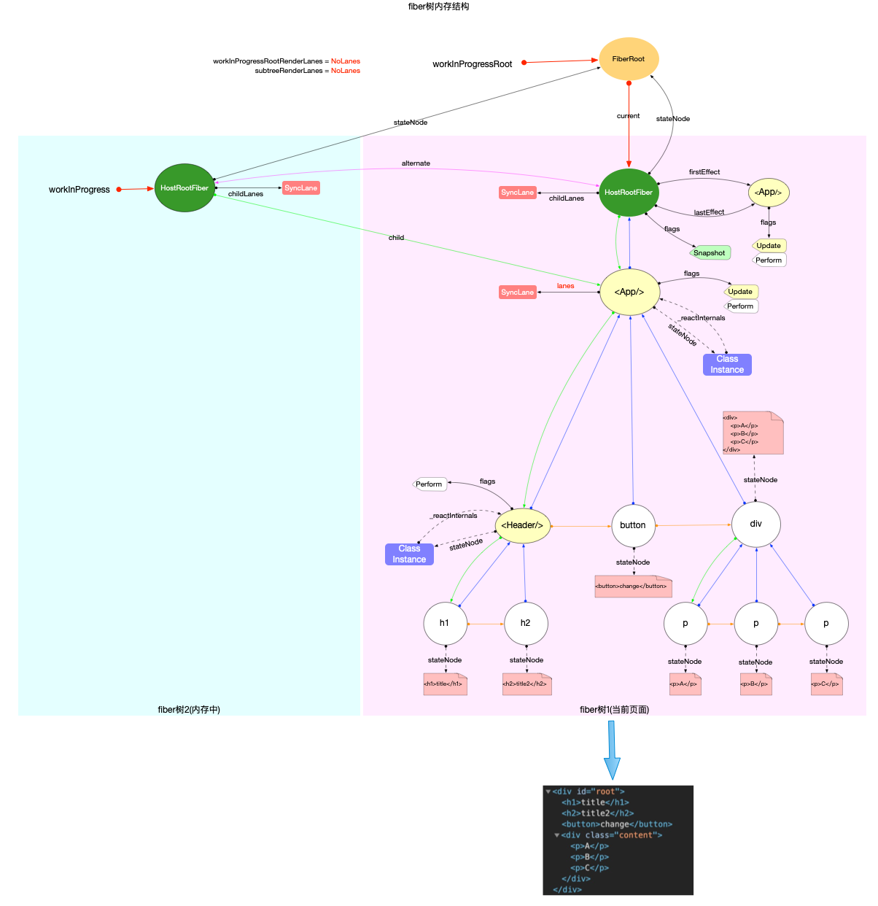

初始demo如下
```js
import React from 'react';

class App extends React.Component {
  state = {
    list: ['A', 'B', 'C'],
  };
  onChange = () => {
    this.setState({ list: ['C', 'A', 'X'] });
  };
  componentDidMount() {
    console.log(`App Mount`);
  }
  render() {
    return (
      <>
        <Header />
        <button onClick={this.onChange}>change</button>
        <div className="content">
          {this.state.list.map((item) => (
            <p key={item}>{item}</p>
          ))}
        </div>
      </>
    );
  }
}

class Header extends React.PureComponent {
  render() {
    return (
      <>
        <h1>title</h1>
        <h2>title2</h2>
      </>
    );
  }
}
export default App;
```


# 更新方式

## 更新入口
无论首次渲染还是对比更新，最终都是通过```scheduleUpdateOnFiber```
## 常见方式

上述示例中给出了三种常见更新方式

1. Class组件中调用setState
2. Function组件中调用hook对象暴露出dispatchAction
3. 在container节点上重复调用render

### setState
```js
Component.prototype.setState = function (partialState, callback) {
  this.updater.enqueueSetState(this, partialState, callback, 'setState');
};
```
```enqueueSetState```实际最终会调用```scheduleUpdateOnFiber```

```js
const classComponentUpdater = {
  // $FlowFixMe[missing-local-annot]
  enqueueSetState(inst: any, payload: any, callback) {

    const fiber = getInstance(inst);
    const lane = requestUpdateLane(fiber);

    const update = createUpdate(lane);
    update.payload = payload;
    if (callback !== undefined && callback !== null) {
     
      update.callback = callback;
    }

    const root = enqueueUpdate(fiber, update, lane);
    if (root !== null) {
      startUpdateTimerByLane(lane, 'this.setState()');
      // 进入reconciler流程
      scheduleUpdateOnFiber(root, fiber, lane);
      entangleTransitions(root, fiber, lane);
    }

    if (enableSchedulingProfiler) {
      markStateUpdateScheduled(fiber, lane);
    }
  }
}
  ```

### dispatchAction
在函数式组件中，hook（useState）则是通过hook api暴露出的dispatchAction进行更新


#### 补充 
补充一个说明，在17版本和18版本中的区别

1. React 17 及以前：只有 dispatchAction，统一处理所有 state hook。

2. React 18+：根据 hook 类型拆分为 dispatchSetState、dispatchReducerAction、dispatchActionState 等，分别服务于不同的 hook 体系。
你可以在 ReactFiberHooks.js 里搜索 dispatchSetState、dispatchReducerAction、dispatchActionState，它们就是新版的“dispatchAction”。

dispatchReducerAction（用于 useReducer），dispatchSetState（用于 useState）

### 重复调用render
对于重复render,调用路径包含updateContainer-->scheduleUpdateOnFiber


```js
import ReactDOM from 'react-dom';
function tick() {
  const element = (
    <div>
      <h1>Hello, world!</h1>
      <h2>It is {new Date().toLocaleTimeString()}.</h2>
    </div>
  );
  ReactDOM.render(element, document.getElementById('root'));
}
setInterval(tick, 1000);
```

# 构造阶段
在初次创建就看过scheduleUpdateOnFiber，对比更新仍然需要继续看这部分
```js
export function scheduleUpdateOnFiber(
  root: FiberRoot,
  fiber: Fiber,
  lane: Lane,
) {

  // Mark that the root has a pending update.
  markRootUpdated(root, lane);
/**
 * 省略
 */

  if((executionContext & RenderContext) !== NoContext &&
    root === workInProgressRoot){
   // 这是 render 阶段的更新（render phase update）
  // ...
  // 只会合并到 workInProgressRootRenderPhaseUpdatedLanes
  } else {
    // 这是正常的、非 render 阶段的更新（比如事件、异步回调等）
    // This is a normal update, scheduled from outside the render phase. For
    // example, during an input event.
    if (enableUpdaterTracking) {
      if (isDevToolsPresent) {
        addFiberToLanesMap(root, fiber, lane);
      }
    }

    warnIfUpdatesNotWrappedWithActDEV(fiber);

    if (enableTransitionTracing) {
      const transition = ReactSharedInternals.T;
      if (transition !== null && transition.name != null) {
        if (transition.startTime === -1) {
          transition.startTime = now();
        }

        addTransitionToLanesMap(root, transition, lane);
      }
    }
/**
 * 如果当前root正在渲染中，又来了新的更新，说明有插队更新
 */
    if (root === workInProgressRoot) {
      // Received an update to a tree that's in the middle of rendering. Mark
      // that there was an interleaved update work on this root.
      if ((executionContext & RenderContext) === NoContext) {
        // 如果当前不在 render context，则把本次更新的 lane 合并到 workInProgressRootInterleavedUpdatedLanes
        workInProgressRootInterleavedUpdatedLanes = mergeLanes(
          workInProgressRootInterleavedUpdatedLanes,
          lane,
        );
      }
      if (workInProgressRootExitStatus === RootSuspendedWithDelay) {
        // 如果当前 root 已经是“延迟挂起”状态（RootSuspendedWithDelay），则调用 markRootSuspended，让当前渲染中断，准备切换到新的更新。
        // The root already suspended with a delay, which means this render
        // definitely won't finish. Since we have a new update, let's mark it as
        // suspended now, right before marking the incoming update. This has the
        // effect of interrupting the current render and switching to the update.
        // TODO: Make sure this doesn't override pings that happen while we've
        // already started rendering.
        const didAttemptEntireTree = false;
        markRootSuspended(
          root,
          workInProgressRootRenderLanes,
          workInProgressDeferredLane,
          didAttemptEntireTree,
        );
      }
    }
// 确保 root 已经被调度（即安排了后续的渲染任务）。
    ensureRootIsScheduled(root);
    if (
      lane === SyncLane &&
      executionContext === NoContext &&
      !disableLegacyMode &&
      (fiber.mode & ConcurrentMode) === NoMode
    ) {
      if (__DEV__ && ReactSharedInternals.isBatchingLegacy) {
        // Treat `act` as if it's inside `batchedUpdates`, even in legacy mode.
      } else {
        // Flush the synchronous work now, unless we're already working or inside
        // a batch. This is intentionally inside scheduleUpdateOnFiber instead of
        // scheduleCallbackForFiber to preserve the ability to schedule a callback
        // without immediately flushing it. We only do this for user-initiated
        // updates, to preserve historical behavior of legacy mode.
        resetRenderTimer();
        flushSyncWorkOnLegacyRootsOnly();
      }
    }
  }
}
  ```


## 对比更新与初次渲染不同点

```markUpdateLaneFromFiberToRoot```在对比更新阶段，找出fiber树中受到本次update影响的所有节点，并设置这些节点的```fiber.lanes```或```fiber.childLanes```(用于fiber树构造使用)
```js

function markUpdateLaneFromFiberToRoot(
  sourceFiber: Fiber,
  update: ConcurrentUpdate | null,
  lane: Lane,
): null | FiberRoot {
  // Update the source fiber's lanes
  // 将update优先级设置到sourceFiber.lanes
  sourceFiber.lanes = mergeLanes(sourceFiber.lanes, lane);
  let alternate = sourceFiber.alternate;
  if (alternate !== null) {
    // 同时设置sourceFiber.alternate的优先级
    alternate.lanes = mergeLanes(alternate.lanes, lane);
  }
  // Walk the parent path to the root and update the child lanes.
  let isHidden = false;
  let parent = sourceFiber.return;
  let node = sourceFiber;
  /**
   * 从sourceFiber开始，向上遍历所有节点，直到hostRoot，设置沿途所有节点的childLanes
   */
  while (parent !== null) {
    parent.childLanes = mergeLanes(parent.childLanes, lane);
    alternate = parent.alternate;
    if (alternate !== null) {
      alternate.childLanes = mergeLanes(alternate.childLanes, lane);
    }

    if (parent.tag === OffscreenComponent) {
      // Check if this offscreen boundary is currently hidden.
      //
      // The instance may be null if the Offscreen parent was unmounted. Usually
      // the parent wouldn't be reachable in that case because we disconnect
      // fibers from the tree when they are deleted. However, there's a weird
      // edge case where setState is called on a fiber that was interrupted
      // before it ever mounted. Because it never mounts, it also never gets
      // deleted. Because it never gets deleted, its return pointer never gets
      // disconnected. Which means it may be attached to a deleted Offscreen
      // parent node. (This discovery suggests it may be better for memory usage
      // if we don't attach the `return` pointer until the commit phase, though
      // in order to do that we'd need some other way to track the return
      // pointer during the initial render, like on the stack.)
      //
      // This case is always accompanied by a warning, but we still need to
      // account for it. (There may be other cases that we haven't discovered,
      // too.)
      const offscreenInstance: OffscreenInstance | null = parent.stateNode;
      if (
        offscreenInstance !== null &&
        !(offscreenInstance._visibility & OffscreenVisible)
      ) {
        isHidden = true;
      }
    }

    node = parent;
    parent = parent.return;
  }

  if (node.tag === HostRoot) {
    const root: FiberRoot = node.stateNode;
    if (isHidden && update !== null) {
      markHiddenUpdate(root, update, lane);
    }
    return root;
  }
  return null;
}

```


### 对比更新scheduler
对比更新没有直接调用performSyncWorkOnRoot，通过Scheduler调度更新，调用链路
```performSyncWorkOnRoot--->renderRootSync--->workLoopSync```与初次构造中的一致

在进入循环构造(workLooopSync)前，会刷新栈帧（prepareFreshStack）,详细见```renderRootSync```关键逻辑
```js
function renderRootSync(root: FiberRoot, lanes: Lanes) {
  const prevExecutionContext = executionContext;
  executionContext |= RenderContext;
  // 如果fiberRoot变动, 或者update.lane变动, 都会刷新栈帧, 丢弃上一次渲染进度
  if (workInProgressRoot !== root || workInProgressRootRenderLanes !== lanes) {
    // 刷新栈帧, legacy模式下都会进入
    prepareFreshStack(root, lanes);
  }
  do {
    try {
      workLoopSync();
      break;
    } catch (thrownValue) {
      handleError(root, thrownValue);
    }
  } while (true);
  executionContext = prevExecutionContext;
  // 重置全局变量, 表明render结束
  workInProgressRoot = null;
  workInProgressRootRenderLanes = NoLanes;
  return workInProgressRootExitStatus;
}
```


- fiberRoot.current指向与当前页面对应的fiber树, workInProgress指向正在构造的fiber树.
- 刷新栈帧会调用createWorkInProgress(), 使得workInProgress.flags和workInProgress.effects都已经被重置. 且workInProgress.child = current.child. 所以在进入循环构造之前, HostRootFiber与HostRootFiber.alternate共用一个child(这里是fiber(<App/>)).


## 循环构造workLoopSync
在初次构造时，整个流程事一个<strong>深度优先遍历</strong>，其中有2个重要的变量```workInProgress```和```current```(双缓冲技术)

- workInProgress和current都视为指针
- workInProgress指向当前正在构造的fiber节点
- current = workInProgress.alternate(即fiber.alternate), 指向当前页面正在使用的fiber节点.

在深度优先遍历中，每个fiber节点会经历2个阶段：
1. 探寻阶段```beginWork```
2. 回溯阶段```completeWork```

这两个阶段共同完成了每个fiber节点的创建（或者更新）所有的fiber节点构成了fiber树


```js
// The work loop is an extremely hot path. Tell Closure not to inline it.
/** @noinline */
function workLoopSync() {
  // Perform work without checking if we need to yield between fiber.
  while (workInProgress !== null) {
    performUnitOfWork(workInProgress);
  }
}
```

```js
function performUnitOfWork(unitOfWork: Fiber): void {
  // The current, flushed, state of this fiber is the alternate. Ideally
  // nothing should rely on this, but relying on it here means that we don't
  // need an additional field on the work in progress.
  // unitOfWork就是被传入的workInProgress
  const current = unitOfWork.alternate;

  let next;
  if (enableProfilerTimer && (unitOfWork.mode & ProfileMode) !== NoMode) {
    startProfilerTimer(unitOfWork);
   
    next = beginWork(current, unitOfWork, entangledRenderLanes);
    
    stopProfilerTimerIfRunningAndRecordDuration(unitOfWork);
  } else {
  
    next = beginWork(current, unitOfWork, entangledRenderLanes);
    
  }

  unitOfWork.memoizedProps = unitOfWork.pendingProps;
  if (next === null) {
    // If this doesn't spawn new work, complete the current work.
    // 如果没有派生出新的节点, 则进入completeWork阶段, 传入的是当前unitOfWork
    completeUnitOfWork(unitOfWork);
  } else {
    workInProgress = next;
  }
}
```
注意：在对比更新过程中```current=unitOfWork.alternate```不为null，后续的调用会大量使用此处传入的current
```js
function beginWork(
  current: Fiber | null,
  workInProgress: Fiber,
  renderLanes: Lanes,
): Fiber | null {
  
  // 进入对比
  if (current !== null) {
    const oldProps = current.memoizedProps;
    const newProps = workInProgress.pendingProps;

    if (
      oldProps !== newProps ||
      hasLegacyContextChanged() ||
      // Force a re-render if the implementation changed due to hot reload:
      (__DEV__ ? workInProgress.type !== current.type : false)
    ) {
      // If props or context changed, mark the fiber as having performed work.
      // This may be unset if the props are determined to be equal later (memo).
      didReceiveUpdate = true;
    } else {
      // Neither props nor legacy context changes. Check if there's a pending
      // update or context change.
      const hasScheduledUpdateOrContext = checkScheduledUpdateOrContext(
        current,
        renderLanes,
      );
      if (
        !hasScheduledUpdateOrContext &&
        // If this is the second pass of an error or suspense boundary, there
        // may not be work scheduled on `current`, so we check for this flag.
        (workInProgress.flags & DidCapture) === NoFlags
      ) {
        // No pending updates or context. Bail out now.
        didReceiveUpdate = false;

        // 当前节点无需更新，循环检测子节点是否需要更新
        return attemptEarlyBailoutIfNoScheduledUpdate(
          current,
          workInProgress,
          renderLanes,
        );
      }
      if ((current.flags & ForceUpdateForLegacySuspense) !== NoFlags) {
        // This is a special case that only exists for legacy mode.
        // See https://github.com/facebook/react/pull/19216.
        didReceiveUpdate = true;
      } else {
        // An update was scheduled on this fiber, but there are no new props
        // nor legacy context. Set this to false. If an update queue or context
        // consumer produces a changed value, it will set this to true. Otherwise,
        // the component will assume the children have not changed and bail out.
        didReceiveUpdate = false;
      }
    }
  } else {
    didReceiveUpdate = false;

    if (getIsHydrating() && isForkedChild(workInProgress)) {
      // Check if this child belongs to a list of muliple children in
      // its parent.
      //
      // In a true multi-threaded implementation, we would render children on
      // parallel threads. This would represent the beginning of a new render
      // thread for this subtree.
      //
      // We only use this for id generation during hydration, which is why the
      // logic is located in this special branch.
      const slotIndex = workInProgress.index;
      const numberOfForks = getForksAtLevel(workInProgress);
      pushTreeId(workInProgress, numberOfForks, slotIndex);
    }
  }

  // Before entering the begin phase, clear pending update priority.
  // TODO: This assumes that we're about to evaluate the component and process
  // the update queue. However, there's an exception: SimpleMemoComponent
  // sometimes bails out later in the begin phase. This indicates that we should
  // move this assignment out of the common path and into each branch.
  /**
   * 余下逻辑与初次创建公用
   * 设置workInProgress优先级为noLanes（最高优先级）
   */
  workInProgress.lanes = NoLanes;

  switch (workInProgress.tag) {
    /**
     * 根据workInProgress节点的类型，用不同方法派生出子节点
     */
    case LazyComponent: {
      const elementType = workInProgress.elementType;
      return mountLazyComponent(
        current,
        workInProgress,
        elementType,
        renderLanes,
      );
    }
    case FunctionComponent: {
      const Component = workInProgress.type;
      return updateFunctionComponent(
        current,
        workInProgress,
        Component,
        workInProgress.pendingProps,
        renderLanes,
      );
    }
    case ClassComponent: {
      const Component = workInProgress.type;
      const unresolvedProps = workInProgress.pendingProps;
      const resolvedProps = resolveClassComponentProps(
        Component,
        unresolvedProps,
      );
      return updateClassComponent(
        current,
        workInProgress,
        Component,
        resolvedProps,
        renderLanes,
      );
    }
    case HostRoot:
      return updateHostRoot(current, workInProgress, renderLanes);
    case HostHoistable:
      if (supportsResources) {
        return updateHostHoistable(current, workInProgress, renderLanes);
      }
    // Fall through
    case HostSingleton:
      if (supportsSingletons) {
        return updateHostSingleton(current, workInProgress, renderLanes);
      }
    // Fall through
    case HostComponent:
      return updateHostComponent(current, workInProgress, renderLanes);
    case HostText:
      return updateHostText(current, workInProgress);
    case SuspenseComponent:
      return updateSuspenseComponent(current, workInProgress, renderLanes);
    case HostPortal:
      return updatePortalComponent(current, workInProgress, renderLanes);
    case ForwardRef: {
      return updateForwardRef(
        current,
        workInProgress,
        workInProgress.type,
        workInProgress.pendingProps,
        renderLanes,
      );
    }
    case Fragment:
      return updateFragment(current, workInProgress, renderLanes);
    case Mode:
      return updateMode(current, workInProgress, renderLanes);
    case Profiler:
      return updateProfiler(current, workInProgress, renderLanes);
    case ContextProvider:
      return updateContextProvider(current, workInProgress, renderLanes);
    case ContextConsumer:
      return updateContextConsumer(current, workInProgress, renderLanes);
    case MemoComponent: {
      return updateMemoComponent(
        current,
        workInProgress,
        workInProgress.type,
        workInProgress.pendingProps,
        renderLanes,
      );
    }
    case SimpleMemoComponent: {
      return updateSimpleMemoComponent(
        current,
        workInProgress,
        workInProgress.type,
        workInProgress.pendingProps,
        renderLanes,
      );
    }
    case IncompleteClassComponent: {
      if (disableLegacyMode) {
        break;
      }
      const Component = workInProgress.type;
      const unresolvedProps = workInProgress.pendingProps;
      const resolvedProps = resolveClassComponentProps(
        Component,
        unresolvedProps,
      );
      return mountIncompleteClassComponent(
        current,
        workInProgress,
        Component,
        resolvedProps,
        renderLanes,
      );
    }
    case IncompleteFunctionComponent: {
      if (disableLegacyMode) {
        break;
      }
      const Component = workInProgress.type;
      const unresolvedProps = workInProgress.pendingProps;
      const resolvedProps = resolveClassComponentProps(
        Component,
        unresolvedProps,
      );
      return mountIncompleteFunctionComponent(
        current,
        workInProgress,
        Component,
        resolvedProps,
        renderLanes,
      );
    }
    case SuspenseListComponent: {
      return updateSuspenseListComponent(current, workInProgress, renderLanes);
    }
    case ScopeComponent: {
      if (enableScopeAPI) {
        return updateScopeComponent(current, workInProgress, renderLanes);
      }
      break;
    }
    case ActivityComponent: {
      return updateActivityComponent(current, workInProgress, renderLanes);
    }
    case OffscreenComponent: {
      return updateOffscreenComponent(
        current,
        workInProgress,
        renderLanes,
        workInProgress.pendingProps,
      );
    }
    case LegacyHiddenComponent: {
      if (enableLegacyHidden) {
        return updateLegacyHiddenComponent(
          current,
          workInProgress,
          renderLanes,
        );
      }
      break;
    }
    case CacheComponent: {
      return updateCacheComponent(current, workInProgress, renderLanes);
    }
    case TracingMarkerComponent: {
      if (enableTransitionTracing) {
        return updateTracingMarkerComponent(
          current,
          workInProgress,
          renderLanes,
        );
      }
      break;
    }
    case ViewTransitionComponent: {
      if (enableViewTransition) {
        return updateViewTransition(current, workInProgress, renderLanes);
      }
      break;
    }
    case Throw: {
      // This represents a Component that threw in the reconciliation phase.
      // So we'll rethrow here. This might be a Thenable.
      throw workInProgress.pendingProps;
    }
  }

  throw new Error(
    `Unknown unit of work tag (${workInProgress.tag}). This error is likely caused by a bug in ` +
      'React. Please file an issue.',
  );
}
```
在beginWork阶段，根据workInProgress节点的类型, 用不同的方法派生出子节点，即updatexxx


## bailout
与初次创建不同，在对比更新过程中，如果是老节点，那么current!==null，需要进行对比，然后决定是否复用老节点及其子树（即bailout逻辑）

```js
function bailoutOnAlreadyFinishedWork(
  current: Fiber | null,
  workInProgress: Fiber,
  renderLanes: Lanes,
): Fiber | null {
  if (current !== null) {
    // Reuse previous dependencies
    workInProgress.dependencies = current.dependencies;
  }

  if (enableProfilerTimer) {
    // Don't update "base" render times for bailouts.
    stopProfilerTimerIfRunning(workInProgress);
  }

  markSkippedUpdateLanes(workInProgress.lanes);

/**
 * 渲染优先级不包括workInProgress.childLanes,表明子节点也无需更新
 */
  // Check if the children have any pending work.
  if (!includesSomeLane(renderLanes, workInProgress.childLanes)) {
    // The children don't have any work either. We can skip them.
    // TODO: Once we add back resuming, we should check if the children are
    // a work-in-progress set. If so, we need to transfer their effects.

    if (current !== null) {
      // Before bailing out, check if there are any context changes in
      // the children.
      lazilyPropagateParentContextChanges(current, workInProgress, renderLanes);
      // 子节点也无需更新. 返回null, 直接进入回溯阶段.
      if (!includesSomeLane(renderLanes, workInProgress.childLanes)) {
        return null;
      }
    } else {
      return null;
    }
  }

  // This fiber doesn't have work, but its subtree does. Clone the child
  // fibers and continue.
  cloneChildFibers(current, workInProgress);
  return workInProgress.child;
}
```

# 回溯阶段completeWork
在初次创建和对比更新一致，都是处理beginWork阶段已经创建出来的fiber节点，最后创建（更新）对象，并上移副作用队列

```js
function completeWork(
  current: Fiber | null,
  workInProgress: Fiber,
  renderLanes: Lanes,
): Fiber | null {
  const newProps = workInProgress.pendingProps;
  // Note: This intentionally doesn't check if we're hydrating because comparing
  // to the current tree provider fiber is just as fast and less error-prone.
  // Ideally we would have a special version of the work loop only
  // for hydration.
  popTreeContext(workInProgress);
  switch (workInProgress.tag) {
     case HostComponent: {
      // 非文本节点
      popHostContext(workInProgress);
      const type = workInProgress.type;
      // 对比更新
      if (current !== null && workInProgress.stateNode != null) {
        updateHostComponent(
          current,
          workInProgress,
          type,
          newProps,
          renderLanes,
        );
      } else {
        // ...
      }
      bubbleProperties(workInProgress);
      if (enableViewTransition) {
        // Host Components act as their own View Transitions which doesn't run enter/exit animations.
        // We clear any ViewTransitionStatic flag bubbled from inner View Transitions.
        workInProgress.subtreeFlags &= ~ViewTransitionStatic;
      }

      // This must come at the very end of the complete phase, because it might
      // throw to suspend, and if the resource immediately loads, the work loop
      // will resume rendering as if the work-in-progress completed. So it must
      // fully complete.
      preloadInstanceAndSuspendIfNeeded(
        workInProgress,
        workInProgress.type,
        current === null ? null : current.memoizedProps,
        workInProgress.pendingProps,
        renderLanes,
      );
      return null;
    }

    case HostText: {
      // 文本节点
      const newText = newProps;
      if (current && workInProgress.stateNode != null) {
        const oldText = current.memoizedProps;
        // 处理改动
        updateHostText(current, workInProgress, oldText, newText);
      } else {
        // ...省略无关代码
      }
      bubbleProperties(workInProgress);
      return null;
    }
  }
}
```
可以看到在更新过程中, 如果 DOM 属性有变化, 不会再次新建 DOM 对象, 而是设置```fiber.flags |= Update```(在markUpdate过程中), 等待commit阶段处理
```js
function updateHostComponent(
  current: Fiber,
  workInProgress: Fiber,
  type: Type,
  newProps: Props,
  renderLanes: Lanes,
) {
  if (supportsMutation) {
    // If we have an alternate, that means this is an update and we need to
    // schedule a side-effect to do the updates.
    const oldProps = current.memoizedProps;
    if (oldProps === newProps) {
      // In mutation mode, this is sufficient for a bailout because
      // we won't touch this node even if children changed.
      return;
    }

    markUpdate(workInProgress);
  } else if (supportsPersistence) {
    const currentInstance = current.stateNode;
    const oldProps = current.memoizedProps;
    // If there are no effects associated with this node, then none of our children had any updates.
    // This guarantees that we can reuse all of them.
    const requiresClone = doesRequireClone(current, workInProgress);
    if (!requiresClone && oldProps === newProps) {
      // No changes, just reuse the existing instance.
      // Note that this might release a previous clone.
      workInProgress.stateNode = currentInstance;
      return;
    }
    const currentHostContext = getHostContext();

    let newChildSet = null;
    let hasOffscreenComponentChild = false;
    if (requiresClone && passChildrenWhenCloningPersistedNodes) {
      markCloned(workInProgress);
      newChildSet = createContainerChildSet();
      // If children might have changed, we have to add them all to the set.
      hasOffscreenComponentChild = appendAllChildrenToContainer(
        newChildSet,
        workInProgress,
        /* needsVisibilityToggle */ false,
        /* isHidden */ false,
      );
    }

    const newInstance = cloneInstance(
      currentInstance,
      type,
      oldProps,
      newProps,
      !requiresClone,
      !hasOffscreenComponentChild ? newChildSet : undefined,
    );
    if (newInstance === currentInstance) {
      // No changes, just reuse the existing instance.
      // Note that this might release a previous clone.
      workInProgress.stateNode = currentInstance;
      return;
    } else {
      markCloned(workInProgress);
    }

    // Certain renderers require commit-time effects for initial mount.
    // (eg DOM renderer supports auto-focus for certain elements).
    // Make sure such renderers get scheduled for later work.
    if (
      finalizeInitialChildren(newInstance, type, newProps, currentHostContext)
    ) {
      markUpdate(workInProgress);
    }
    workInProgress.stateNode = newInstance;
    if (!requiresClone) {
      if (!enablePersistedModeClonedFlag) {
        // If there are no other effects in this tree, we need to flag this node as having one.
        // Even though we're not going to use it for anything.
        // Otherwise parents won't know that there are new children to propagate upwards.
        markUpdate(workInProgress);
      }
    } else if (
      !passChildrenWhenCloningPersistedNodes ||
      hasOffscreenComponentChild
    ) {
      // If children have changed, we have to add them all to the set.
      appendAllChildren(
        newInstance,
        workInProgress,
        /* needsVisibilityToggle */ false,
        /* isHidden */ false,
      );
    }
  }
}
```

```classComponentUpdater```
/**
 * enqueueUpdate主要流程
获取 updateQueue
每个 class 组件 fiber 都有一个 updateQueue，存放所有待处理的更新。

开发环境警告
检查是否在更新函数内部再次调度更新，如果是则警告。

判断是否为 render 阶段的“危险”更新

如果是，直接插入 sharedQueue.pending（循环链表），并调用 unsafe_markUpdateLaneFromFiberToRoot，立即沿 fiber 树向上标记 lane，返回根节点。
如果不是，调用 enqueueConcurrentClassUpdate，这是正常的并发更新流程，内部也会沿 fiber 树向上标记 lane 并返回根节点。
作用
插入更新队列：保证本次更新不会丢失。
标记优先级（lane）：沿 fiber 树向上，把本次更新的 lane 标记到每一级的 childLanes，最终到达根节点。
返回根节点：方便后续调度（如 scheduleUpdateOnFiber）。
 */
 //  将update对象添加到当前Fiber节点的updateQueue队列当中
    const root = enqueueUpdate(fiber, update, lane);
```
enqueueUpdate 是 class 组件 setState/forceUpdate 的核心入口之一，负责把更新加入队列，并沿 fiber 树向上标记优先级，为调度系统准备好后续的渲染。