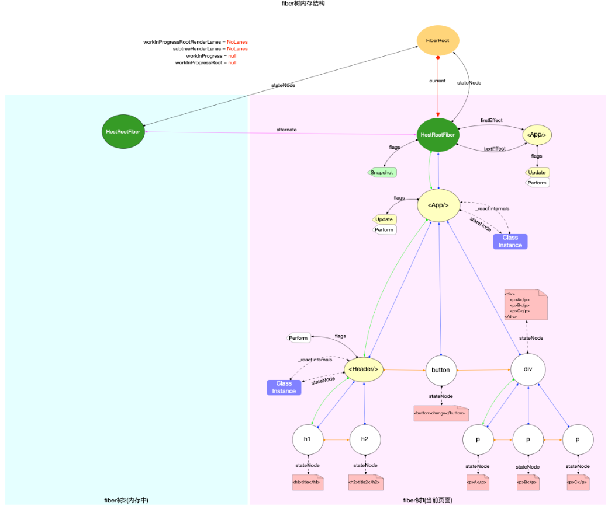

初始demo如下
```js
import React from 'react';

class App extends React.Component {
  state = {
    list: ['A', 'B', 'C'],
  };
  onChange = () => {
    this.setState({ list: ['C', 'A', 'X'] });
  };
  componentDidMount() {
    console.log(`App Mount`);
  }
  render() {
    return (
      <>
        <Header />
        <button onClick={this.onChange}>change</button>
        <div className="content">
          {this.state.list.map((item) => (
            <p key={item}>{item}</p>
          ))}
        </div>
      </>
    );
  }
}

class Header extends React.PureComponent {
  render() {
    return (
      <>
        <h1>title</h1>
        <h2>title2</h2>
      </>
    );
  }
}
export default App;
```



# 更新方式

## 更新入口
无论首次渲染还是对比更新，最终都是通过```scheduleUpdateOnFiber```
## 常见方式

上述示例中给出了三种常见更新方式

1. Class组件中调用setState
2. Function组件中调用hook对象暴露出dispatchAction
3. 在container节点上重复调用render

### setState
```js
Component.prototype.setState = function (partialState, callback) {
  this.updater.enqueueSetState(this, partialState, callback, 'setState');
};
```
```enqueueSetState```实际最终会调用```scheduleUpdateOnFiber```
```js
const classComponentUpdater = {
  // $FlowFixMe[missing-local-annot]
  enqueueSetState(inst: any, payload: any, callback) {

    const fiber = getInstance(inst);
    const lane = requestUpdateLane(fiber);

    const update = createUpdate(lane);
    update.payload = payload;
    if (callback !== undefined && callback !== null) {
     
      update.callback = callback;
    }

    const root = enqueueUpdate(fiber, update, lane);
    if (root !== null) {
      startUpdateTimerByLane(lane, 'this.setState()');
      // 进入reconciler流程
      scheduleUpdateOnFiber(root, fiber, lane);
      entangleTransitions(root, fiber, lane);
    }

    if (enableSchedulingProfiler) {
      markStateUpdateScheduled(fiber, lane);
    }
  }
}
  ```

### dispatchAction
在函数式组件中，hook（useState）则是通过hook api暴露出的dispatchAction进行更新


#### 补充 
补充一个说明，在17版本和18版本中的区别

1. React 17 及以前：只有 dispatchAction，统一处理所有 state hook。

2. React 18+：根据 hook 类型拆分为 dispatchSetState、dispatchReducerAction、dispatchActionState 等，分别服务于不同的 hook 体系。
你可以在 ReactFiberHooks.js 里搜索 dispatchSetState、dispatchReducerAction、dispatchActionState，它们就是新版的“dispatchAction”。

dispatchReducerAction（用于 useReducer），dispatchSetState（用于 useState）

### 重复调用render
对于重复render,调用路径包含updateContainer-->scheduleUpdateOnFiber


```js
import ReactDOM from 'react-dom';
function tick() {
  const element = (
    <div>
      <h1>Hello, world!</h1>
      <h2>It is {new Date().toLocaleTimeString()}.</h2>
    </div>
  );
  ReactDOM.render(element, document.getElementById('root'));
}
setInterval(tick, 1000);
```

# 构造阶段
在初次创建就看过scheduleUpdateOnFiber，对比更新仍然需要继续看这部分
```js
export function scheduleUpdateOnFiber(
  root: FiberRoot,
  fiber: Fiber,
  lane: Lane,
) {

  // Mark that the root has a pending update.
  markRootUpdated(root, lane);
/**
 * 省略
 */

  if((executionContext & RenderContext) !== NoContext &&
    root === workInProgressRoot){
   // 这是 render 阶段的更新（render phase update）
  // ...
  // 只会合并到 workInProgressRootRenderPhaseUpdatedLanes
  } else {
    // 这是正常的、非 render 阶段的更新（比如事件、异步回调等）
    // This is a normal update, scheduled from outside the render phase. For
    // example, during an input event.
    if (enableUpdaterTracking) {
      if (isDevToolsPresent) {
        addFiberToLanesMap(root, fiber, lane);
      }
    }

    warnIfUpdatesNotWrappedWithActDEV(fiber);

    if (enableTransitionTracing) {
      const transition = ReactSharedInternals.T;
      if (transition !== null && transition.name != null) {
        if (transition.startTime === -1) {
          transition.startTime = now();
        }

        addTransitionToLanesMap(root, transition, lane);
      }
    }
/**
 * 如果当前root正在渲染中，又来了新的更新，说明有插队更新
 */
    if (root === workInProgressRoot) {
      // Received an update to a tree that's in the middle of rendering. Mark
      // that there was an interleaved update work on this root.
      if ((executionContext & RenderContext) === NoContext) {
        // 如果当前不在 render context，则把本次更新的 lane 合并到 workInProgressRootInterleavedUpdatedLanes
        workInProgressRootInterleavedUpdatedLanes = mergeLanes(
          workInProgressRootInterleavedUpdatedLanes,
          lane,
        );
      }
      if (workInProgressRootExitStatus === RootSuspendedWithDelay) {
        // 如果当前 root 已经是“延迟挂起”状态（RootSuspendedWithDelay），则调用 markRootSuspended，让当前渲染中断，准备切换到新的更新。
        // The root already suspended with a delay, which means this render
        // definitely won't finish. Since we have a new update, let's mark it as
        // suspended now, right before marking the incoming update. This has the
        // effect of interrupting the current render and switching to the update.
        // TODO: Make sure this doesn't override pings that happen while we've
        // already started rendering.
        const didAttemptEntireTree = false;
        markRootSuspended(
          root,
          workInProgressRootRenderLanes,
          workInProgressDeferredLane,
          didAttemptEntireTree,
        );
      }
    }
// 确保 root 已经被调度（即安排了后续的渲染任务）。
    ensureRootIsScheduled(root);
    if (
      lane === SyncLane &&
      executionContext === NoContext &&
      !disableLegacyMode &&
      (fiber.mode & ConcurrentMode) === NoMode
    ) {
      if (__DEV__ && ReactSharedInternals.isBatchingLegacy) {
        // Treat `act` as if it's inside `batchedUpdates`, even in legacy mode.
      } else {
        // Flush the synchronous work now, unless we're already working or inside
        // a batch. This is intentionally inside scheduleUpdateOnFiber instead of
        // scheduleCallbackForFiber to preserve the ability to schedule a callback
        // without immediately flushing it. We only do this for user-initiated
        // updates, to preserve historical behavior of legacy mode.
        resetRenderTimer();
        flushSyncWorkOnLegacyRootsOnly();
      }
    }
  }
}
  ```

在```classComponentUpdater```中通过
```js
/**
 * enqueueUpdate主要流程
获取 updateQueue
每个 class 组件 fiber 都有一个 updateQueue，存放所有待处理的更新。

开发环境警告
检查是否在更新函数内部再次调度更新，如果是则警告。

判断是否为 render 阶段的“危险”更新

如果是，直接插入 sharedQueue.pending（循环链表），并调用 unsafe_markUpdateLaneFromFiberToRoot，立即沿 fiber 树向上标记 lane，返回根节点。
如果不是，调用 enqueueConcurrentClassUpdate，这是正常的并发更新流程，内部也会沿 fiber 树向上标记 lane 并返回根节点。
作用
插入更新队列：保证本次更新不会丢失。
标记优先级（lane）：沿 fiber 树向上，把本次更新的 lane 标记到每一级的 childLanes，最终到达根节点。
返回根节点：方便后续调度（如 scheduleUpdateOnFiber）。
 */
 //  将update对象添加到当前Fiber节点的updateQueue队列当中
    const root = enqueueUpdate(fiber, update, lane);
```
enqueueUpdate 是 class 组件 setState/forceUpdate 的核心入口之一，负责把更新加入队列，并沿 fiber 树向上标记优先级，为调度系统准备好后续的渲染。