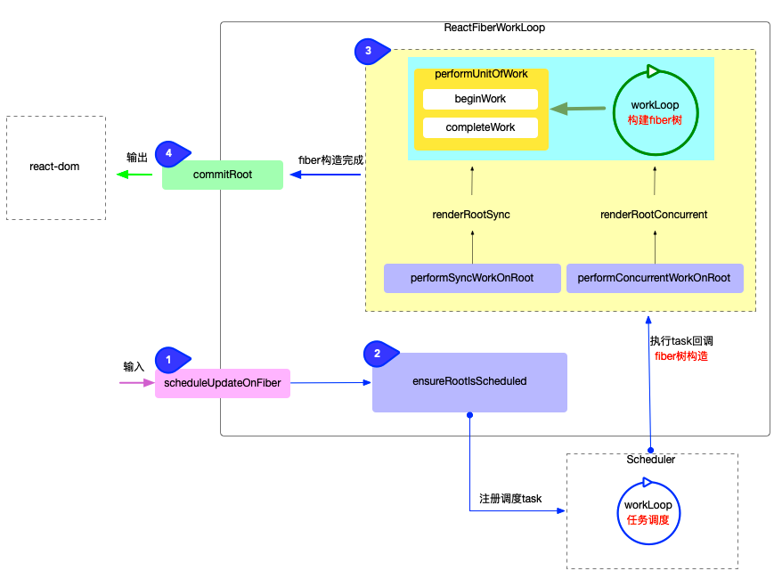

## reconciler运作流程


1. 输入阶段：衔接```react-dom```包，承接fiber更新请求
2. 注册调度任务：与调度中心（scheduler包）交互，注册调度任务task，等待任务回调
3. 执行任务回调：在内存中构造出fiber树和dom对象
4. 输出：与渲染器(react-dom)交互，渲染dom节点

fiber树渲染处于reconciler最后输出阶段，

## fiber树特点
1. 首次构造和对比更新，最终都会在内存中生成一颗用于渲染页面的fiber树(fiber.finishedWork)，特点如下
- 副作用队列挂载在 根节点(finishedWork.firstEffect)
- 代表最新页面的DOM对象挂载在fiber树中首个HostComponent类型的节点上（DOM对象挂载在fiber.stateNode属性上）


## commitRoot
渲染逻辑在commitRoot函数,整个函数分为三个阶段
1. 渲染前（dom变更前）,commitBeforeMutationEffects
2. 渲染中（dom变更），commitMutationEffects
3. 渲染后（dom变更后）commitLayoutEffects

```js
function Test() {
  console.log(1);
  useEffect(() => {
    console.log(2);
  });
  console.log(3);
  Promise.resolve().then(() => {
    console.log(4);
  });
  return <div>test</div>;
}
// 1、3：同步代码，立即输出。
// 4：Promise 的 .then，属于微任务队列，在同步代码后执行。
// 2：useEffect 的回调，在 DOM 更新后执行，属于宏任务队列，通常在微任务之后。
```
理论输出顺序为 13 4 2，但是我在react playground下输出为 13 2 4，有点奇怪

另外说明下如果resolve没有.then实际返回的是一个函数，并不会执行
```js
// 该
Promise.resolve(()=>{
    console.log(4)
})
```
第三个点是关于useEffect 

在 React 中，useEffect 的依赖数组（第二个参数）决定了副作用的执行时机：

1. 没有依赖数组（即 useEffect(() => { ... })）：
2. 每次组件渲染后都会执行（包括首次和每次更新），所以会“循环”执行。
3. 空依赖数组（即 useEffect(() => { ... }, [])）：
4. 只在组件首次挂载时执行一次。

没有依赖数组，所以每次组件渲染都会执行。如果组件只渲染一次，就只执行一次；如果有状态更新导致多次渲染，就会多次执行。


commitRoot中```finishedWork```指的是本次渲染完成后生成的 Fiber 树的根节点，也就是“工作完成的 Fiber 树”的根（通常是 HostRoot Fiber）。它代表了 React 本轮更新后要提交（commit）到 DOM 或宿主环境的最新 Fiber 树。

- 在渲染（render）阶段，React 会以当前 Fiber 树为基础，构建一棵新的 workInProgress Fiber 树。
- 渲染完成后，这棵新的 Fiber 树的根节点就是 finishedWork。
- 进入 commit 阶段时，commitRoot 会以 finishedWork 为入口，遍历整棵树，执行副作用（如 DOM 更新、生命周期回调等），并最终将 root.current 指向这棵新的树。


```js
function commitRoot(
  root: FiberRoot,
  finishedWork: null | Fiber,
  lanes: Lanes,
  recoverableErrors: null | Array<CapturedValue<mixed>>,
  transitions: Array<Transition> | null,
  didIncludeRenderPhaseUpdate: boolean,
  spawnedLane: Lane,
  updatedLanes: Lanes,
  suspendedRetryLanes: Lanes,
  exitStatus: RootExitStatus,
  suspendedCommitReason: SuspendedCommitReason, // Profiling-only
  completedRenderStartTime: number, // Profiling-only
  completedRenderEndTime: number, // Profiling-only
): void {
  root.cancelPendingCommit = null;

  do {
    // `flushPassiveEffects` will call `flushSyncUpdateQueue` at the end, which
    // means `flushPassiveEffects` will sometimes result in additional
    // passive effects. So we need to keep flushing in a loop until there are
    // no more pending effects.
    // TODO: Might be better if `flushPassiveEffects` did not automatically
    // flush synchronous work at the end, to avoid factoring hazards like this.
    flushPendingEffects();
  } while (pendingEffectsStatus !== NO_PENDING_EFFECTS);

    // 如果没有更新的
    if (finishedWork === null) {
        return
    }

     if (finishedWork === root.current) {
    throw new Error(
      'Cannot commit the same tree as before. This error is likely caused by ' +
        'a bug in React. Please file an issue.',
    );
  }


  // Check which lanes no longer have any work scheduled on them, and mark
  // those as finished.
  let remainingLanes = mergeLanes(finishedWork.lanes, finishedWork.childLanes);

  // Make sure to account for lanes that were updated by a concurrent event
  // during the render phase; don't mark them as finished.
  const concurrentlyUpdatedLanes = getConcurrentlyUpdatedLanes();
  remainingLanes = mergeLanes(remainingLanes, concurrentlyUpdatedLanes);

  if (enableGestureTransition && root.pendingGestures === null) {
    // Gestures don't clear their lanes while the gesture is still active but it
    // might not be scheduled to do any more renders and so we shouldn't schedule
    // any more gesture lane work until a new gesture is scheduled.
    remainingLanes &= ~GestureLane;
  }

/**
 * 标记本次 commit 后，哪些 lanes（优先级/任务）已经完成，哪些还剩下需要处理。
 */
  markRootFinished(
    root,
    lanes,
    remainingLanes,
    spawnedLane,
    updatedLanes,
    suspendedRetryLanes,
  );

    // Reset this before firing side effects so we can detect recursive updates.
  didIncludeCommitPhaseUpdate = false;


  if (root === workInProgressRoot) {
    // We can reset these now that they are finished.
    workInProgressRoot = null;
    workInProgress = null;
    workInProgressRootRenderLanes = NoLanes;
  } else {
    // This indicates that the last root we worked on is not the same one that
    // we're committing now. This most commonly happens when a suspended root
    // times out.
  }

    // workInProgressX might be overwritten, so we want
  // to store it in pendingPassiveX until they get processed
  // We need to pass this through as an argument to commitRoot
  // because workInProgressX might have changed between
  // the previous render and commit if we throttle the commit
  // with setTimeout
  pendingFinishedWork = finishedWork;
  pendingEffectsRoot = root;
  pendingEffectsLanes = lanes;
  pendingEffectsRemainingLanes = remainingLanes;
  pendingPassiveTransitions = transitions;
  pendingRecoverableErrors = recoverableErrors;
  pendingDidIncludeRenderPhaseUpdate = didIncludeRenderPhaseUpdate;
 /**
  * 部分代码省略
  */

/**
 * 在 commit 阶段，如果本次渲染有 passive effects（如 useEffect），就安排一个异步任务去执行这些副作用；如果没有，则清理调度信息。
这样可以保证副作用在合适的时机被执行，同时不会重复调度无用任务，提升性能和资源利用率。
 */
  if (
    // If this subtree rendered with profiling this commit, we need to visit it to log it.
    (enableProfilerTimer &&
      enableComponentPerformanceTrack &&
      finishedWork.actualDuration !== 0) ||
    (finishedWork.subtreeFlags & passiveSubtreeMask) !== NoFlags ||
    (finishedWork.flags & passiveSubtreeMask) !== NoFlags
  ) {
    if (enableYieldingBeforePassive) {
      // We don't schedule a separate task for flushing passive effects.
      // Instead, we just rely on ensureRootIsScheduled below to schedule
      // a callback for us to flush the passive effects.
    } else {
      // So we can clear these now to allow a new callback to be scheduled.
      root.callbackNode = null;
      root.callbackPriority = NoLane;
      scheduleCallback(NormalSchedulerPriority, () => {
        if (enableProfilerTimer && enableComponentPerformanceTrack) {
          // Track the currently executing event if there is one so we can ignore this
          // event when logging events.
          trackSchedulerEvent();
        }
        flushPassiveEffects(true);
        // This render triggered passive effects: release the root cache pool
        // *after* passive effects fire to avoid freeing a cache pool that may
        // be referenced by a node in the tree (HostRoot, Cache boundary etc)
        return null;
      });
    }
  } else {
    // If we don't have passive effects, we're not going to need to perform more work
    // so we can clear the callback now.
    root.callbackNode = null;
    root.callbackPriority = NoLane;
  }

    // 部分代码省略

  // The commit phase is broken into several sub-phases. We do a separate pass
  // of the effect list for each phase: all mutation effects come before all
  // layout effects, and so on.

  // Check if there are any effects in the whole tree.
  // TODO: This is left over from the effect list implementation, where we had
  // to check for the existence of `firstEffect` to satisfy Flow. I think the
  // only other reason this optimization exists is because it affects profiling.
  // Reconsider whether this is necessary.
  const subtreeHasBeforeMutationEffects =
    (finishedWork.subtreeFlags & (BeforeMutationMask | MutationMask)) !==
    NoFlags;
  const rootHasBeforeMutationEffect =
    (finishedWork.flags & (BeforeMutationMask | MutationMask)) !== NoFlags;

  if (subtreeHasBeforeMutationEffects || rootHasBeforeMutationEffect) {
    const prevTransition = ReactSharedInternals.T;
    ReactSharedInternals.T = null;
    const previousPriority = getCurrentUpdatePriority();
    setCurrentUpdatePriority(DiscreteEventPriority);
    const prevExecutionContext = executionContext;
    executionContext |= CommitContext;
    try {
      // The first phase a "before mutation" phase. We use this phase to read the
      // state of the host tree right before we mutate it. This is where
      // getSnapshotBeforeUpdate is called.
      commitBeforeMutationEffects(root, finishedWork, lanes);
    } finally {
      // Reset the priority to the previous non-sync value.
      executionContext = prevExecutionContext;
      setCurrentUpdatePriority(previousPriority);
      ReactSharedInternals.T = prevTransition;
    }
  }

   pendingEffectsStatus = PENDING_MUTATION_PHASE;
  if (enableViewTransition && willStartViewTransition) {
    pendingViewTransition = startViewTransition(
      root.containerInfo,
      pendingTransitionTypes,
      flushMutationEffects,
      flushLayoutEffects,
      flushAfterMutationEffects,
      flushSpawnedWork,
      flushPassiveEffects,
      reportViewTransitionError,
    );
  } else {
    /**
     * 精髓处
     */
    // Flush synchronously.
    flushMutationEffects();
    flushLayoutEffects();
    // Skip flushAfterMutationEffects
    flushSpawnedWork();
  }
}
```

### markRootFinished
前面主要处理一些finishedWork的边界情况，通过```markRootFinished```标记本次 commit 后，哪些 lanes（优先级/任务）已经完成，哪些还剩下需要处理。

markRootFinished 是 React 内部用于管理调度和任务优先级的函数。它会根据本次 commit 完成的 lanes（lanes），以及还剩下的 lanes（remainingLanes），更新 root 上的状态。这样，React 就能知道哪些任务已经完成，哪些还需要继续调度和处理，保证后续的调度和更新是正确的。


为什么要这样做？

React 支持多优先级并发调度（Concurrent Mode），同一个 root 可能有多个不同优先级的任务（lanes）。每次 commit 后，需要把已经完成的 lanes 标记为“已完成”，剩下的继续等待下次调度。这样可以避免重复渲染、保证高优先级任务优先完成。


### flushMutationEffects
```js

function flushMutationEffects(): void {
  if (pendingEffectsStatus !== PENDING_MUTATION_PHASE) {
    return;
  }
  pendingEffectsStatus = NO_PENDING_EFFECTS;

  const root = pendingEffectsRoot;
  const finishedWork = pendingFinishedWork;
  const lanes = pendingEffectsLanes;
  const subtreeMutationHasEffects =
    (finishedWork.subtreeFlags & MutationMask) !== NoFlags;
  const rootMutationHasEffect = (finishedWork.flags & MutationMask) !== NoFlags;

  if (subtreeMutationHasEffects || rootMutationHasEffect) {
    const prevTransition = ReactSharedInternals.T;
    ReactSharedInternals.T = null;
    const previousPriority = getCurrentUpdatePriority();
    setCurrentUpdatePriority(DiscreteEventPriority);
    const prevExecutionContext = executionContext;
    executionContext |= CommitContext;
    try {
      // The next phase is the mutation phase, where we mutate the host tree.
      commitMutationEffects(root, finishedWork, lanes);

      if (enableCreateEventHandleAPI) {
        if (shouldFireAfterActiveInstanceBlur) {
          afterActiveInstanceBlur();
        }
      }
      resetAfterCommit(root.containerInfo);
    } finally {
      // Reset the priority to the previous non-sync value.
      executionContext = prevExecutionContext;
      setCurrentUpdatePriority(previousPriority);
      ReactSharedInternals.T = prevTransition;
    }
  }

  // The work-in-progress tree is now the current tree. This must come after
  // the mutation phase, so that the previous tree is still current during
  // componentWillUnmount, but before the layout phase, so that the finished
  // work is current during componentDidMount/Update.
  root.current = finishedWork;
  pendingEffectsStatus = PENDING_LAYOUT_PHASE;
}
```

```flushMutationEffects```在 React commit 阶段的“Mutation Phase”中，遍历 Fiber 树，执行所有需要“变更 DOM”或“副作用”的操作。


详细流程
状态检查
只有当 pendingEffectsStatus === PENDING_MUTATION_PHASE 时才会执行，防止重复调用。

准备变量

获取当前需要处理的 root、finishedWork（即将成为 current 的 Fiber 树）、lanes。
检查本次 commit 是否有 Mutation 类型的副作用（如 Placement、Update、Deletion 等）。
执行 Mutation 副作用

如果有 Mutation 副作用（MutationMask），则：
切换到 CommitContext，提升优先级到 DiscreteEventPriority。
调用 commitMutationEffects(root, finishedWork, lanes)，遍历 Fiber 树，执行所有 Mutation 副作用，如：
插入/删除/移动 DOM 节点
调用 class 组件的 componentWillUnmount
处理 ref 的 attach/detach
触发 useInsertionEffect
处理事件相关的副作用（如 afterActiveInstanceBlur）。
调用 resetAfterCommit，让宿主环境（如 DOM）做一些收尾工作。
切换 Fiber 树

将 root.current 指向刚刚 commit 完成的 finishedWork，即“切换当前树”。
进入下一个阶段

将 pendingEffectsStatus 设为 PENDING_LAYOUT_PHASE，准备进入 Layout 副作用阶段。