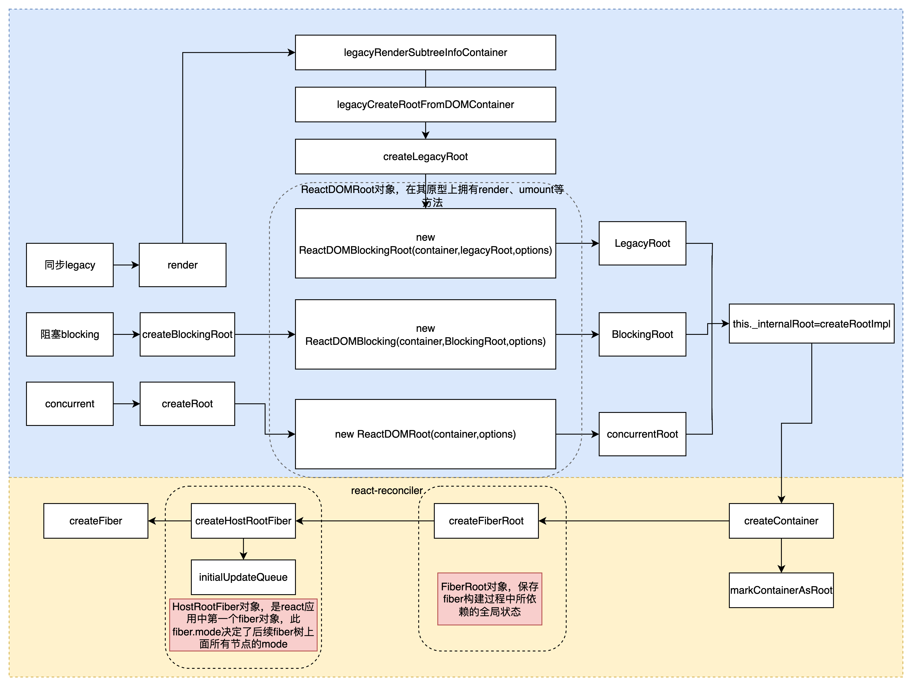

## 启动模式
react启动模式共有3种

1. Legacy(同步)模式，<=17使用ReactDOM.render
```js
// LegacyRoot
ReactDOM.render(<App />, document.getElementById('root'), (dom) => {}); // 支持callback回调, 参数是一个dom对象
```
2. Blocking（阻塞/交互式）模式，18默认，使用ReactDOM.createRoot,兼容旧代码并支持部分并发特性
```js
// BlockingRoot
// 1. 创建ReactDOMRoot对象
const reactDOMBlockingRoot = ReactDOM.createBlockingRoot(
  document.getElementById('root'),
);
// 2. 调用render
reactDOMBlockingRoot.render(<App />); // 不支持回调
```
3. Concurrent（并发）
```js
// ConcurrentRoot
// 1. 创建ReactDOMRoot对象
const reactDOMRoot = ReactDOM.createRoot(document.getElementById('root'));
// 2. 调用render
reactDOMRoot.render(<App />); // 不支持回调
```

## 启动流程
在调用入口函数后，reactElement和dom对象关联

## 创建全局对象
三种启动模式下，react初始化会创建3个全局对象
1. ReactDOMRoot对象
该包在react-dom包，该对象暴露有render,unmount方法，通过调用该实例的render方法，引导创建

2. fiberRoot对象
fiber对象在react-reconciler，保存fiber构建过程中所依赖的全局状态

3. HostRootFiber对象
属于react-reconciler包，这个是react应用中的第一个fiber对象，是Fiber树的根节点，节点类型是HostRoot




## 创建ReactDOM（Blocking）Root对象
由于 3 种模式启动的 api 有所不同, 所以从源码上追踪, 也对应了 3 种方式. 最终都 new 一个ReactDOMRoot或ReactDOMBlockingRoot的实例, 需要创建过程中RootTag参数, 3 种模式各不相同. 该RootTag的类型决定了整个 react 应用是否支持可中断渲染(后文有解释).

### legacy模式
```js
ReactDOM.render
```
然后调用legacyRenderSubtreeInfoContainer，初次调用，初次挂载，else则是root已经更新
```js
function legacyRenderSubtreeIntoContainer(
  parentComponent: ?React$Component<any, any>,
  children: ReactNodeList,
  container: Container,
  forceHydrate: boolean,
  callback: ?Function,
): React$Component<any, any> | PublicInstance | null {
  if (__DEV__) {
    topLevelUpdateWarnings(container);
    warnOnInvalidCallback(callback === undefined ? null : callback);
  }

  const maybeRoot = container._reactRootContainer;
  let root: FiberRoot;
  if (!maybeRoot) {
    // Initial mount
    root = legacyCreateRootFromDOMContainer(
      container,
      children,
      parentComponent,
      callback,
      forceHydrate,
    );
  } else {
    // root已经初始化，二次调用render会进入
    root = maybeRoot;
    if (typeof callback === 'function') {
      const originalCallback = callback;
      callback = function () {
        const instance = getPublicRootInstance(root);
        originalCallback.call(instance);
      };
    }
    // Update
    updateContainer(children, root, parentComponent, callback);
  }
  return getPublicRootInstance(root);
}
```
继续往下分析，初次挂载会调用legacyCreateRootFromDOMContainer，实际的如下
```js
function legacyCreateRootFromDOMContainer(
  container: Container,
  initialChildren: ReactNodeList,
  parentComponent: ?React$Component<any, any>,
  callback: ?Function,
  isHydrationContainer: boolean,
): FiberRoot {
  if (isHydrationContainer) {
    if (typeof callback === 'function') {
      const originalCallback = callback;
      callback = function () {
        const instance = getPublicRootInstance(root);
        originalCallback.call(instance);
      };
    }

    const root: FiberRoot = createHydrationContainer(
      initialChildren,
      callback,
      container,
      LegacyRoot,
      null, // hydrationCallbacks
      false, // isStrictMode
      false, // concurrentUpdatesByDefaultOverride,
      '', // identifierPrefix
      wwwOnUncaughtError,
      wwwOnCaughtError,
      noopOnRecoverableError,
      noopOnDefaultTransitionIndicator,
      // TODO(luna) Support hydration later
      null,
      null,
    );
    container._reactRootContainer = root;
    markContainerAsRoot(root.current, container);

    const rootContainerElement =
      !disableCommentsAsDOMContainers && container.nodeType === COMMENT_NODE
        ? container.parentNode
        : container;
    // $FlowFixMe[incompatible-call]
    listenToAllSupportedEvents(rootContainerElement);

    flushSyncWork();
    return root;
  } else {
    // First clear any existing content.
    clearContainer(container);

    if (typeof callback === 'function') {
      const originalCallback = callback;
      callback = function () {
        const instance = getPublicRootInstance(root);
        originalCallback.call(instance);
      };
    }

    const root = createContainer(
      container,
      LegacyRoot,
      null, // hydrationCallbacks
      false, // isStrictMode
      false, // concurrentUpdatesByDefaultOverride,
      '', // identifierPrefix
      wwwOnUncaughtError,
      wwwOnCaughtError,
      noopOnRecoverableError,
      noopOnDefaultTransitionIndicator,
      null, // transitionCallbacks
    );
    container._reactRootContainer = root;
    markContainerAsRoot(root.current, container);

    const rootContainerElement =
      !disableCommentsAsDOMContainers && container.nodeType === COMMENT_NODE
        ? container.parentNode
        : container;
    // $FlowFixMe[incompatible-call]
    listenToAllSupportedEvents(rootContainerElement);

    // Initial mount should not be batched.
    updateContainerSync(initialChildren, root, parentComponent, callback);
    flushSyncWork();

    return root;
  }
}
```