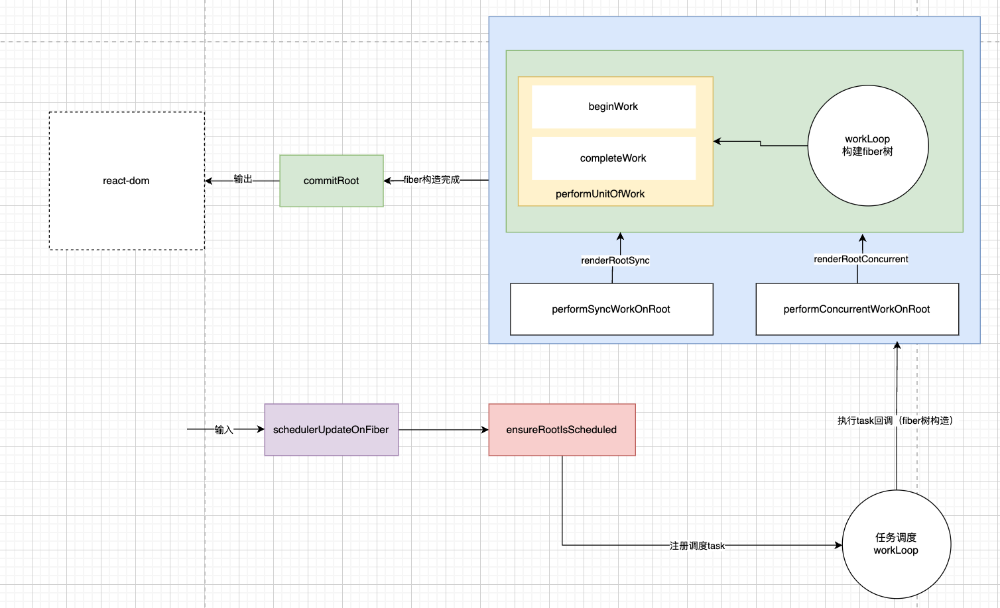

reconciler包的主要作用

1. 输入：暴露api函数（如：scheduleUpdateOnFiber），供其他包用
2. 注册调度任务：与调度中心（scheduler包）交互，注册调度任务task，等待任务回到
3. 执行任务回调：在内存中构造出fiber树，同时与渲染器(react-dom)交互、在内存中创建出与fiber对应的dom节点
4. 输出：与渲染器(react-dom)交互，渲染dom节点


上图是一个固定流程，每次更新都会运行

1. 输入：scheduleUpdateOnFiber

由 React（如 setState、dispatchAction 等）触发，调度 Fiber 更新。
主要做标记和调度，不直接构造 Fiber。
2. ensureRootIsScheduled

确保当前 FiberRoot 有任务被调度到 Scheduler。
 注册调度任务，等待执行。
3. workLoop（performUnitOfWork）

Scheduler 执行回调，进入 Fiber 构建流程。
包括 beginWork、completeWork，循环构建 Fiber 树。
具体执行路径有同步（renderRootSync）和并发（renderRootConcurrent）两种。
4. commitRoot

Fiber 树构建完成后，进入提交阶段，输出到 react-dom。

## 输入
只要是需要触发 React 更新流程的操作（即会导致组件重新渲染），最终都会走到 scheduleUpdateOnFiber。但像 Fiber 的创建、销毁、遍历、effect 处理等操作，并不会直接调用这个函数。是所有触发 React 更新流程的入口，比如 ```setState/useState/useReducer/forceUpdate``` 等，最终都会调度到这里。
```js
export function scheduleUpdateOnFiber(
  root: FiberRoot,
  fiber: Fiber,
  lane: Lane,
) {
  // 1. 开发环境下的警告
  if (__DEV__) {
    if (isRunningInsertionEffect) {
      console.error('useInsertionEffect must not schedule updates.');
    }
    if (isFlushingPassiveEffects) {
      didScheduleUpdateDuringPassiveEffects = true;
    }
  }

  // 2. 如果当前 work loop 处于挂起（等待数据或 action），则重置 stack，准备重新渲染
  if (
    (root === workInProgressRoot &&
      (workInProgressSuspendedReason === SuspendedOnData ||
        workInProgressSuspendedReason === SuspendedOnAction)) ||
    root.cancelPendingCommit !== null
  ) {
    prepareFreshStack(root, NoLanes);
    const didAttemptEntireTree = false;
    markRootSuspended(
      root,
      workInProgressRootRenderLanes,
      workInProgressDeferredLane,
      didAttemptEntireTree,
    );
  }

  // 3. 标记 root 有新的更新
  markRootUpdated(root, lane);

  // 4. 判断当前是否在 render phase
  if (
    (executionContext & RenderContext) !== NoContext &&
    root === workInProgressRoot
  ) {
    // Render phase 更新（通常是内部机制，不推荐用户代码这样做）
    warnAboutRenderPhaseUpdatesInDEV(fiber);
    workInProgressRootRenderPhaseUpdatedLanes = mergeLanes(
      workInProgressRootRenderPhaseUpdatedLanes,
      lane,
    );
  } else {
    // 5. 正常的更新（比如事件触发）
    if (enableUpdaterTracking && isDevToolsPresent) {
      addFiberToLanesMap(root, fiber, lane);
    }
    warnIfUpdatesNotWrappedWithActDEV(fiber);

    // 6. 处理 transition tracing（如果启用）
    if (enableTransitionTracing) {
      const transition = ReactSharedInternals.T;
      if (transition !== null && transition.name != null) {
        if (transition.startTime === -1) {
          transition.startTime = now();
        }
        addTransitionToLanesMap(root, transition, lane);
      }
    }

    // 7. 如果 root 正在渲染，标记 interleaved 更新
    if (root === workInProgressRoot) {
      if ((executionContext & RenderContext) === NoContext) {
        workInProgressRootInterleavedUpdatedLanes = mergeLanes(
          workInProgressRootInterleavedUpdatedLanes,
          lane,
        );
      }
      if (workInProgressRootExitStatus === RootSuspendedWithDelay) {
        const didAttemptEntireTree = false;
        markRootSuspended(
          root,
          workInProgressRootRenderLanes,
          workInProgressDeferredLane,
          didAttemptEntireTree,
        );
      }
    }

    // 8. 确保 root 被调度
    ensureRootIsScheduled(root);

    // 9. 如果是同步更新（SyncLane），且是 legacy 模式，则立即刷新
    if (
      lane === SyncLane &&
      executionContext === NoContext &&
      !disableLegacyMode &&
      (fiber.mode & ConcurrentMode) === NoMode
    ) {
      if (__DEV__ && ReactSharedInternals.isBatchingLegacy) {
        // act 测试环境特殊处理
      } else {
        resetRenderTimer();
        flushSyncWorkOnLegacyRootsOnly();
      }
    }
  }
}
```