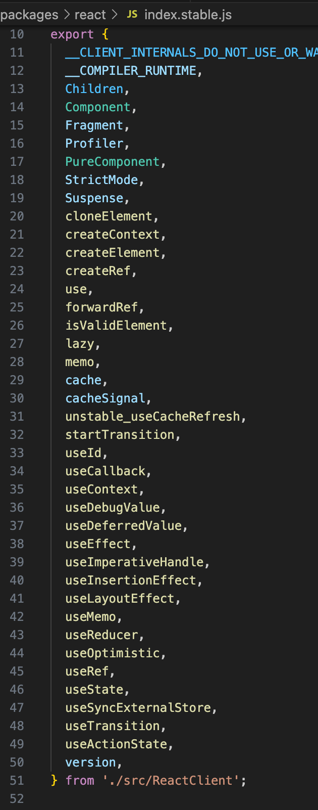
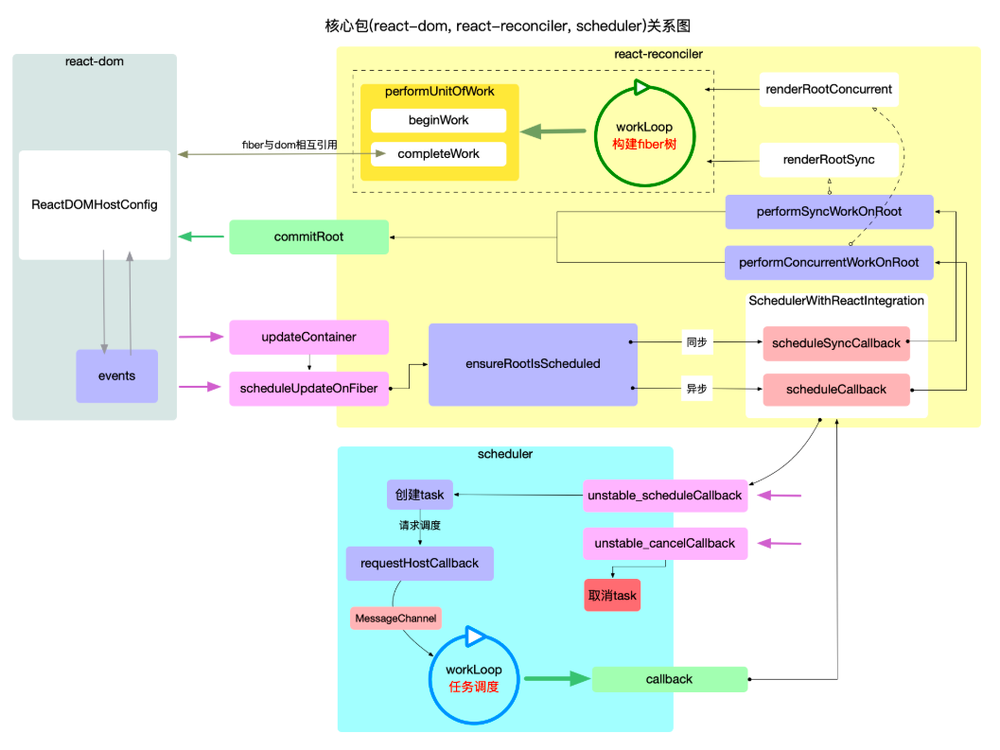

学习一个源码仓库，肯定要先看看源码仓库的文件结构,react仓库基础包结构如下

1. <strong>react</strong>

react 基础包, 只提供定义 react 组件(ReactElement)的必要函数, 一般来说需要和渲染器(react-dom,react-native)一同使用. 在编写react应用的代码时, 大部分都是调用此包的 api.

2. <strong>react-dom</strong>

react 渲染器之一, 是 react 与 web 平台连接的桥梁(可以在浏览器和 nodejs 环境中使用), 将react-reconciler中的运行结果输出到 web 界面上. 在编写react应用的代码时,大多数场景下, 能用到此包的就是一个入口函数ReactDOM.render(<App/>, document.getElementById('root')), 其余使用的 api, 基本是react包提供的.

3. <strong>react-reconciler</strong>
核心包

4. <strong>scheduler</strong>

调度机制的核心实现, 控制由react-reconciler送入的回调函数的执行时机, 在concurrent模式下可以实现任务分片. 在编写react应用的代码时, 同样几乎不会直接用到此包提供的 api.

## 宏观总览
### 架构分层
为了便于理解, 可将 react 应用整体结构分为接口层(api)和内核层(core)2 个部分

#### 接口层（api）
react包，在react启动后，正常可以改变渲染的基本操作有3个
- class组件setState
- function组件使用hook，dispatchAction改变hook对象
- 改变context

setState和dispatchAction都是由react包直接暴露



#### 内核层(core)

内核分为3个部分
1. 调度器(scheduler)
只有一个核心职责：调度器将react-reconciler提供的回调函数，包装在一个任务对象中，在内部维护一个任务队列，优先级高的排在最前面，循环消费任务队列，直到队列清空

2. 构造器(react-reconciler)
共有3个核心职责：装载渲染器，渲染器必须实现HostConfig协议，保证在需要的时候正确调用渲染器的api，生成实际节点（dom节点）；接收react-dom包（初次render）和react包（后续的setState）发起的更新请求；将fiber树的构造过程包装在一个回调函数中，并将回调函数传入scheduler包等待调度

3. 渲染器(react-dom)
共有2个核心职责引导react应用的启动（reactDOM.render）；实现HostConfig协议，能够将react-reconciler包构造出来的fiber树表现出来，生成dom节点（浏览器）或者字符串(ssr)，新版在主要在```packages/react-dom-bindings/src/client/ReactFiberConfigDOM.js```中，可以理解为react和dom之间的翻译

