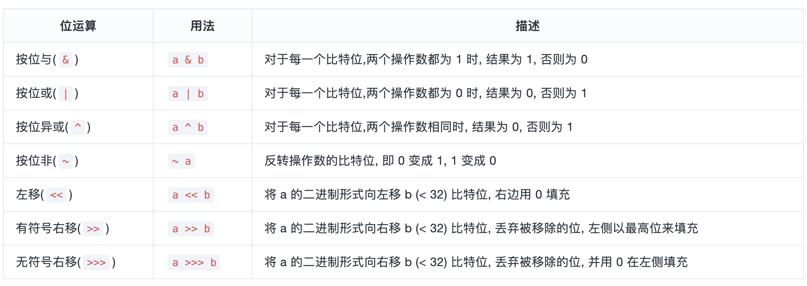

React内部对于优先级的管理, 贯穿运作流程的 4 个阶段(从输入到输出), 根据其功能的不同, 可以分为 3 种类型:

1. fiber优先级(LanePriority): 位于react-reconciler包, 也就是Lane(车道模型).
2. 调度优先级(SchedulerPriority): 位于scheduler包.
3. 优先级等级(ReactPriorityLevel) : 位于react-reconciler包中的SchedulerWithReactIntegration.js, 负责上述 2 套优先级体系的转换.

<strong>优先级</strong>
### Fiber优先级(lanes)

本质：每个更新（如 setState）会被分配一个 Lane（车道），Lane 其实就是一个 bitmask，代表不同的优先级和类型。

作用：决定哪些更新可以被合并、批量处理、跳过、延迟等。

常见 Lane：SyncLane、TransitionLane、IdleLane、RetryLane 等。

Lanes决定哪些要做，做那些先，是react内部更新内容优先级


[ReactFiberLane](https://github.com/facebook/react/blob/main/packages/react-reconciler/src/ReactFiberLane.js)，该模型使用32位来表示优先级

<Strong>PS：为什么使用32位表示呢</strong>

1. 性能与实现简洁
32位在js引擎中运算高效，位运算可以直接使用cpu指令完成，速度快，用32位整数，每一位代表一个lane，可以高效进行合并、筛选、优先级判断等操作

2. 优先级数量足够
32个lane足以覆盖react内部所有常见的优先级场景，如同步、异步、交互、渲染、等等

3. 内存占用低
只用一个32位整数（4字节）就能表示所有lane，节省内存、便于在fiber树中频繁传递和比较

4. 源码可维护
32位lane设计简单直观、易于维护和扩展

### 小结
共定义了18 种车道(Lane/Lanes)变量, 每一个变量占有 1 个或多个比特位, 分别定义为Lane和Lanes类型.

每一种车道(Lane/Lanes)都有对应的优先级, 所以源码中定义了 18 种优先级(LanePriority).

占有低位比特位的Lane变量对应的优先级越高
最高优先级为SyncLanePriority对应的车道为SyncLane = 0b0000000000000000000000000000001.

最低优先级为OffscreenLanePriority对应的车道为OffscreenLane = 0b1000000000000000000000000000000.

### 调度优先级（scheduler prority）
[SchedulerPriorities](https://github.com/facebook/react/blob/v17.0.2/packages/scheduler/src/SchedulerPriorities.js)

本质：React 内部调度任务时用的优先级，决定任务在 JS 事件循环中的调度顺序。

作用：决定任务何时被执行（比如同步、异步、空闲时等）。

常见值：ImmediatePriority、UserBlockingPriority、NormalPriority、LowPriority、IdlePriority。

scheduler prority决定哪些先做，是JS层面的调度优先级

为了能协同调度中心(scheduler包)和 fiber 树构造(react-reconciler包)中对优先级的使用, 则需要转换SchedulerPriority和LanePriority, 转换的桥梁是ReactPriorityLevel

### ReactPriorityLevel

详细定义见```getInternalReactConstants```

转换主要一个在scheduler中的```getCurrentPriorityLevel```
大体转换伪代码如下
```js
export function getCurrentPriorityLevel(): ReactPriorityLevel {
  switch (Scheduler_getCurrentPriorityLevel()) {
    case Scheduler_ImmediatePriority:
      return ImmediatePriority;
    case Scheduler_UserBlockingPriority:
      return UserBlockingPriority;
    case Scheduler_NormalPriority:
      return NormalPriority;
    case Scheduler_LowPriority:
      return LowPriority;
    case Scheduler_IdlePriority:
      return IdlePriority;
    default:
      invariant(false, 'Unknown priority level.');
  }
}

function reactPriorityToSchedulerPriority(reactPriorityLevel) {
  switch (reactPriorityLevel) {
    case ImmediatePriority:
      return Scheduler_ImmediatePriority;
    case UserBlockingPriority:
      return Scheduler_UserBlockingPriority;
    case NormalPriority:
      return Scheduler_NormalPriority;
    case LowPriority:
      return Scheduler_LowPriority;
    case IdlePriority:
      return Scheduler_IdlePriority;
    default:
      invariant(false, 'Unknown priority level.');
  }
}
```

### react算法（位运算）



ES5规范中位运算左右操作数都转换为有符号32位整型，且返回结果也是有符号32位整型

- 当操作数是浮点数时首先会被转换为整型，再进行位运算
- 当操作数过大，超过了Int32范围, 超过的部分会被截取

上述知识点回顾，要点如下

- 位运算只在整数变量之间进行运算
- js 中的Number类型在底层都是以浮点数(参考 IEEE754 标准)进行存储.
- js 中所有的按位操作符的操作数都会被转成补码（two's complement）形式的有符号32位整数

所以在 js 中使用位运算时, 有 2 种情况会造成结果异常:

1. 操作数为浮点型(虽然底层都是浮点型, 此处理解为显示性的浮点型)
```bash
转换流程: 浮点数 -> 整数(丢弃小数位) -> 位运算
```
2. 操作数的大小超过```Int32```范围```(-2^31 ~ 2^31-1)```. 超过范围的二进制位会被截断, 取低位32bit.
```js
Before: 11100110111110100000000000000110000000000001
After:              10100000000000000110000000000001
```
另外由于 js 语言的隐式转换, 对非Number类型使用位运算操作符时会发生隐式转换, 相当于先使用Number(xxx)将其转换为number类型, 再进行位运算:
```js
'str' >>> 0; //  ===> Number('str') >>> 0  ===> NaN >>> 0 = 0
```

#### 基本使用

1. 枚举属性
```js
const A = 1 << 0; // 0b00000001
const B = 1 << 1; // 0b00000010
const C = 1 << 2; // 0b00000100
```

2. 位掩码

通过位移定义的一组枚举常量, 可以利用位掩码的特性, 快速操作这些枚举产量(增加, 删除, 比较).
```js

// 属性增加|
// ABC = A | B | C
// 属性删除& ~
// AB = ABC & ~C
// 属性比较
// AB 当中包含 B: AB & B === B
// AB 当中不包含 C: AB & C === 0
// A 和 B 相等: A === B

const A = 1 << 0; // 0b00000001
const B = 1 << 1; // 0b00000010
const C = 1 << 2; // 0b00000100

// 增加属性
const ABC = A | B | C; // 0b00000111
// 删除属性
const AB = ABC & ~C; // 0b00000011

// 属性比较
// 1. AB当中包含B
console.log((AB & B) === B); // true
// 2. AB当中不包含C
console.log((AB & C) === 0); // true
// 3. A和B相等
console.log(A === B); // false
```

在react中有多个地方用到了位运算，举几个🌰

#### lanes模型

在lane中变量只列出了 31 位, 由于 js 中位运算都会转换成Int32(上文已经解释), 最多为 32 位, 且最高位是符号位. 所以除去符号位, 最多只有 31 位可以参与运算.
<strong>getHighestPriorityLane：分离出最高优先级</strong>
```js

export function getHighestPriorityLane(lanes: Lanes): Lane {
  return lanes & -lanes;
}
```
通过lanes & -lanes可以分离出所有比特位中最右边的 1, 具体来讲:

```bash

假设 lanes(InputDiscreteLanes) = 0b0000000000000000000000000011000
那么 -lanes = 0b1111111111111111111111111101000
所以 lanes & -lanes = 0b0000000000000000000000000001000
相比最初的 InputDiscreteLanes, 分离出来了最右边的1
通过 lanes 的定义, 数字越小的优先级越高, 所以此方法可以获取最高优先级的lane
```

#### 执行上下文ExecutionContext
ExecutionContext定义与react-reconciler包中, 代表reconciler在运行时的上下文状态(在reconciler 执行上下文章节中深入解读, 此处介绍位运算的应用).

```js
export const NoContext = /*             */ 0b0000000;
const BatchedContext = /*               */ 0b0000001;
const EventContext = /*                 */ 0b0000010;
const DiscreteEventContext = /*         */ 0b0000100;
const LegacyUnbatchedContext = /*       */ 0b0001000;
const RenderContext = /*                */ 0b0010000;
const CommitContext = /*                */ 0b0100000;
export const RetryAfterError = /*       */ 0b1000000;

// ...

// Describes where we are in the React execution stack
let executionContext: ExecutionContext = NoContext;
```