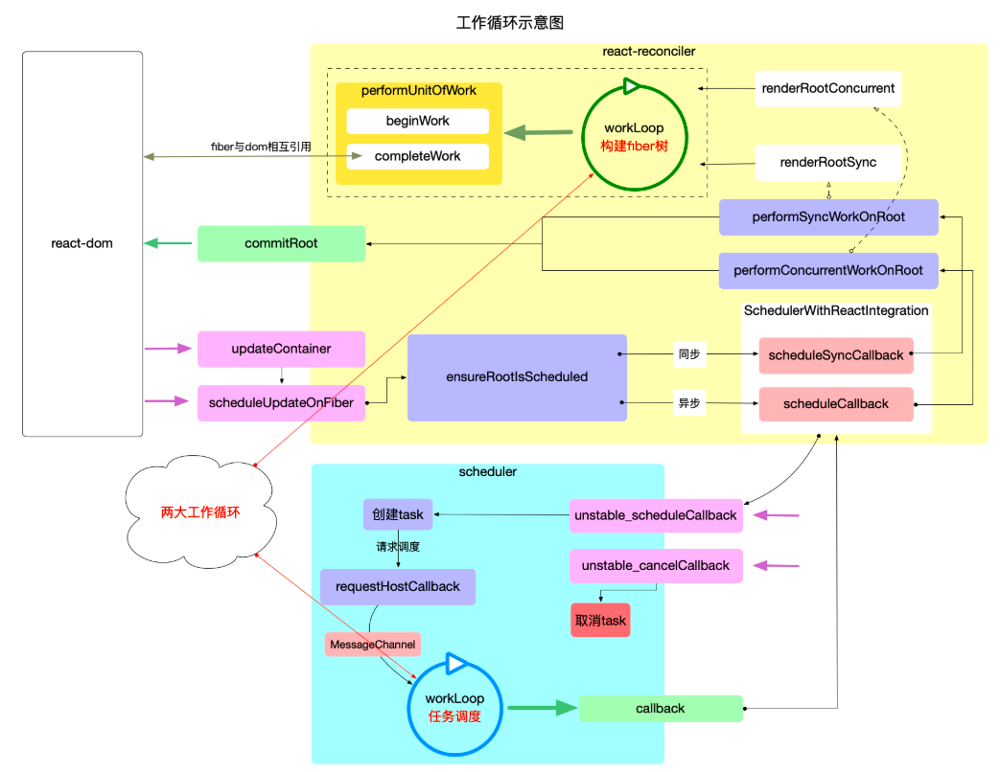
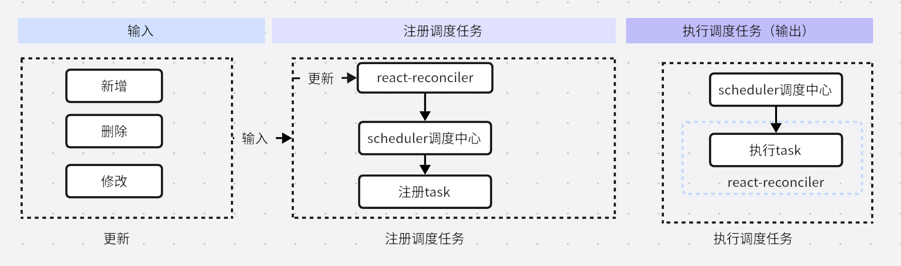

图示中存在两大循环，一个是任务调度循环和fiber构造循环

## 任务调度循环
Scheduler.js，循环调用，控制任务的调度

## fiber构造循环

控制fiber树的构造，通过深度优先遍历

## 对比

1. 任务调度循环数据结构:二叉堆，循环执行堆的定点，直到堆被清空

2. 主要用于任务调度，不关心任务是什么，具体任务其实就是执行回调函数performSyncWorkOnRoot或performConcurrentWorkOnRoot.属于宏观调度

3. fiber树构造是树结构，执行深度有限遍历

4. fiber构造循环是任务的一部分，它只是任务(task)的一部分(如performSyncWorkOnRoot包括: fiber树的构造, DOM渲染, 调度检测), 只负责fiber树的构造.

fiber构造循环是任务调度循环中的一部分，每个任务都会重新构造一个fiber树

## react主干逻辑
两大循环总结：大循环（任务调度）负责调度task，小循环（fiber构造循环）负责实现task

执行task包括如下
1. fiber构造循环是task的实现环节之一, 循环完成之后会构造出最新的 fiber 树.
2. commitRoot是task的实现环节之二, 把最新的 fiber 树最终渲染到页面上, task完成.