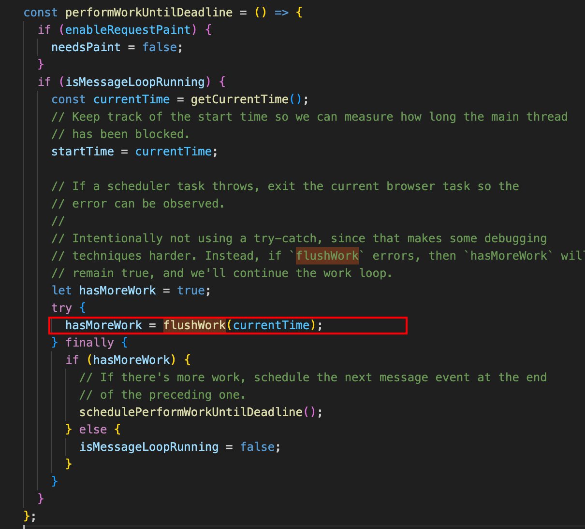

react中调度中心（Scheduler）是整个react运行的中枢
```js
+-----------------------------+
|   unstable_scheduleCallback |
+-----------------------------+
              |
              v
+-----------------------------+
|    任务对象 Task            |
|  (priority, callback, ...)  |
+-----------------------------+
              |
              v
+-------------------+   +-------------------+
|   timerQueue      |   |   taskQueue       |
| (延迟任务)        |   | (到期/立即任务)   |
+-------------------+   +-------------------+
         |                      |
         | advanceTimers        |
         +----------+-----------+
                    |
                    v
           +-------------------+
           |   requestHostCallback
           +-------------------+
                    |
                    v
           +-------------------+
           | performWorkUntilDeadline
           +-------------------+
                    |
                    v
           +-------------------+
           |    flushWork      |
           +-------------------+
                    |
                    v
           +-------------------+
           |    workLoop       |
           +-------------------+
                    |
                    v
           +-------------------+
           | 执行 callback     |
           +-------------------+
                    |
                    v
           +-------------------+
           | shouldYieldToHost |
           +-------------------+

```

1. unstable_scheduleCallback：入口，创建任务（Task），分配优先级和时间，加入队列。
2. timerQueue / taskQueue：分别存储延迟任务和到期/立即任务。
3. advanceTimers：把到期的 timerQueue 任务转移到 taskQueue。
4. requestHostCallback：启动主循环（根据环境选择 setImmediate、MessageChannel、setTimeout）。
5. performWorkUntilDeadline：主循环，调用 flushWork。
6. flushWork / workLoop：遍历 taskQueue，执行任务 callback，支持 continuation（分片）。
7. shouldYieldToHost：判断是否需要让出主线程，保证响应性。
8. hasMoreWork：如果还有任务，继续调度；否则退出主循环。

## 任务队列管理
 从```Scheduler.js```文件可以看到，任务队列实际是一个小顶堆
```js
// Tasks are stored on a min heap
var taskQueue: Array<Task> = [];
var timerQueue: Array<Task> = [];

```

### 创建任务
```js
// 创建任务
function unstable_scheduleCallback(
  priorityLevel: PriorityLevel,
  callback: Callback,
  options?: {delay: number},
): Task {
  // 获取当前时间
  var currentTime = getCurrentTime();

  var startTime;
  if (typeof options === 'object' && options !== null) {
    var delay = options.delay;
    if (typeof delay === 'number' && delay > 0) {
      startTime = currentTime + delay;
    } else {
      startTime = currentTime;
    }
  } else {
    startTime = currentTime;
  }

  var timeout;
  switch (priorityLevel) {
    case ImmediatePriority:
      // Times out immediately
      timeout = -1;
      break;
    case UserBlockingPriority:
      // Eventually times out
      timeout = userBlockingPriorityTimeout;
      break;
    case IdlePriority:
      // Never times out
      timeout = maxSigned31BitInt;
      break;
    case LowPriority:
      // Eventually times out
      timeout = lowPriorityTimeout;
      break;
    case NormalPriority:
    default:
      // Eventually times out
      timeout = normalPriorityTimeout;
      break;
  }

  var expirationTime = startTime + timeout;
  // 创建新任务
  var newTask: Task = {
    id: taskIdCounter++,
    callback, // 传入的回调函数
    priorityLevel, // 优先级等级
    startTime, // 创建task时的时间
    expirationTime, // task过期时间，优先级越高expirationTime=startTime+timeout 越小
    sortIndex: -1,
  };
  if (enableProfiling) {
    newTask.isQueued = false;
  }

  if (startTime > currentTime) {
    // This is a delayed task.
    newTask.sortIndex = startTime;
    push(timerQueue, newTask);
    if (peek(taskQueue) === null && newTask === peek(timerQueue)) {
      // All tasks are delayed, and this is the task with the earliest delay.
      if (isHostTimeoutScheduled) {
        // Cancel an existing timeout.
        cancelHostTimeout();
      } else {
        isHostTimeoutScheduled = true;
      }
      // Schedule a timeout.
      requestHostTimeout(handleTimeout, startTime - currentTime);
    }
  } else {
    newTask.sortIndex = expirationTime;
    // 加入任务队列
    push(taskQueue, newTask);
    if (enableProfiling) {
      markTaskStart(newTask, currentTime);
      newTask.isQueued = true;
    }
    // Schedule a host callback, if needed. If we're already performing work,
    // wait until the next time we yield.
    // 请求调度
    if (!isHostCallbackScheduled && !isPerformingWork) {
      isHostCallbackScheduled = true;
      requestHostCallback();
    }
  }

  return newTask;
}
```

### 消费任务
```js
function flushWork(initialTime: number) {
  if (enableProfiling) {
    markSchedulerUnsuspended(initialTime);
  }

  // We'll need a host callback the next time work is scheduled.
  isHostCallbackScheduled = false;
  if (isHostTimeoutScheduled) {
    // We scheduled a timeout but it's no longer needed. Cancel it.
    isHostTimeoutScheduled = false;
    cancelHostTimeout();
  }

  isPerformingWork = true;
  const previousPriorityLevel = currentPriorityLevel;
  try {
    if (enableProfiling) {
      try {
        return workLoop(initialTime);
      } catch (error) {
        if (currentTask !== null) {
          const currentTime = getCurrentTime();
          // $FlowFixMe[incompatible-call] found when upgrading Flow
          markTaskErrored(currentTask, currentTime);
          // $FlowFixMe[incompatible-use] found when upgrading Flow
          currentTask.isQueued = false;
        }
        throw error;
      }
    } else {
      // No catch in prod code path.
      return workLoop(initialTime);
    }
  } finally {
    currentTask = null;
    currentPriorityLevel = previousPriorityLevel;
    isPerformingWork = false;
    if (enableProfiling) {
      const currentTime = getCurrentTime();
      markSchedulerSuspended(currentTime);
    }
  }
}
```

```js
function workLoop(initialTime: number) {
  let currentTime = initialTime;
  advanceTimers(currentTime);
  currentTask = peek(taskQueue);
  while (currentTask !== null) {
    if (!enableAlwaysYieldScheduler) {
        // 如果currentTask没有过期，但是执行时间超过了限制，停止执行，让出主线程
      if (currentTask.expirationTime > currentTime && shouldYieldToHost()) {
        // This currentTask hasn't expired, and we've reached the deadline.
        break;
      }
    }
    // $FlowFixMe[incompatible-use] found when upgrading Flow
    const callback = currentTask.callback;
    if (typeof callback === 'function') {
      // $FlowFixMe[incompatible-use] found when upgrading Flow
      currentTask.callback = null;
      // $FlowFixMe[incompatible-use] found when upgrading Flow
      currentPriorityLevel = currentTask.priorityLevel;
      // $FlowFixMe[incompatible-use] found when upgrading Flow
      const didUserCallbackTimeout = currentTask.expirationTime <= currentTime;
      if (enableProfiling) {
        // $FlowFixMe[incompatible-call] found when upgrading Flow
        markTaskRun(currentTask, currentTime);
      }
    //   执行回调
      const continuationCallback = callback(didUserCallbackTimeout);
      currentTime = getCurrentTime();
    //   回调完成，判断是否还有连续（派生）回调，类似promise的那种回调
      if (typeof continuationCallback === 'function') {
    // 产生了连续回调(如fiber树太大, 出现了中断渲染), 保留currentTask
        currentTask.callback = continuationCallback;
        if (enableProfiling) {
          // $FlowFixMe[incompatible-call] found when upgrading Flow
          markTaskYield(currentTask, currentTime);
        }
        advanceTimers(currentTime);
        return true;
      } else {
          
        // 把currentTask移出队列
        if (currentTask === peek(taskQueue)) {
          pop(taskQueue);
        }
        advanceTimers(currentTime);
      }
    } else {
      // 如果任务被取消(这时currentTask.callback = null), 将其移出队列
      pop(taskQueue);
    }
    // 更新currentTask
    currentTask = peek(taskQueue);
    if (enableAlwaysYieldScheduler) {
      if (currentTask === null || currentTask.expirationTime > currentTime) {
        // This currentTask hasn't expired we yield to the browser task.
        break;
      }
    }
  }
  // Return whether there's additional work
  if (currentTask !== null) {
    // 如果task队伍没有清空，返回true，等待调度中心下次回调
    return true;
  } else {
    const firstTimer = peek(timerQueue);
    if (firstTimer !== null) {
      requestHostTimeout(handleTimeout, firstTimer.startTime - currentTime);
    }
    return false;
  }
}
```
最后上述任务workLoop的return，最后返回值会直接在下图函数中使用，用于判断是否还有更多task


```workLoop```是一个大循环，在此处实现时间切片(time slicing)和fiber树的可中断渲染

每一次while循环的退出就是一个时间切片，退出条件如下
1. 队列被完全清空，正常退出
2. 执行超时：在消费taskQueue时，在执行task.callback之前，都会检测是否超时，超时检测是以task为单位， 如果task.callback执行时间太长(如fiber树很大，或逻辑很重)，造成超时

#### 时间切片原理
消费任务队列的过程中，可以消费1-n个task，甚至清空队列，但是在每一次具体执行的时候都要执行超时检测，如果超时可以立即退出循环并等待下一次调用

#### 可中断渲染原理
在时间切片的基础上，如果单个task.callback执行时间很长，就需要task.callback自己能够检测是否超时，所以在fiber树构造过程中，每构造完成一个单元，都会检测一次超时，遇到超时就退出fiber树构造循环，并返回一个新的回调函数(continuationCallback)并等待下一次回调继续未完成的fiber树构造

## 节流防抖
在reconciler运作流程中，注册调度任务在ensureRootIsScheduled中，正常情况下```ensureRootIsScheduled```函数会和```Scheduler```包通信,最后注册一个task并等待回调
```js
export function ensureRootIsScheduled(root: FiberRoot): void {
  // This function is called whenever a root receives an update. It does two
  // things 1) it ensures the root is in the root schedule, and 2) it ensures
  // there's a pending microtask to process the root schedule.
  //
  // Most of the actual scheduling logic does not happen until
  // `scheduleTaskForRootDuringMicrotask` runs.

  // Add the root to the schedule
  
  if (root === lastScheduledRoot || root.next !== null) {
    // Fast path. This root is already scheduled.
  } else {
    if (lastScheduledRoot === null) {
      firstScheduledRoot = lastScheduledRoot = root;
    } else {
      lastScheduledRoot.next = root;
      lastScheduledRoot = root;
    }
  }

  // Any time a root received an update, we set this to true until the next time
  // we process the schedule. If it's false, then we can quickly exit flushSync
  // without consulting the schedule.
  mightHavePendingSyncWork = true;

  ensureScheduleIsScheduled();

}
```
1. 在task注册完成之后, 会设置fiberRoot对象上的属性(fiberRoot是 react 运行时中的重要全局对象, 可参考React 应用的启动过程), 代表现在已经处于调度进行中

2. 再次进入ensureRootIsScheduled时(比如连续 2 次setState, 第 2 次setState同样会触发reconciler运作流程中的调度阶段), 如果发现处于调度中, 则需要一些节流和防抖措施, 进而保证调度性能.
    - 节流(判断条件: existingCallbackPriority === newCallbackPriority, 新旧更新的优先级相同, 如连续多次执行setState), 则无需注册新task(继续沿用上一个优先级相同的task), 直接退出调用.
    
    - 防抖(判断条件: existingCallbackPriority !== newCallbackPriority, 新旧更新的优先级不同), 则取消旧task, 重新注册新task.