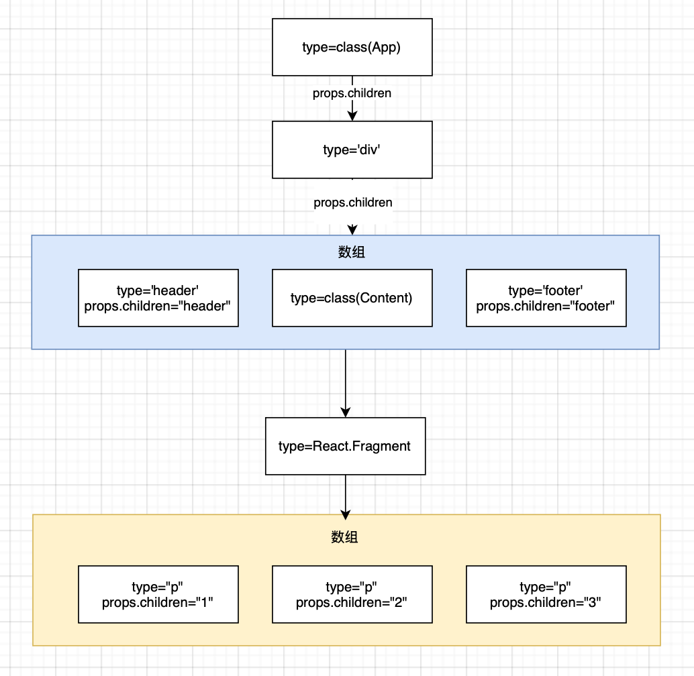
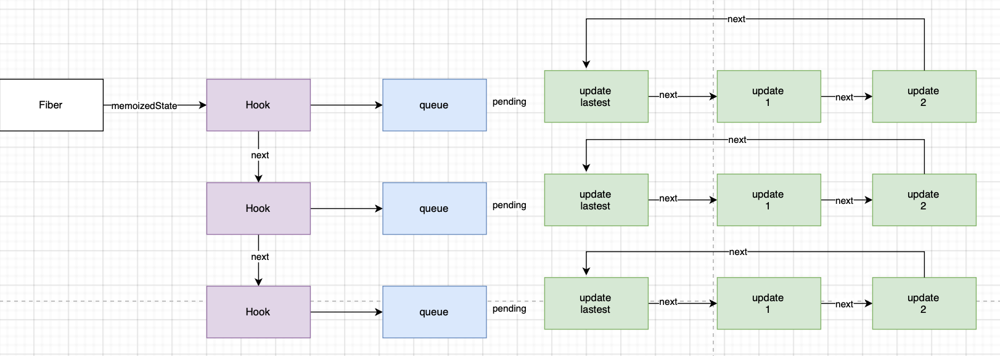

## react包
react包定义react组件(ReactElement)的必要函数，可以操作ReactElement对象api

react应用的入口函数如下
```js
ReactDOM.render(<App/>,document.getElementById('root'))
```


### ReactElement对象

jsx语法最终会被编译转换为ReactElement对象,通过React.createElement(...)

```js
// 类型定义
export type ReactElement = {
    // 用于辨别ReactElement对象
  $$typeof: any,
  type: any, // 表明其种类
  key: any,
  ref: any,
  props: any,
  // __DEV__ or for string refs
  _owner: any,

  // __DEV__
  _store: {validated: 0 | 1 | 2, ...}, // 0: not validated, 1: validated, 2: force fail
  _debugInfo: null | ReactDebugInfo,
  _debugStack: Error,
  _debugTask: null | ConsoleTask,
};

```

上面便是reactElement对象的ts定义，其中```key```属性在reconciler阶段，用于diff算法，默认值为null，所有的ReactElement都有key

type属性决定了节点的种类

值可以是字符串（代表div、span等dom节点）、函数（代表function、class等节点）、或者react内部定义的节点类型，在reconciler阶段，根据不同type执行不同逻辑（用于fiber构建）

#### ReactComponent对象
reactComponent是ReactElement一种

继承class类型，继承父类Component，带有setState等，在reconciler阶段，会根据ReactElement对象的特征，生成对应的fiber节点，当识别到ReactElement对象是class类型，会触发对应的生命周期，调用render方法、生成ReactElement子节点

```js
class App extends React.Component {
  render() {
    return (
      <div className="app">
        <header>header</header>
        <Content />
        <footer>footer</footer>
      </div>
    );
  }
}

class Content extends React.Component {
  render() {
    return (
      <React.Fragment>
        <p>1</p>
        <p>2</p>
        <p>3</p>
      </React.Fragment>
    );
  }
}

export default App;
```

上述jsx代码编译后变为
```js
class App_App extends react_default.a.Component {
  render() {
    return /*#__PURE__*/ react_default.a.createElement(
      'div',
      {
        className: 'app',
      } /*#__PURE__*/,
      react_default.a.createElement('header', null, 'header') /*#__PURE__*/,

      // 此处直接将Content传入, 是一个指针传递
      react_default.a.createElement(App_Content, null) /*#__PURE__*/,
      react_default.a.createElement('footer', null, 'footer'),
    );
  }
}
class App_Content extends react_default.a.Component {
  render() {
    return /*#__PURE__*/ react_default.a.createElement(
      react_default.a.Fragment,
      null /*#__PURE__*/,
      react_default.a.createElement('p', null, '1'),
      /*#__PURE__*/

      react_default.a.createElement('p', null, '2'),
      /*#__PURE__*/

      react_default.a.createElement('p', null, '3'),
    );
  }
}
```

Content类组件被编译为App_Content,createElement函数的第一个参数是type


#### ReactElement内存结构
```js
class App extends React.Component {
  render() {
    return (
      <div className="app">
        <header>header</header>
        <Content />
        <footer>footer</footer>
      </div>
    );
  }
}

class Content extends React.Component {
  render() {
    return (
      <React.Fragment>
        <p>1</p>
        <p>2</p>
        <p>3</p>
      </React.Fragment>
    );
  }
}

export default App;
```

该模块对应的ReactElement结构


class和function类型的组件，其子节点是在render之后才生成

父级对象和子级对象之间通过props.children属性进行关联

总结：

1. ReactElement：父子关系通过 props.children 关联
2. Fiber：父子关系通过 child、sibling、return 指针关联，实现高效遍历和更新

##### 补充信息
1. class和function类型的组件,其子节点是在 render 之后(reconciler阶段)才生成的. 此处只是单独表示ReactElement的数据结构.
2. 父级对象和子级对象之间是通过props.children属性进行关联的(与 fiber 树不同).
3. ReactElement虽然不能算是一个严格的树, 也不能算是一个严格的链表. 它的生成过程是自顶向下的, 是所有组件节点的总和.
4. ReactElement树(暂且用树来表述)和fiber树是以props.children为单位先后交替生成的(在 fiber 树构建章节详细解读), 当ReactElement树构造完毕, fiber 树也随后构造完毕.
5. reconciler阶段会根据ReactElement的类型生成对应的fiber节点(不是一一对应, 比如Fragment类型的组件在生成fiber节点的时候会略过).

## react-reconciler

react-reconciler包是react中枢，连接渲染器(react-dom)、调度中心(scheduler)，同时自身也负责fiber树构造

### Fiber对象
```js
// A Fiber is work on a Component that needs to be done or was done. There can
// be more than one per component.
export type Fiber = {
  // These first fields are conceptually members of an Instance. This used to
  // be split into a separate type and intersected with the other Fiber fields,
  // but until Flow fixes its intersection bugs, we've merged them into a
  // single type.

  // An Instance is shared between all versions of a component. We can easily
  // break this out into a separate object to avoid copying so much to the
  // alternate versions of the tree. We put this on a single object for now to
  // minimize the number of objects created during the initial render.

  // Tag identifying the type of fiber.
  tag: WorkTag, // 表示fiber类型，根据ReactElement组件的type进行生成

  // Unique identifier of this child.
  key: null | string, // 与ReactElement组件的key一致

  // The value of element.type which is used to preserve the identity during
  // reconciliation of this child.
  elementType: any, // 一般来讲和ReactElement组件的 type 一致

  // The resolved function/class/ associated with this fiber.
  type: any, // 一般来讲和fiber.elementType一致

  // The local state associated with this fiber.
  stateNode: any, // 与fiber关联的局部状态节点

  // Conceptual aliases
  // parent : Instance -> return The parent happens to be the same as the
  // return fiber since we've merged the fiber and instance.

  // Remaining fields belong to Fiber

  // The Fiber to return to after finishing processing this one.
  // This is effectively the parent, but there can be multiple parents (two)
  // so this is only the parent of the thing we're currently processing.
  // It is conceptually the same as the return address of a stack frame.
  return: Fiber | null, // 指向父节点.

  // Singly Linked List Tree Structure.
  child: Fiber | null, // 指向第一个子节点.
  sibling: Fiber | null, //  指向下一个兄弟节点.
  index: number, //  fiber 在兄弟节点中的索引, 如果是单节点默认为 0.

  // The ref last used to attach this node.
  // I'll avoid adding an owner field for prod and model that as functions.
  ref: // 指向在ReactElement组件上设置的 ref
    | null
    | (((handle: mixed) => void) & {_stringRef: ?string, ...})
    | RefObject,

  refCleanup: null | (() => void),

  // Input is the data coming into process this fiber. Arguments. Props.
  pendingProps: any, // This type will be more specific once we overload the tag. 输入属性, 从ReactElement对象传入的 props. 用于和fiber.memoizedProps比较可以得出属性是否变动.
  memoizedProps: any, // The props used to create the output.上一次生成子节点时用到的属性, 生成子节点之后保持在内存中. 向下生成子节点之前叫做pendingProps, 生成子节点之后会把pendingProps赋值给memoizedProps用于下一次比较.pendingProps和memoizedProps比较可以得出属性是否变动.

  // A queue of state updates and callbacks.存储update更新对象的队列, 每一次发起更新, 都需要在该队列上创建一个update对象.
  updateQueue: mixed,

  // The state used to create the output
  memoizedState: any, // 上一次生成子节点之后保持在内存中的局部状态.

  // Dependencies (contexts, events) for this fiber, if it has any
  dependencies: Dependencies | null, // 该 fiber 节点所依赖的(contexts, events)等, 在context机制章节详细说明.

  // Bitfield that describes properties about the fiber and its subtree. E.g.
  // the ConcurrentMode flag indicates whether the subtree should be async-by-
  // default. When a fiber is created, it inherits the mode of its
  // parent. Additional flags can be set at creation time, but after that the
  // value should remain unchanged throughout the fiber's lifetime, particularly
  // before its child fibers are created.
  mode: TypeOfMode,

  // Effect
  flags: Flags, // 标志位, 副作用标记
  subtreeFlags: Flags,
  deletions: Array<Fiber> | null, // 存储将要被删除的子节点. 默认未开启,

  lanes: Lanes, // 本 fiber 节点所属的优先级, 创建 fiber 的时候设置.
  childLanes: Lanes, // 子节点所属的优先级.

  // This is a pooled version of a Fiber. Every fiber that gets updated will
  // eventually have a pair. There are cases when we can clean up pairs to save
  // memory if we need to.
  alternate: Fiber | null, //  指向内存中的另一个 fiber, 每个被更新过 fiber 节点在内存中都是成对出现(current 和 workInProgress)


  // Time spent rendering this Fiber and its descendants for the current update.
  // This tells us how well the tree makes use of sCU for memoization.
  // It is reset to 0 each time we render and only updated when we don't bailout.
  // This field is only set when the enableProfilerTimer flag is enabled.
  actualDuration?: number,

  // If the Fiber is currently active in the "render" phase,
  // This marks the time at which the work began.
  // This field is only set when the enableProfilerTimer flag is enabled.
  actualStartTime?: number,

  // Duration of the most recent render time for this Fiber.
  // This value is not updated when we bailout for memoization purposes.
  // This field is only set when the enableProfilerTimer flag is enabled.
  selfBaseDuration?: number,

  // Sum of base times for all descendants of this Fiber.
  // This value bubbles up during the "complete" phase.
  // This field is only set when the enableProfilerTimer flag is enabled.
  treeBaseDuration?: number,

  // Conceptual aliases
  // workInProgress : Fiber ->  alternate The alternate used for reuse happens
  // to be the same as work in progress.
  // __DEV__ only

  _debugInfo?: ReactDebugInfo | null,
  _debugOwner?: ReactComponentInfo | Fiber | null,
  _debugStack?: string | Error | null,
  _debugTask?: ConsoleTask | null,
  _debugNeedsRemount?: boolean,

  // Used to verify that the order of hooks does not change between renders.
  _debugHookTypes?: Array<HookType> | null,
};
```

根据Fiber的结构形式，将上面的ReactElement结构通过Fiber结构表示


### Update和UpdateQueue对象

updateQueue是一个链式队列
```js
export type Update<State> = {
  lane: Lane, // update所属的优先级

  tag: 0 | 1 | 2 | 3,
  payload: any,
  callback: (() => mixed) | null,
// 指向链表中的下一个, 由于UpdateQueue是一个环形链表, 最后一个update.next指向第一个update对象
  next: Update<State> | null,
};

export type SharedQueue<State> = {
// 指向即将输入的update队列. 在class组件中调用setState()之后, 会将新的 update 对象添加到这个队列中来.
  pending: Update<State> | null,
  lanes: Lanes,
  hiddenCallbacks: Array<() => mixed> | null,
};

export type UpdateQueue<State> = {
    // 此队列的基础state
  baseState: State,
  // 指向基础队列的队首
  firstBaseUpdate: Update<State> | null,
  // 指向基础队列的队尾
  lastBaseUpdate: Update<State> | null,
  // 共享队列
  shared: SharedQueue<State>,
//   
  callbacks: Array<() => mixed> | null,
};
```


### Hook对象

```js

export type Hook = {
// 内存状态, 用于输出成最终的fiber树
  memoizedState: any,
//  基础状态, 当Hook.queue更新过后, baseState也会更新.
  baseState: any,
//  基础状态队列, 在reconciler阶段会辅助状态合并.
  baseQueue: Update<any, any> | null,
//   指向一个Update队列
  queue: any,
//   指向该function组件的下一个Hook对象, 使得多个Hook之间也构成了一个链表.
  next: Hook | null,
};
```

hook和Fiber关系


#### 补充说明
<strong>Class 组件与 Function 组件的实现不同</strong>

1. Class 组件使用的是 ReactFiberClassUpdateQueue.js 中的 UpdateQueue 类型，专门处理 setState、forceUpdate 等 class 组件相关的更新。
Function 组件（Hooks）使用的是 ReactFiberHooks.js 中的 UpdateQueue 类型，专门处理 hooks（如 useState、useReducer）相关的更新。
不同的功能需求

2. 有些队列需要支持异步、乐观更新、事务（如 transition），所以结构和字段会有差异。例如 hooks 的队列会有 lastRenderedReducer、lastRenderedState 等字段，而 class 组件的队列会有 baseState、firstBaseUpdate、lastBaseUpdate 等。
有些队列还会有特殊字段，比如 hiddenCallbacks 用于处理隐藏组件的回调。
类型安全和代码隔离

每种队列类型都定义了自己的字段和方法，方便类型检查和维护，避免不同组件类型之间的实现混淆。

## Scheduler包

该包主要用于调度，该调度内部维护任务队列taskQueue，数据结构为一个最小堆数组

### Task对象
```js
type Task = {
    id: number;
    callback: Callback | null;
    priorityLevel: PriorityLevel;
    startTime: number;
    expirationTime: number;
    sortIndex: number;
    isQueued?: boolean;
}
```
